Covariance
================

``` r
require(quantmod)
getSymbols("SPY")
getSymbols("VXX")
```

상관관계
--------

수익률의 상관관계를 나타내는 scaterplot

``` r
returns_matrix <- cbind(diff(log(SPY)), diff(log(VXX)))

# Subsetting from 2009/02/02 and take only close value
sv <- as.xts(returns_matrix["2009-02-02::", c(4, 10)])

# Draw scaterplot 산점도 그리기
df <- as.data.frame(sv)
plot(df)
```

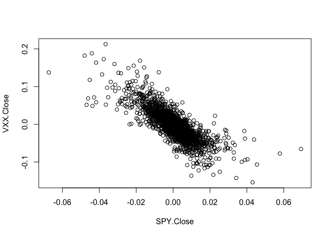

상관관계 출력

``` r
head(sv)
```

    ##               SPY.Close    VXX.Close
    ## 2009-02-02 -0.003022794 -0.003160486
    ## 2009-02-03  0.013949192 -0.047941576
    ## 2009-02-04 -0.004908084  0.003716494
    ## 2009-02-05  0.014770941 -0.006134686
    ## 2009-02-06  0.028098648 -0.014530565
    ## 2009-02-09  0.001378619  0.016546131

``` r
cor(sv)
```

    ##            SPY.Close  VXX.Close
    ## SPY.Close  1.0000000 -0.8009259
    ## VXX.Close -0.8009259  1.0000000

VSS의 극단치를 그래프로 확인

``` r
plot(sv$SPY.Close)
```

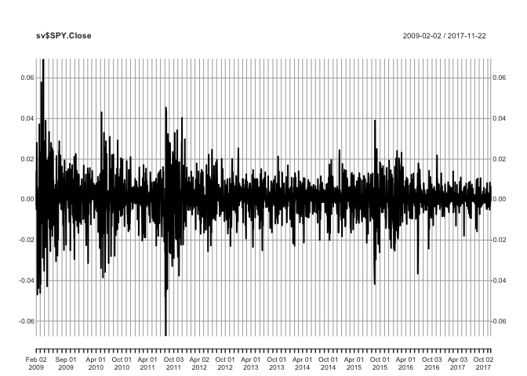

``` r
plot(sv$VXX.Close)
```

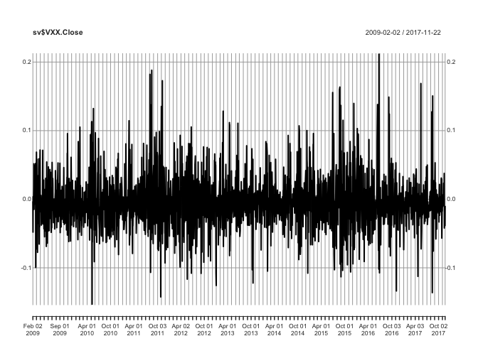

``` r
plot(sv)
```

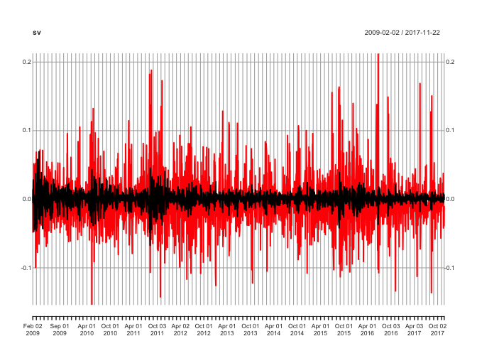

데이터 필터링
-------------

-   극단치 무시
-   극단치 제거
-   극단치 변경 극단치 제거

``` r
# 극단치 찾기
without_outliers <- sv[abs(sv[,1]) < 0.04, ]
without_outliers <- sv[abs(sv[,2]) < 0.15, ]

plot(without_outliers$SPY.Close)
```

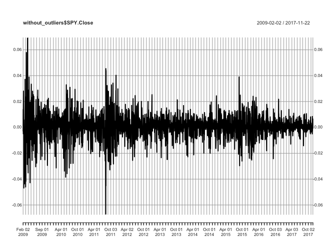

``` r
plot(without_outliers$VXX.Close)
```

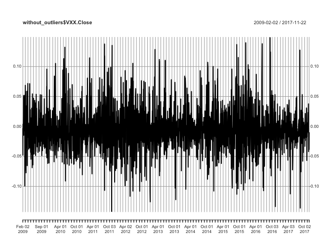

``` r
plot(without_outliers)
```


산포도

``` r
df_without_outliers <- as.data.frame(without_outliers)
plot(df_without_outliers)
```

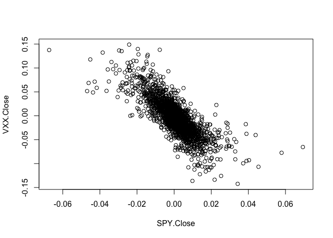

선형회귀
--------

SPY와 VXX 간에 관계가 얼마나 강한지 계량화하는 한가지 방법은, 두 시계열 간 선형 회귀 분석(linear regression)의 R^2 값이다.

### 구조식 (Fomulas)

``` r
# 구조식 만들기
my_formula <- as.formula("y~x")

# 결과는?
my_formula
```

    ## y ~ x

``` r
# 클래스는?
class(my_formula)
```

    ## [1] "formula"

구조식을 활용한 선형회귀

-   절편 = -0.0024857
-   기울기 = -2.8889981
-   귀무가설, "기울기, 절편이 모두 0"을 기각할 수 있는 p-value = 2.2e-16
-   매우 작음으로 기각, 즉 상관관계 있음

``` r
# 선형 회귀 객체 생성
reg <- lm(VXX.Close ~ SPY.Close, data = df_without_outliers)
summary(reg)
```

    ## 
    ## Call:
    ## lm(formula = VXX.Close ~ SPY.Close, data = df_without_outliers)
    ## 
    ## Residuals:
    ##       Min        1Q    Median        3Q       Max 
    ## -0.105270 -0.012439 -0.000623  0.011754  0.137496 
    ## 
    ## Coefficients:
    ##               Estimate Std. Error t value Pr(>|t|)    
    ## (Intercept) -0.0024857  0.0004742  -5.242 1.74e-07 ***
    ## SPY.Close   -2.8889981  0.0475804 -60.718  < 2e-16 ***
    ## ---
    ## Signif. codes:  0 '***' 0.001 '**' 0.01 '*' 0.05 '.' 0.1 ' ' 1
    ## 
    ## Residual standard error: 0.02225 on 2208 degrees of freedom
    ## Multiple R-squared:  0.6254, Adjusted R-squared:  0.6253 
    ## F-statistic:  3687 on 1 and 2208 DF,  p-value: < 2.2e-16

산포도에서 선형회귀 직선 표시

``` r
intercept <- reg$coefficients[1]
slope <- reg$coefficients[2]
plot(df_without_outliers)
# abline(reg = reg)
abline(intercept, slope, col="red", lty = 3)
```

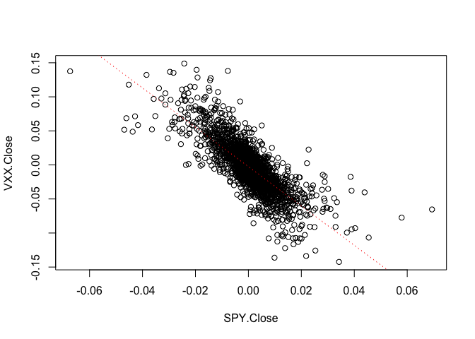

잔차 (Residuals)
----------------

이상적으로 잔차는 가능한 잡음적(noisy)이면 좋다. 즉 정규분포를 따르는 것이 좋다.

acf는 자기 상관 함수 (auto/cross covariance/correlation function estimation)

<http://blog.naver.com/PostView.nhn?blogId=sw4r&logNo=221030974616>

<https://m.blog.naver.com/PostView.nhn?blogId=mghsh1004&logNo=220593445445&proxyReferer=https%3A%2F%2Fwww.google.co.kr%2F>

``` r
par(mfrow = c(2, 2))
plot(reg$residuals, main = "Residuals through time", xlab = "Days", ylab = "Residuals")
hist(reg$residuals, breaks = 100, main = "Distribution of residuals", xlab = "Residuals")
qqnorm(reg$residuals)
qqline(reg$residuals)
acf(reg$residuals, main = "Autocorrelation")
```

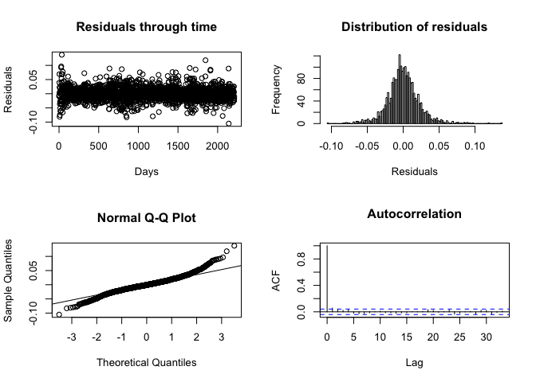

지연 (lag)
----------

`lag()` 함수는 가격을 한 단계 앞으로 이동해 시계열을 하루 지연

``` r
head(VXX$VXX.Close)
```

    ##            VXX.Close
    ## 2009-01-30  107089.9
    ## 2009-02-02  106752.0
    ## 2009-02-03  101754.9
    ## 2009-02-04  102133.8
    ## 2009-02-05  101509.1
    ## 2009-02-06  100044.8

``` r
# 시계일 지연
head(lag(VXX$VXX.Close, k = 1))
```

    ##            VXX.Close
    ## 2009-01-30        NA
    ## 2009-02-02  107089.9
    ## 2009-02-03  106752.0
    ## 2009-02-04  101754.9
    ## 2009-02-05  102133.8
    ## 2009-02-06  101509.1

``` r
# 시계열 선행
head(lag(VXX$VXX.Close, k = -1))
```

    ##            VXX.Close
    ## 2009-01-30  106752.0
    ## 2009-02-02  101754.9
    ## 2009-02-03  102133.8
    ## 2009-02-04  101509.1
    ## 2009-02-05  100044.8
    ## 2009-02-06  101713.9

SPY 수익률이 VXX 수익률에 선행한다고 가정하고 산점도를 그려보면 특별한 관계가 없음.

``` r
# 수익률과 지연 수익률 합치기
lagged_sv <- merge(without_outliers, lag(without_outliers[,1]), lag(without_outliers[,2]))
head(lagged_sv)
```

    ##               SPY.Close    VXX.Close  SPY.Close.1  VXX.Close.1
    ## 2009-02-02 -0.003022794 -0.003160486           NA           NA
    ## 2009-02-03  0.013949192 -0.047941576 -0.003022794 -0.003160486
    ## 2009-02-04 -0.004908084  0.003716494  0.013949192 -0.047941576
    ## 2009-02-05  0.014770941 -0.006134686 -0.004908084  0.003716494
    ## 2009-02-06  0.028098648 -0.014530565  0.014770941 -0.006134686
    ## 2009-02-09  0.001378619  0.016546131  0.028098648 -0.014530565

``` r
# 시간 지연된 SPY와 VXX 간의 산점도
plot(as.numeric(lagged_sv[,3]), as.numeric(lagged_sv[,2]), main = "Scatter plot SPY lagged vs. VXX", xlab = "SPY lagged", ylab = "VXX", cex.main = 0.8, cex.axis = 0.8, cex.lab = 0.8)
```

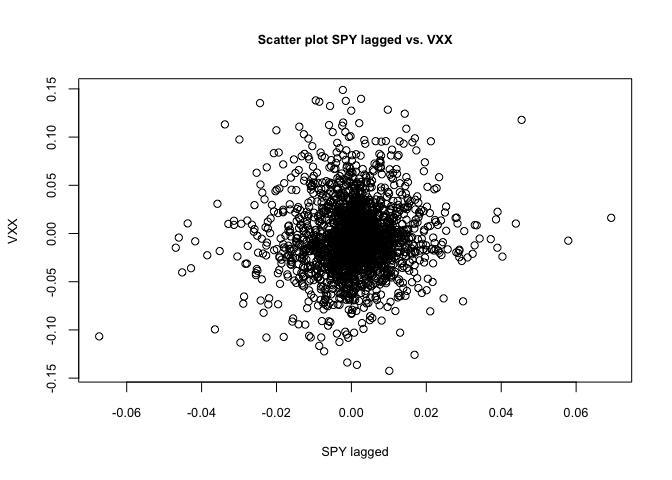

선형 분석을 통한 확인, p-value는 0.02225 로 높음 귀무가설 채택

``` r
reg2 <- lm(VXX.Close ~ SPY.Close.1, data = lagged_sv)
summary(reg2)
```

    ## 
    ## Call:
    ## lm(formula = VXX.Close ~ SPY.Close.1, data = lagged_sv)
    ## 
    ## Residuals:
    ##       Min        1Q    Median        3Q       Max 
    ## -0.139816 -0.020246 -0.002229  0.017911  0.153721 
    ## 
    ## Coefficients:
    ##               Estimate Std. Error t value Pr(>|t|)    
    ## (Intercept) -0.0044215  0.0007742  -5.711 1.28e-08 ***
    ## SPY.Close.1  0.1776762  0.0776687   2.288   0.0223 *  
    ## ---
    ## Signif. codes:  0 '***' 0.001 '**' 0.01 '*' 0.05 '.' 0.1 ' ' 1
    ## 
    ## Residual standard error: 0.03632 on 2207 degrees of freedom
    ##   (1 observation deleted due to missingness)
    ## Multiple R-squared:  0.002366,   Adjusted R-squared:  0.001914 
    ## F-statistic: 5.233 on 1 and 2207 DF,  p-value: 0.02225

VXX 수익률이 SPY 수익률에 선행한다고 가정후, `ccf()` 함수를 이용한 두 시계열 지연 상관

파란선을 넘어서는 것이 없음으로 시계열 지연을 시켜도 상관관계 없음

``` r
ccf(as.numeric(without_outliers[,1]), as.numeric(without_outliers[,2]),
    main = "Cross correlation between SPY and VXX",
    ylab = "Cross correlation",
    xlab = "Lag",
    cex.main = 0.8,
    cex.lab = 0.8,
    cex.axis = 0.8
)
```

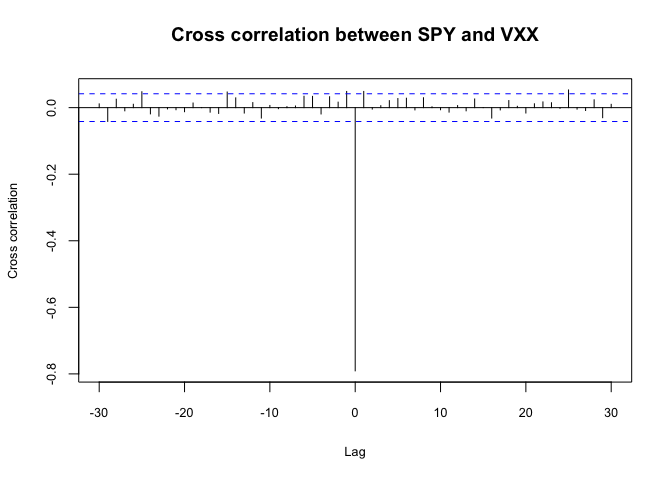
