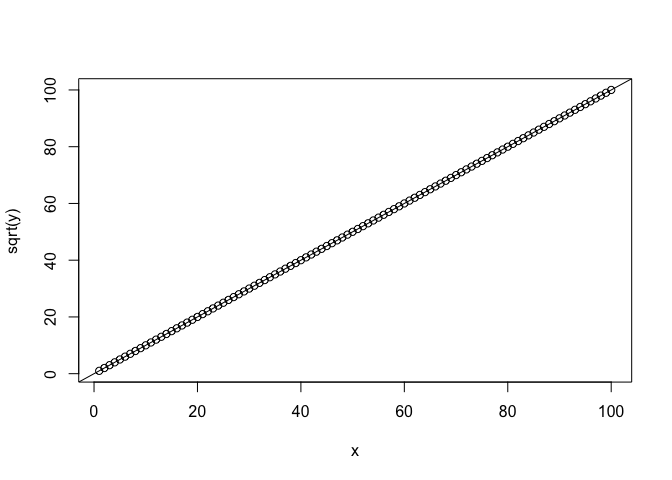

Linearity of Linear Regration
================

회귀분석

``` r
# 데이터 생성
x <- seq(1:100)
y <- x ^ 2

# 그래프 생성
plot(x, y)

# 회귀분석
reg_parabola <- lm(y ~ x)

# 선형 그래프
abline(reg_parabola, lwd = 2)
```


``` r
# 결과
summary(reg_parabola)
```

    ## 
    ## Call:
    ## lm(formula = y ~ x)
    ## 
    ## Residuals:
    ##    Min     1Q Median     3Q    Max 
    ##   -833   -677   -208    573   1617 
    ## 
    ## Coefficients:
    ##              Estimate Std. Error t value Pr(>|t|)    
    ## (Intercept) -1717.000    151.683  -11.32   <2e-16 ***
    ## x             101.000      2.608   38.73   <2e-16 ***
    ## ---
    ## Signif. codes:  0 '***' 0.001 '**' 0.01 '*' 0.05 '.' 0.1 ' ' 1
    ## 
    ## Residual standard error: 752.7 on 98 degrees of freedom
    ## Multiple R-squared:  0.9387, Adjusted R-squared:  0.9381 
    ## F-statistic:  1500 on 1 and 98 DF,  p-value: < 2.2e-16

다시 변형

``` r
plot(x, sqrt(y))
reg_transformed = lm(sqrt(y) ~ x)
abline((reg_transformed))
```



``` r
summary(reg_transformed)
```

    ## Warning in summary.lm(reg_transformed): essentially perfect fit: summary
    ## may be unreliable

    ## 
    ## Call:
    ## lm(formula = sqrt(y) ~ x)
    ## 
    ## Residuals:
    ##        Min         1Q     Median         3Q        Max 
    ## -2.680e-13 -4.300e-16  2.850e-15  5.302e-15  3.575e-14 
    ## 
    ## Coefficients:
    ##               Estimate Std. Error    t value Pr(>|t|)    
    ## (Intercept) -5.684e-14  5.598e-15 -1.015e+01   <2e-16 ***
    ## x            1.000e+00  9.624e-17  1.039e+16   <2e-16 ***
    ## ---
    ## Signif. codes:  0 '***' 0.001 '**' 0.01 '*' 0.05 '.' 0.1 ' ' 1
    ## 
    ## Residual standard error: 2.778e-14 on 98 degrees of freedom
    ## Multiple R-squared:      1,  Adjusted R-squared:      1 
    ## F-statistic: 1.08e+32 on 1 and 98 DF,  p-value: < 2.2e-16
