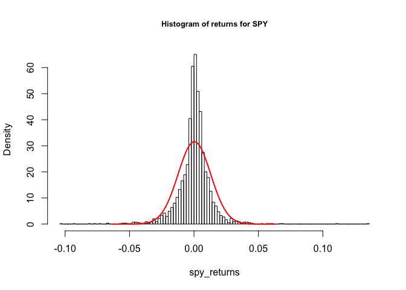
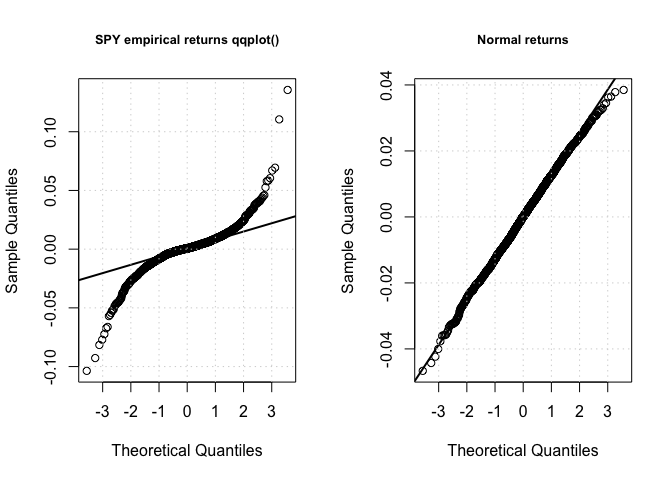

Stationary Test With `urca`
================

``` r
require(quantmod)
```

    ## Loading required package: quantmod

    ## Loading required package: xts

    ## Loading required package: zoo

    ## 
    ## Attaching package: 'zoo'

    ## The following objects are masked from 'package:base':
    ## 
    ##     as.Date, as.Date.numeric

    ## Loading required package: TTR

    ## Version 0.4-0 included new data defaults. See ?getSymbols.

``` r
getSymbols("SPY")
```

    ## 'getSymbols' currently uses auto.assign=TRUE by default, but will
    ## use auto.assign=FALSE in 0.5-0. You will still be able to use
    ## 'loadSymbols' to automatically load data. getOption("getSymbols.env")
    ## and getOption("getSymbols.auto.assign") will still be checked for
    ## alternate defaults.
    ## 
    ## This message is shown once per session and may be disabled by setting 
    ## options("getSymbols.warning4.0"=FALSE). See ?getSymbols for details.

    ## 
    ## WARNING: There have been significant changes to Yahoo Finance data.
    ## Please see the Warning section of '?getSymbols.yahoo' for details.
    ## 
    ## This message is shown once per session and may be disabled by setting
    ## options("getSymbols.yahoo.warning"=FALSE).

    ## Warning in as.POSIXlt.POSIXct(Sys.time()): unknown timezone 'zone/tz/2017c.
    ## 1.0/zoneinfo/Asia/Seoul'

    ## [1] "SPY"

``` r
spy <- SPY$SPY.Adjusted

# 기본 설정 사용
require(urca)
```

    ## Loading required package: urca

``` r
# Kwiatkowski et al. Unit Root Test
test <- ur.kpss(as.numeric(spy))
```

``` r
# 결과물은 S4 객체
class(test)
```

    ## [1] "ur.kpss"
    ## attr(,"package")
    ## [1] "urca"

``` r
# 테스트 통계치 추출
test@teststat
```

    ## [1] 23.98652

``` r
# 임계값 보기
test@cval
```

    ##                 10pct  5pct 2.5pct  1pct
    ## critical values 0.347 0.463  0.574 0.739

``` r
# 수익률에 대하여 테스트
spy_returns <- diff(log(spy))
test_returns <- ur.kpss(as.numeric(spy_returns))
test_returns@teststat
```

    ## [1] 0.2658626

따라서 귀무 가설 기각?

``` r
test_post_2013 <- ur.kpss(as.numeric(spy_returns['2013::']))
test_post_2013@teststat
```

    ## [1] 0.1064216

정규성의 가정
-------------

`dnorm()` 함수는 주어진 x 값의 범위와 평균, 표준편차로 정규분포를 생성한다. `lines()` 함수는 기존 히스토그램 그래프 위에 선 그래프를 그린다.

``` r
mu <- mean(spy_returns, na.rm = TRUE)
sigma <- sd(spy_returns, na.rm = TRUE)
x <- seq(-5 * sigma, 5 * sigma, length = nrow(spy_returns))

hist(spy_returns, breaks = 100, main = "Histogram of returns for SPY", cex.main = 0.8, probability = TRUE)
lines(x, dnorm(x, mu, sigma), col = "red", lwd = 2)
```



실증적 데이터와 이론적 정규분포간의 차이는 `qqnorm()`과 `qqline()` 함수로 시각화할 수 있다.

<http://clearnight.tistory.com/256>

Theoretical normal quantile을 x 축에 놓고~ obsersved quantile을 y축에 놓았을때~

<정규성의 여부는...>

1.Line of identity를 잘 따라가면 OK

1.  그렇지 않더라도... 어느쪽으로 휘지 않고? 직선성을 유지하면 정규성 OK. 이것을 확인하려면 수평선을 추가로 그려서 자료의 분포를 보면 쉽게 구분된다.

<만약 위 아래 모두 세로로 길게 늘어섰다면...>

다시 말해 기울기가 45도 이상인 경우, 이론적인 정규분포보다 넓게 분포함을 의미한다. 그래도 정규성이긴 하지.. 위에 두번째에 해당하니..

<만약 위 아래 모두 가로로 길게 늘어섰다면...>

다시 말해 기울기가 45도 이하인 경우, 이론적인 정규분포보다 좁게 분포함을 의미한다. 마찬가지로 정규성이긴 하지.. 위에 두번째에 해당하니..

<만약 위 아래 중 특정 부분이 세로로 길게 늘어섰다면...>

늘어선 쪽에 길게 long tail을 갖는다는 것을 의미한다.

<만약 위 아래 중 특정 부분이 가로로 길게 늘어섰다면...>

관측치에서의 자료 변화가 없고, 그 쪽에 자료가 많이 분포하는 것이다.

응용하면....

<만약 위는 세로, 아래는 가로로 늘어섰다면...>

그러니까 비틀어서 U 모양으로 보이면, 말로하려니... 힘들다.. 차라리 시뮬레이션이라도 할까...싶은데..

Positive skewed, 다시 말해 long right tail을 갖는다.

<만약 위는 가로, 아래는 세로로 늘어섰다면...>

그러니까 비틀어서 뒤집어진 U 모양으로 보이면..

Negative skewed, 다시 말해 long left tail을 갖는다.

``` r
# 그래프 창 설정
par(mfrow = c(1, 2))

# SPY 데이터
qqnorm(as.numeric(spy_returns), main = "SPY empirical returns qqplot()", cex.main = 0.8)
qqline(as.numeric(spy_returns), lwd = 2)
grid()

# 정규분포를 따르는 임의의 데이터
normal_data = rnorm(nrow(spy_returns), mean = mu, sd = sigma)
qqnorm(normal_data, main = "Normal returns", cex.main = 0.8)
qqline(normal_data, lwd = 2)
grid()
```



Shapiro-Wilks 정규성 테스트
---------------------------

극단치 추가할 경우 정규성 판단하지 않음. 데이터의 정제 필요.

``` r
# 정규성을 가지는 데이터로 테스트
set.seed(129)
normal_numbers <- rnorm(5000, 0, 1)
ans <- shapiro.test(normal_numbers)
ans[[2]]
```

    ## [1] 0.9963835

``` r
normal_numbers[50] <- 1000
ans <- shapiro.test(normal_numbers)
ans[[2]]
```

    ## [1] 1.775666e-95

``` r
answer <- shapiro.test(as.numeric(spy_returns))
answer
```

    ## 
    ##  Shapiro-Wilk normality test
    ## 
    ## data:  as.numeric(spy_returns)
    ## W = 0.86433, p-value < 2.2e-16

``` r
answer[[2]]
```

    ## [1] 1.135293e-43
