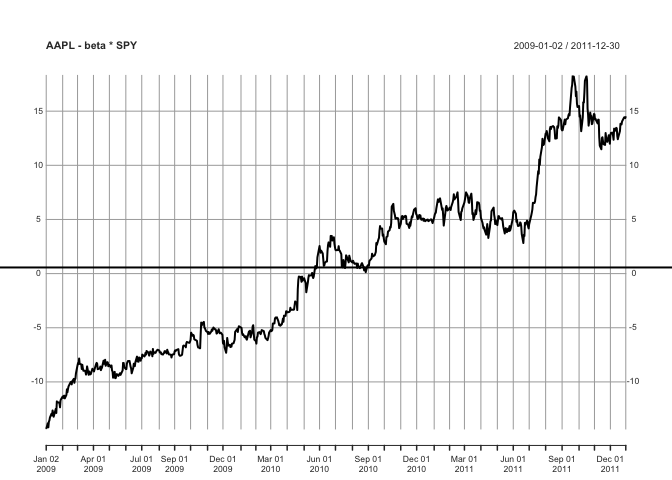

스프레드 구성
================

``` r
require(quantmod)
require(xts)

# 데이터 구하기
getSymbols("SPY")
```

    ## [1] "SPY"

``` r
getSymbols("AAPL")
```

    ## [1] "AAPL"

``` r
# SPY <- getSymbols('SPY', from = '2011-01-01', to = '2012-12-31', adjust = T, auto.assign = FALSE)
# AAPL <- getSymbols('AAPL', from = '2011-01-01', to = '2012-12-31', adjust = T, auto.assign = FALSE)
```

``` r
# 스프레드를 계산할 함수
calculate_spread <- function(x, y, beta) {
  return (y - beta * x)
  # return (y - x)
}

# 주어진 시각, 종료 날짜에서 베타와 레벨을 계산할 함수
calculate_beta_and_level <- function(x, y, start_date, end_date) {
  require(xts)
  
  time_range <- paste(start_date, "::", end_date, sep = "")
  x <- x[time_range]
  y <- y[time_range]
  
  # dx <- diff(x)
  # dy <- diff(y)
  dx <- diff(x[time_range])
  dy <- diff(y[time_range])
  r <- prcomp( ~ dx + dy )
  
  beta <- r$rotation[2, 1] / r$rotation[1, 1]
  spread <- calculate_spread(x, y, beta)
  names(spread) <- "spread"
  level <- mean(spread, na.rm = TRUE)
  
  outL <- list()
  outL$spread <- spread
  outL$beta <- beta
  outL$level <- level
  
  return (outL)
}

# 상단, 하단 임계치로 매수, 매도 신호를 계산하는 함수
caculate_buy_sell_signals <- function(spread, beta, level, lower_threshold, upper_threshold) {
  buy_signals  <- ifelse(spread <= level - lower_threshold, 1, 0)
  sell_signals <- ifelse(spread <= level + upper_threshold, 1, 0)
  
  # 백터를 행렬로 합치기
  output <- cbind(spread, buy_signals, sell_signals)
  colnames(output) <- c("spread", "buy_signals", "sell_signals")
  
  return (output)
}
```

``` r
# 실행
start_date  <- "2009-01-01"
end_date    <- "2011-12-31"
x <- SPY[, 6]
y <- AAPL[, 6]

results <- calculate_beta_and_level(x, y, start_date, end_date)
results$beta
```

    ## [1] 0.3344629

``` r
results$level
```

    ## [1] 0.5676038

``` r
plot(results$spread, ylab="Spread Value", main="AAPL - beta * SPY")
abline(h = results$level, lwd = 2)
```



``` r
# 샘플 밖 시작, 종료 날짜
start_date_out_sample <- "2012-01-01"
end_date_out_sample <- "2012-10-22"
range <- paste(start_date_out_sample, "::", end_date_out_sample, sep = "")

# 샘플 밖 분석
spread_out_of_sample <- calculate_spread(x[range], y[range], results$beta)

# 그래프
plot(spread_out_of_sample, ylab="Spread Value", main="AAPL - beta * SPY")
abline(h = results$level, lwd = 2)
```


