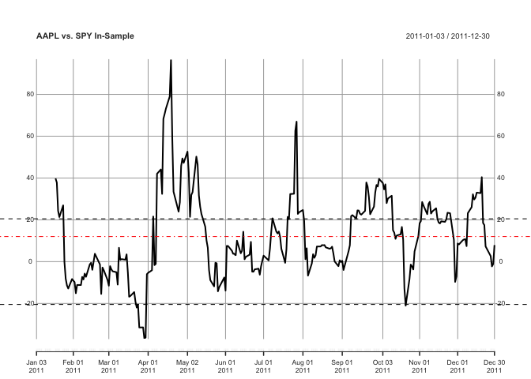
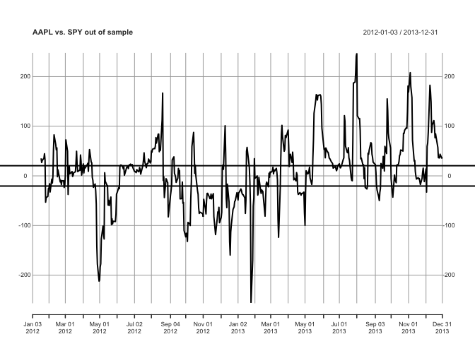
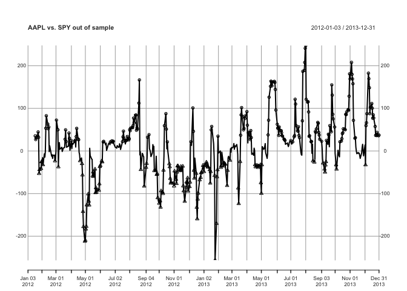
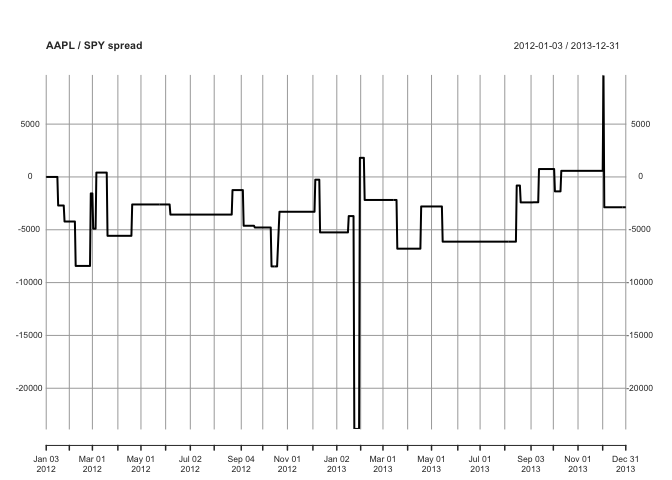

신호 생성과 검증
================

``` r
require(quantmod)
require(xts)
getSymbols("SPY")
```

    ## [1] "SPY"

``` r
getSymbols("AAPL")
```

    ## [1] "AAPL"

``` r
# 이동할 거래일 수
window_length <- 10

# 시간 구간
start_date <- "2011-01-01"
end_date <- "2011-12-31"
range <- paste(start_date, "::", end_date, sep="")

# 주가 쌍
x <- SPY[range, 6]
y <- AAPL[range, 6]

dF <- cbind(x, y)
names(dF) <- c("SPY", "AAPL")

x <- 1:5
test <- coef(lm(c(1:3, 7, 6) ~ x))
class(test)
```

    ## [1] "numeric"

``` r
names(test) <- c("b", "a")
str(test)
```

    ##  Named num [1:2] -0.7 1.5
    ##  - attr(*, "names")= chr [1:2] "b" "a"

``` r
# Beta
run_regression <- function(dF) {
  data <- as.data.frame(dF)
  result <- coef(lm(data[,2] ~ data[,1]))
  # return (result)
  names(result) <- c("intercept", "beta")
  return (result)
}

rolling_beta <- function(z, width) {
  rollapply(z, width=width, FUN = run_regression, by.column = FALSE, align = "right")
}

betas <- rolling_beta(diff(dF), 10)

data <- merge(betas, dF)
# data <- na.omit(data)

data$spread <- data$AAPL - lag(data$beta, 1) * data$SPY

# 수익률
returns <- diff(dF) / dF
returns_beta <- rolling_beta(returns, 10)
data$spreadR <- (diff(data$AAPL) / data$AAPL) - returns_beta$beta * (diff(data$SPY) / data$SPY)
tail(data)
```

    ##             intercept      beta      SPY     AAPL    spread      spreadR
    ## 2011-12-22 0.02728788 0.3946239 111.4264 51.03908 17.510531 -0.002301565
    ## 2011-12-23 0.08005081 0.4389964 112.4227 51.65121  7.286532  0.003386079
    ## 2011-12-27 0.05603623 0.4848415 112.5116 52.06101  2.668823  0.007037818
    ## 2011-12-28 0.06969623 0.4725469 111.0350 51.56285 -2.271547  0.004006216
    ## 2011-12-29 0.13903033 0.3936503 112.1825 51.88045 -1.131033 -0.002555792
    ## 2011-12-30 0.19154331 0.3908320 111.6310 51.86508  7.921496  0.003873899

중심이 0이라고 가정한 스프레드의 평균 대비 위로 1 표준편차, 아래로 1표준편차를 같이 그린 그래프

``` r
threshold <- sd(data$spread, na.rm = TRUE)
mean <- mean(data$spread, na.rm = TRUE)
plot(data$spread, main = "AAPL vs. SPY In-Sample")
abline(h =  threshold, lty = 2)
abline(h =  mean, lty = 4, col = "red")
abline(h = -threshold, lty = 2)
```



전략 시뮬레이션 \* 한 번의 스프레드에 대해 오직 하나의 매수나 매도 포지션을 가져간다 \* 스프레드 하나를 매수하고 있는데 매수 신호가 생기면 더 매수하지 않는다 \* 포지션을 뒤바꿀 매도 신호를 기다린다

``` r
# 샘플 밖 스프레드 생성
# 10일 변동 구간 유지
window_length <- 10

# 시간 범위
start_date <- "2012-01-01"
end_date <- "2013-12-31"
range <-paste(start_date, "::", end_date, sep = "")

# 주가 쌍
x <- SPY[range, 6]
y <- AAPL[range, 6]

# 두 주가를 행렬로 묶기
dF <- cbind(x, y)
names(dF) <- c("SPY", "AAPL")

# 샘플 밖 변동 스프레드 계산
beta_out_of_sample <- rolling_beta(diff(dF), 10)

# 매수, 매도 임계치
data_out <- merge(beta_out_of_sample, dF)
data_out$spread <- data_out$AAPL - lag(beta_out_of_sample$beta, 1) * data_out$SPY

# 샘플 안 스프레드 폭과 함께 스프레드 그리기
plot(data_out$spread, main = "AAPL vs. SPY out of sample")
abline(h =  threshold, lwd = 2)
abline(h = -threshold, lwd = 2)
```



트레이딩 로직

``` r
# 매수, 매도 신호 생성
buys  <- ifelse(data_out$spread >  threshold,  1, 0)
sells <- ifelse(data_out$spread < -threshold, -1, 0)
data_out$signal <- buys + sells
```

매수 신호를 원, 매도 신호를 삼격형

``` r
plot(data_out$spread, main = "AAPL vs. SPY out of sample")
abline(h =  threshold, lty = 2)
abline(h = -threshold, lty = 2)
```


``` r
buy_index   = which(data_out$signal ==  1)
sell_index  = which(data_out$signal == -1)
point_type  = rep(NA, nrow(data_out))
point_type[buy_index ] <- 21
point_type[sell_index] <- 24
points(data_out$spread, pch = point_type)
```



매수/매도 신호 횟수

``` r
num_of_buy_signals  <- sum(buys, na.rm = TRUE)
num_of_sell_signals <- sum(abs(sells), na.rm = TRUE)

num_of_sell_signals
```

    ## [1] 143

``` r
num_of_buy_signals
```

    ## [1] 196

X(SPY)와 Y(AAPL)의 거래수량을 계산

``` r
printf <- function(...)print(sprintf(...))

prev_x_qty <- 0
position   <- 0
trade_size <- 100
signal     <- as.numeric(data_out$signal)
signal[is.na(signal)] <- 0
beta <- as.numeric(data_out$beta)

qty_x <- rep(0, length(signal))
qty_y <- rep(0, length(signal))

for (i in 1:length(signal)) {
  
  # printf('%d, %d', i, position)
  # 초기 스프레드 매수
  if (signal[i] == 1 && position == 0) {
    # SPY 매도량
    prev_x_qty  <- round(beta[i] * trade_size)
    # SPY 매도
    qty_x[i]    <- -prev_x_qty
    # APPL 매수
    qty_y[i]    <- trade_size
    printf('초기 스프레드 매수 SPY=%d, APPL=%d', qty_x[i], qty_y[i])
    position    <- 1
  }
  
  # 초기 스프레드 매도
  if (signal[i] == -1 && position == 0) {
    prev_x_qty <- round(beta[i] * trade_size)
    # SPY 매수
    qty_x[i] <- prev_x_qty
    # APPL 매도
    qty_y[i] <- -trade_size
    position <- -1
    printf('초기 스프레드 매도 SPY=%d, APPL=%d', qty_x[i], qty_y[i])
  }
  
  # 스프레드 매도 상태에서 매수
  if (signal[i] == 1 && position == -1) {
    qty_x[i]    <- -(round(beta[i] * trade_size) + prev_x_qty)
    prev_x_qty  <-   round(beta[i] * trade_size)
    qty_y[i]    <- 2 * trade_size
    position    <- 1
    printf('매도 -> 매수 SPY=%d, APPL=%d', qty_x[i], qty_y[i])
  }
  
  # 스프레드 매수 상태에서 매도
  if (signal[i] == -1 && position == 1) {
    qty_x[i]    <- round(beta[i] * trade_size) + prev_x_qty
    prev_x_qty  <- round(beta[i] * trade_size)
    qty_y[i]    <- -2 * trade_size
    position    <- -1
    printf('매수 -> 매도 SPY=%d, APPL=%d', qty_x[i], qty_y[i])
  }
  
}
```

    ## [1] "초기 스프레드 매수 SPY=-24, APPL=100"
    ## [1] "매수 -> 매도 SPY=110, APPL=-200"
    ## [1] "매도 -> 매수 SPY=-70, APPL=200"
    ## [1] "매수 -> 매도 SPY=56, APPL=-200"
    ## [1] "매도 -> 매수 SPY=-87, APPL=200"
    ## [1] "매수 -> 매도 SPY=69, APPL=-200"
    ## [1] "매도 -> 매수 SPY=-76, APPL=200"
    ## [1] "매수 -> 매도 SPY=95, APPL=-200"
    ## [1] "매도 -> 매수 SPY=-116, APPL=200"
    ## [1] "매수 -> 매도 SPY=116, APPL=-200"
    ## [1] "매도 -> 매수 SPY=-109, APPL=200"
    ## [1] "매수 -> 매도 SPY=138, APPL=-200"
    ## [1] "매도 -> 매수 SPY=-97, APPL=200"
    ## [1] "매수 -> 매도 SPY=86, APPL=-200"
    ## [1] "매도 -> 매수 SPY=-134, APPL=200"
    ## [1] "매수 -> 매도 SPY=146, APPL=-200"
    ## [1] "매도 -> 매수 SPY=-108, APPL=200"
    ## [1] "매수 -> 매도 SPY=234, APPL=-200"
    ## [1] "매도 -> 매수 SPY=-275, APPL=200"
    ## [1] "매수 -> 매도 SPY=115, APPL=-200"
    ## [1] "매도 -> 매수 SPY=-51, APPL=200"
    ## [1] "매수 -> 매도 SPY=44, APPL=-200"
    ## [1] "매도 -> 매수 SPY=-52, APPL=200"
    ## [1] "매수 -> 매도 SPY=52, APPL=-200"
    ## [1] "매도 -> 매수 SPY=-77, APPL=200"
    ## [1] "매수 -> 매도 SPY=86, APPL=-200"
    ## [1] "매도 -> 매수 SPY=-99, APPL=200"
    ## [1] "매수 -> 매도 SPY=96, APPL=-200"
    ## [1] "매도 -> 매수 SPY=-95, APPL=200"
    ## [1] "매수 -> 매도 SPY=36, APPL=-200"
    ## [1] "매도 -> 매수 SPY=-15, APPL=200"

``` r
data_out$qty_spy <- qty_x
data_out$qty_appl <- qty_y
```

수익곡선

``` r
# 수익 곡선을 계산할 함수
compute_equity_curve <- function(qty, price) {
  cash_buy  <- ifelse(sign(qty) ==  1,  qty * price, 0)
  cash_sell <- ifelse(sign(qty) == -1, -qty * price, 0)
  position  <- cumsum(qty)
  cumulative_buy  <- cumsum(cash_buy)
  cumulative_sell <- cumsum(cash_sell)
  
  # equity <- cumulative_sell - cumulative_buy + position * price
  equity <- cumulative_sell - cumulative_buy # + position * price
  return(equity)
}

data_out$equity_curve_spy  <- compute_equity_curve(data_out$qty_spy, data_out$SPY)
data_out$equity_curve_appl <- compute_equity_curve(data_out$qty_appl, data_out$AAPL)

plot(data_out$equity_curve_spy + data_out$equity_curve_appl, type = "l", main = "AAPL / SPY spread", ylab = "P&L")
```



``` r
cumsum(data_out$qty_spy) * data_out$SPY
```

    ##               qty_spy
    ## 2012-01-03     0.0000
    ## 2012-01-04     0.0000
    ## 2012-01-05     0.0000
    ## 2012-01-06     0.0000
    ## 2012-01-09     0.0000
    ## 2012-01-10     0.0000
    ## 2012-01-11     0.0000
    ## 2012-01-12     0.0000
    ## 2012-01-13     0.0000
    ## 2012-01-17     0.0000
    ## 2012-01-18 -2791.6472
    ## 2012-01-19 -2806.3768
    ## 2012-01-20 -2816.8365
    ## 2012-01-23 -2809.5791
    ## 2012-01-24 -2806.3768
    ## 2012-01-25 -2829.8595
    ## 2012-01-26 10088.3140
    ## 2012-01-27 10083.7231
    ## 2012-01-30 10049.2967
    ## 2012-01-31 10045.4741
    ## 2012-02-01 10133.4458
    ## 2012-02-02 10149.5084
    ## 2012-02-03 10291.7911
    ## 2012-02-06 10284.9090
    ## 2012-02-07 10310.9166
    ## 2012-02-08 10341.5138
    ## 2012-02-09  1926.4216
    ## 2012-02-10  1912.1903
    ## 2012-02-13  1926.4216
    ## 2012-02-14  1924.0026
    ## 2012-02-15  1915.0364
    ## 2012-02-16  1936.2422
    ## 2012-02-17  1941.3656
    ## 2012-02-21  1942.2196
    ## 2012-02-22  1935.9578
    ## 2012-02-23  1944.4962
    ## 2012-02-24  1948.7656
    ## 2012-02-27  1952.0393
    ## 2012-02-28  8809.7942
    ## 2012-02-29  8775.2115
    ## 2012-03-01  8820.6823
    ## 2012-03-02 -1832.0385
    ## 2012-03-05 -1824.5666
    ## 2012-03-06  6472.3746
    ## 2012-03-07  6517.5250
    ## 2012-03-08  6582.3689
    ## 2012-03-09  6607.8244
    ## 2012-03-12  6608.3069
    ## 2012-03-13  6727.4268
    ## 2012-03-14  6720.2228
    ## 2012-03-15  6759.1276
    ## 2012-03-16  6768.4846
    ## 2012-03-19  6795.0207
    ## 2012-03-20 -2760.2845
    ## 2012-03-21 -2755.7632
    ## 2012-03-22 -2735.9119
    ## 2012-03-23 -2744.7568
    ## 2012-03-26 -2783.2795
    ## 2012-03-27 -2774.6308
    ## 2012-03-28 -2760.8733
    ## 2012-03-29 -2756.1561
    ## 2012-03-30 -2767.5558
    ## 2012-04-02 -2787.7997
    ## 2012-04-03 -2776.3999
    ## 2012-04-04 -2748.8842
    ## 2012-04-05 -2747.5085
    ## 2012-04-09 -2716.6502
    ## 2012-04-10 -2671.0523
    ## 2012-04-11 -2692.6725
    ## 2012-04-12 -2727.8533
    ## 2012-04-13 -2695.4235
    ## 2012-04-16 -2693.6552
    ## 2012-04-17 -2733.5539
    ## 2012-04-18 -2724.3161
    ## 2012-04-19 -2706.8231
    ## 2012-04-20  8996.7309
    ## 2012-04-23  8921.0810
    ## 2012-04-24  8954.9934
    ## 2012-04-25  9077.6017
    ## 2012-04-26  9140.8624
    ## 2012-04-27  9155.8621
    ## 2012-04-30  9121.9479
    ## 2012-05-01  9178.6868
    ## 2012-05-02  9151.2979
    ## 2012-05-03  9081.5154
    ## 2012-05-04  8934.7768
    ## 2012-05-07  8941.2970
    ## 2012-05-08  8905.4280
    ## 2012-05-09  8852.6012
    ## 2012-05-10  8870.8639
    ## 2012-05-11  8844.1222
    ## 2012-05-14  8746.2964
    ## 2012-05-15  8696.0777
    ## 2012-05-16  8662.8185
    ## 2012-05-17  8534.3412
    ## 2012-05-18  8461.2977
    ## 2012-05-21  8606.7313
    ## 2012-05-22  8621.7321
    ## 2012-05-23  8626.2957
    ## 2012-05-24  8643.2530
    ## 2012-05-25  8615.2114
    ## 2012-05-29  8719.5579
    ## 2012-05-30  8593.0360
    ## 2012-05-31  8574.1232
    ## 2012-06-01  8358.2533
    ## 2012-06-04  8354.3418
    ## 2012-06-05  8417.6020
    ## 2012-06-06  8606.7313
    ## 2012-06-07 -5072.7921
    ## 2012-06-08 -5113.1288
    ## 2012-06-11 -5048.2066
    ## 2012-06-12 -5106.2129
    ## 2012-06-13 -5073.5611
    ## 2012-06-14 -5127.3429
    ## 2012-06-15 -5179.7813
    ## 2012-06-18 -5189.8217
    ## 2012-06-19 -5240.0200
    ## 2012-06-20 -5231.5248
    ## 2012-06-21 -5114.1357
    ## 2012-06-22 -5153.5237
    ## 2012-06-25 -5070.8880
    ## 2012-06-26 -5096.3733
    ## 2012-06-27 -5142.3259
    ## 2012-06-28 -5127.6516
    ## 2012-06-29 -5255.4666
    ## 2012-07-02 -5271.2977
    ## 2012-07-03 -5306.0514
    ## 2012-07-05 -5282.1097
    ## 2012-07-06 -5231.9129
    ## 2012-07-09 -5225.3467
    ## 2012-07-10 -5179.7813
    ## 2012-07-11 -5180.5542
    ## 2012-07-12 -5155.4553
    ## 2012-07-13 -5241.9517
    ## 2012-07-16 -5229.5932
    ## 2012-07-17 -5265.5060
    ## 2012-07-18 -5304.5063
    ## 2012-07-19 -5318.4073
    ## 2012-07-20 -5269.7538
    ## 2012-07-23 -5216.4657
    ## 2012-07-24 -5171.6715
    ## 2012-07-25 -5172.8316
    ## 2012-07-26 -5258.1689
    ## 2012-07-27 -5355.0914
    ## 2012-07-30 -5355.0914
    ## 2012-07-31 -5317.6367
    ## 2012-08-01 -5313.0012
    ## 2012-08-02 -5276.3187
    ## 2012-08-03 -5380.9649
    ## 2012-08-06 -5391.3901
    ## 2012-08-07 -5418.4199
    ## 2012-08-08 -5424.9845
    ## 2012-08-09 -5429.6190
    ## 2012-08-10 -5438.5010
    ## 2012-08-13 -5435.7965
    ## 2012-08-14 -5436.5681
    ## 2012-08-15 -5442.7478
    ## 2012-08-16 -5482.9081
    ## 2012-08-17 -5490.2446
    ## 2012-08-20 -5490.6311
    ## 2012-08-21 -5474.0261
    ## 2012-08-22 -5476.3422
    ## 2012-08-23 -5431.5494
    ## 2012-08-24  9276.7243
    ## 2012-08-27  9278.6914
    ## 2012-08-28  9269.5130
    ## 2012-08-29  9276.7243
    ## 2012-08-30  9209.8574
    ## 2012-08-31  9253.7820
    ## 2012-09-04  9245.2574
    ## 2012-09-05  9237.3928
    ## 2012-09-06  9424.8785
    ## 2012-09-07 -4665.9897
    ## 2012-09-10 -4639.4797
    ## 2012-09-11 -4652.4122
    ## 2012-09-12 -4667.9288
    ## 2012-09-13 -4739.0526
    ## 2012-09-14 -4760.0656
    ## 2012-09-17 -4743.9020
    ## 2012-09-18 -4740.0227
    ## 2012-09-19 -4742.6094
    ## 2012-09-20 -4742.9313
    ## 2012-09-21 13432.6915
    ## 2012-09-24 13412.4303
    ## 2012-09-25 13269.6995
    ## 2012-09-26 13195.1045
    ## 2012-09-27 13319.4233
    ## 2012-09-28 13257.7261
    ## 2012-10-01 13292.7202
    ## 2012-10-02 13306.5347
    ## 2012-10-03 13360.8623
    ## 2012-10-04 13456.6320
    ## 2012-10-05 13457.5534
    ## 2012-10-08 13411.5074
    ## 2012-10-09 13278.9056
    ## 2012-10-10 13194.1847
    ## 2012-10-11 13201.5542
    ## 2012-10-12   645.0132
    ## 2012-10-15   650.3851
    ## 2012-10-16   656.9755
    ## 2012-10-17   659.9549
    ## 2012-10-18   658.2396
    ## 2012-10-19   647.2703
    ## 2012-10-22 11781.9645
    ## 2012-10-23 11618.4725
    ## 2012-10-24 11585.6104
    ## 2012-10-25 11619.2918
    ## 2012-10-26 11612.7204
    ## 2012-10-31 11612.7204
    ## 2012-11-01 11734.3150
    ## 2012-11-02 11629.9766
    ## 2012-11-05 11653.8013
    ## 2012-11-06 11744.9944
    ## 2012-11-07 11478.8108
    ## 2012-11-08 11340.7875
    ## 2012-11-09 11350.6469
    ## 2012-11-12 11359.6829
    ## 2012-11-13 11320.2488
    ## 2012-11-14 11167.4382
    ## 2012-11-15 11148.5421
    ## 2012-11-16 11203.5856
    ## 2012-11-19 11430.3379
    ## 2012-11-20 11435.2666
    ## 2012-11-21 11456.6252
    ## 2012-11-23 11612.7204
    ## 2012-11-26 11588.0758
    ## 2012-11-27 11528.9242
    ## 2012-11-28 11621.7620
    ## 2012-11-29 11675.9807
    ## 2012-11-30 11678.4481
    ## 2012-12-03 11620.9400
    ## 2012-12-04 11604.5065
    ## 2012-12-05 11625.0466
    ## 2012-12-06 -5511.7869
    ## 2012-12-07 -5528.4795
    ## 2012-12-10 -5530.8094
    ## 2012-12-11 -5568.4659
    ## 2012-12-12 13344.9265
    ## 2012-12-13 13263.0982
    ## 2012-12-14 13213.8127
    ## 2012-12-17 13369.1064
    ## 2012-12-18 13517.8903
    ## 2012-12-19 13417.4584
    ## 2012-12-20 13494.6408
    ## 2012-12-21 13372.1475
    ## 2012-12-24 13330.9419
    ## 2012-12-26 13274.7537
    ## 2012-12-27 13256.9594
    ## 2012-12-28 13113.6747
    ## 2012-12-31 13336.5622
    ## 2013-01-02 13678.3767
    ## 2013-01-03 13647.4764
    ## 2013-01-04 13707.4130
    ## 2013-01-07 13669.9542
    ## 2013-01-08 13630.6188
    ## 2013-01-09 13665.2676
    ## 2013-01-10 13773.9019
    ## 2013-01-11 13772.9668
    ## 2013-01-14 13763.6045
    ## 2013-01-15 13772.9668
    ## 2013-01-16 13771.0934
    ## 2013-01-17  -672.8186
    ## 2013-01-18  -674.3187
    ## 2013-01-22  -677.9557
    ## 2013-01-23  -679.0466
    ## 2013-01-24 31108.6626
    ## 2013-01-25 31283.5608
    ## 2013-01-28 31246.0850
    ## 2013-01-29 31368.9256
    ## 2013-01-30 31246.0850
    ## 2013-01-31 -6261.0298
    ## 2013-02-01 -6325.4387
    ## 2013-02-04 -6254.3386
    ## 2013-02-05 -6317.4931
    ## 2013-02-06  9483.1412
    ## 2013-02-07  9470.5943
    ## 2013-02-08  9523.2919
    ## 2013-02-11  9521.4083
    ## 2013-02-12  9537.0916
    ## 2013-02-13  9545.2460
    ## 2013-02-14  9554.0300
    ## 2013-02-15  9542.7392
    ## 2013-02-19  9614.2587
    ## 2013-02-20  9494.4320
    ## 2013-02-21  9436.7154
    ## 2013-02-22  9528.9362
    ## 2013-02-25  9347.6322
    ## 2013-02-26  9411.6196
    ## 2013-02-27  9530.1933
    ## 2013-02-28  9511.3714
    ## 2013-03-01  9542.7392
    ## 2013-03-04  9593.5563
    ## 2013-03-05  9679.5000
    ## 2013-03-06  9692.6785
    ## 2013-03-07  9710.2423
    ## 2013-03-08  9751.6480
    ## 2013-03-11  9788.6622
    ## 2013-03-12  9766.7059
    ## 2013-03-13  9780.5078
    ## 2013-03-14  9832.5779
    ## 2013-03-15  9819.5962
    ## 2013-03-18  9765.4025
    ## 2013-03-19  2541.5794
    ## 2013-03-20  2559.3327
    ## 2013-03-21  2537.4685
    ## 2013-03-22  2557.8531
    ## 2013-03-25  2547.1681
    ## 2013-03-26  2567.5513
    ## 2013-03-27  2567.5513
    ## 2013-03-28  2575.4428
    ## 2013-04-01  2565.2508
    ## 2013-04-02  2577.9084
    ## 2013-04-03  2551.7711
    ## 2013-04-04  2562.1273
    ## 2013-04-05  2550.6200
    ## 2013-04-08  2567.8803
    ## 2013-04-09  2576.7570
    ## 2013-04-10  2608.3196
    ## 2013-04-11  2616.8678
    ## 2013-04-12  2610.4567
    ## 2013-04-15  2549.9627
    ## 2013-04-16  2587.6074
    ## 2013-04-17  2549.7985
    ## 2013-04-18  8727.7147
    ## 2013-04-19  8803.5884
    ## 2013-04-22  8842.6582
    ## 2013-04-23  8933.8191
    ## 2013-04-24  8939.4812
    ## 2013-04-25  8975.7204
    ## 2013-04-26  8959.8647
    ## 2013-04-29  9019.8846
    ## 2013-04-30  9041.4024
    ## 2013-05-01  8962.1286
    ## 2013-05-02  9045.3635
    ## 2013-05-03  9137.0920
    ## 2013-05-06  9160.3070
    ## 2013-05-07  9206.7361
    ## 2013-05-08  9248.6364
    ## 2013-05-09  9222.5918
    ## 2013-05-10  9252.6003
    ## 2013-05-13  9259.9615
    ## 2013-05-14  9355.6511
    ## 2013-05-15  1517.1042
    ## 2013-05-16  1509.9808
    ## 2013-05-17  1524.5930
    ## 2013-05-20  1524.5013
    ## 2013-05-21  1526.6936
    ## 2013-05-22  1515.3688
    ## 2013-05-23  1510.9851
    ## 2013-05-24  1509.7064
    ## 2013-05-28  1518.7480
    ## 2013-05-29  1508.8847
    ## 2013-05-30  1514.4557
    ## 2013-05-31  1492.7202
    ## 2013-06-03  1500.9399
    ## 2013-06-04  1493.7247
    ## 2013-06-05  1472.8108
    ## 2013-06-06  1486.1444
    ## 2013-06-07  1505.0493
    ## 2013-06-10  1505.0493
    ## 2013-06-11  1489.5238
    ## 2013-06-12  1477.1945
    ## 2013-06-13  1499.6608
    ## 2013-06-14  1490.2541
    ## 2013-06-17  1501.7615
    ## 2013-06-18  1513.6340
    ## 2013-06-19  1492.7202
    ## 2013-06-20  1455.7333
    ## 2013-06-21  1460.4068
    ## 2013-06-24  1441.9528
    ## 2013-06-25  1455.8160
    ## 2013-06-26  1470.2301
    ## 2013-06-27  1478.8602
    ## 2013-06-28  1472.8009
    ## 2013-07-01  1481.4307
    ## 2013-07-02  1480.0537
    ## 2013-07-03  1480.6963
    ## 2013-07-05  1496.6710
    ## 2013-07-08  1505.2092
    ## 2013-07-09  1516.0425
    ## 2013-07-10  1516.5936
    ## 2013-07-11  1537.2507
    ## 2013-07-12  1537.8931
    ## 2013-07-15  1543.7688
    ## 2013-07-16  1537.9851
    ## 2013-07-17  1541.9328
    ## 2013-07-18  1550.3790
    ## 2013-07-19  1553.1334
    ## 2013-07-22  1556.1630
    ## 2013-07-23  1552.8580
    ## 2013-07-24  1547.1658
    ## 2013-07-25  1550.9297
    ## 2013-07-26  1552.5827
    ## 2013-07-29  1547.8087
    ## 2013-07-30  1547.8087
    ## 2013-07-31  1548.9104
    ## 2013-08-01  1566.8132
    ## 2013-08-02  1569.4756
    ## 2013-08-05  1567.1803
    ## 2013-08-06  1558.2747
    ## 2013-08-07  1553.2254
    ## 2013-08-08  1558.9175
    ## 2013-08-09  1554.4188
    ## 2013-08-12  1552.5827
    ## 2013-08-13  1557.1733
    ## 2013-08-14  1549.1856
    ## 2013-08-15  1527.5189
    ## 2013-08-16  9439.3098
    ## 2013-08-19  9378.9739
    ## 2013-08-20  9425.0804
    ## 2013-08-21 -2266.2144
    ## 2013-08-22 -2286.8713
    ## 2013-08-23 -2294.5830
    ## 2013-08-26 -2286.0450
    ## 2013-08-27 -2249.2760
    ## 2013-08-28 -2257.2629
    ## 2013-08-29 -2260.8433
    ## 2013-08-30 -2253.6820
    ## 2013-09-03 -2263.8730
    ## 2013-09-04 -2282.6022
    ## 2013-09-05 -2285.4941
    ## 2013-09-06 10823.2207
    ## 2013-09-09 10926.8649
    ## 2013-09-10 11007.6911
    ## 2013-09-11 11042.2377
    ## 2013-09-12 11012.9065
    ## 2013-09-13 -4352.8862
    ## 2013-09-16 -4378.0787
    ## 2013-09-17 -4397.6171
    ## 2013-09-18 -4448.5145
    ## 2013-09-19 -4441.0608
    ## 2013-09-20 -4410.0111
    ## 2013-09-23 -4389.6037
    ## 2013-09-24 -4379.2712
    ## 2013-09-25 -4366.6123
    ## 2013-09-26 -4383.4039
    ## 2013-09-27 -4363.2537
    ## 2013-09-30 -4340.0064
    ## 2013-10-01 -4374.3630
    ## 2013-10-02 -4370.2298
    ## 2013-10-03 10515.5501
    ## 2013-10-04 10595.2210
    ## 2013-10-07 10503.6280
    ## 2013-10-08 10381.2974
    ## 2013-10-09 10388.8241
    ## 2013-10-10 10612.7885
    ## 2013-10-11 -4241.0513
    ## 2013-10-14 -4257.9910
    ## 2013-10-15 -4227.1030
    ## 2013-10-16 -4286.1375
    ## 2013-10-17 -4314.7847
    ## 2013-10-18 -4343.9274
    ## 2013-10-21 -4344.1767
    ## 2013-10-22 -4369.3342
    ## 2013-10-23 -4348.4106
    ## 2013-10-24 -4362.8582
    ## 2013-10-25 -4382.7852
    ## 2013-10-28 -4389.7602
    ## 2013-10-29 -4413.1742
    ## 2013-10-30 -4391.2544
    ## 2013-10-31 -4378.8005
    ## 2013-11-01 -4389.2617
    ## 2013-11-04 -4404.7062
    ## 2013-11-05 -4390.7568
    ## 2013-11-06 -4413.1742
    ## 2013-11-07 -4357.3780
    ## 2013-11-08 -4416.1632
    ## 2013-11-11 -4416.9109
    ## 2013-11-12 -4407.9445
    ## 2013-11-13 -4443.3144
    ## 2013-11-14 -4465.4843
    ## 2013-11-15 -4484.9136
    ## 2013-11-18 -4469.2201
    ## 2013-11-19 -4459.5071
    ## 2013-11-20 -4445.5573
    ## 2013-11-21 -4481.4265
    ## 2013-11-22 -4503.8440
    ## 2013-11-25 -4499.3607
    ## 2013-11-26 -4500.6062
    ## 2013-11-27 -4511.5663
    ## 2013-11-29 -4508.5777
    ## 2013-12-02 -4496.8694
    ## 2013-12-03  1492.4800
    ## 2013-12-04  -994.8761
    ## 2013-12-05  -990.5031
    ## 2013-12-06 -1001.5739
    ## 2013-12-09 -1004.1201
    ## 2013-12-10 -1000.5222
    ## 2013-12-11  -989.2854
    ## 2013-12-12  -986.0195
    ## 2013-12-13  -985.9086
    ## 2013-12-16  -992.0529
    ## 2013-12-17  -988.8978
    ## 2013-12-18 -1005.7808
    ## 2013-12-19 -1004.6184
    ## 2013-12-20 -1010.4620
    ## 2013-12-23 -1015.8607
    ## 2013-12-24 -1018.0868
    ## 2013-12-26 -1023.2628
    ## 2013-12-27 -1023.2071
    ## 2013-12-30 -1023.0402
    ## 2013-12-31 -1027.8820

``` r
cumsum(1:10)
```

    ##  [1]  1  3  6 10 15 21 28 36 45 55
