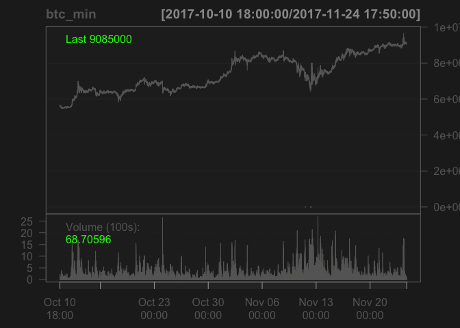
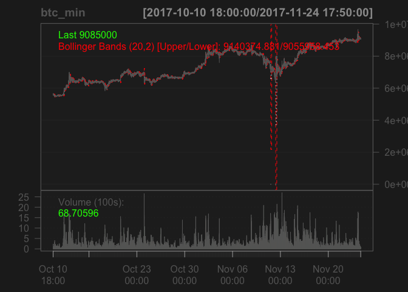

만들지 말고 활용하기...
================

``` r
require(rjson)
```

    ## Loading required package: rjson

``` r
require(xts)
```

    ## Loading required package: xts

    ## Loading required package: zoo

    ## 
    ## Attaching package: 'zoo'

    ## The following objects are masked from 'package:base':
    ## 
    ##     as.Date, as.Date.numeric

``` r
require(highcharter)
```

    ## Loading required package: highcharter

    ## Highcharts (www.highcharts.com) is a Highsoft software product which is

    ## not free for commercial and Governmental use

``` r
require(quantmod)
```

    ## Loading required package: quantmod

    ## Loading required package: TTR

    ## Version 0.4-0 included new data defaults. See ?getSymbols.

``` r
# read json file
xts_from_json <- function(tag, file) {
  json_data <- fromJSON(file=file)
  json_data <- as.data.frame(do.call('rbind', json_data))
  col_name <- function(name) {
    paste(tag, name, sep = '.')
  }
  colnames(json_data) <- c('time', col_name('Open'), col_name('Close'), 'High', 'Low', 'Volume')
  json_data[,1] <- as.POSIXct(json_data[,1]/1000, origin = "1970-01-01")
  btc_min <- xts(json_data[, -1], order.by = json_data[, 1])
  return (btc_min);
}

btc_min <- xts_from_json('BTC', '171125_btc_min.json')
```

    ## Warning in strptime(xx, f <- "%Y-%m-%d %H:%M:%OS", tz = tz): unknown
    ## timezone 'zone/tz/2017c.1.0/zoneinfo/Asia/Seoul'

``` r
bch_min <- xts_from_json('BCH', '171125_bch_min.json')


{
# barChart(btc_min)
candleChart(btc_min)
addMACD()
addBBands()
}
```



``` r
{
  # highchart() %>% 
  # hc_add_series(btc_min)
  #hc_add_series(y, type = "ohlc") %>% 
  #hc_add_series(z, type = "line")
}
```

    ## NULL
