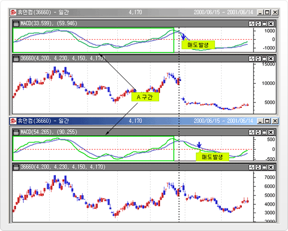

# 기술적분석의 기본가정

* 주가는 그 주식에 대한 수요와 공급에 의해서만 결정된다.
* 수요와 공급은 그것이 합리적이든 비합리적이든 수없이 많은 요인에 의해 결정된다.
* 주가의 사소한 변동을 무시한다면 주가는 상당히 오랫동안 같은 방향으로의 움직임을 지속하려는 경향을 갖고 움직인다.
* 시장동향은 수요와 공급의 변화에 의해서만 이루어진다.
* 수요와 공급의 변화는 그 원인이 무엇이든 간에 시장행위를 현상화한 도표상에 조만간 나타난다.
* 도표상에 나타나는 모든 형태의 주가 모형은 반복하려는 경향을 가지고 있다.

# 수정주가

## 수정 주가의 필요성

기본적으로 가격(주가)의 연속성이 유지되어야 하나, 하루나 일정 부분이 누락된 데이터나 시장 요인(유상, 무상 증자, 배당, 액면분할 등)에 의해 과거주가와 현재주가간에 괴리가 발생할 수 있다. 기술적 지표를 적용하여 분석할 경우는 이러한 괴리된 데이터로 인해 지표의 왜곡현상이 일어나므로 수정주가를 이용한다.

단, 지지/저항선 등 실제 과거주가가 필요한 기술적 분석에서는, 수정주가를 이용할 경우 과거 데이터 값이 변화된다는 의미를 가지게 되어, 실제 형성된 가격과 또 다른 괴리를 나타나게 된다. 따라서 지지, 저항선 등에서는 수정되지 않은 주가를 이용한다.

## 개별 종목 주가의 수정 방법

기준가격과 전일종가의 차액을 기준일 이전 모든 가격에 일률적으로 차감하여 수정 하는 방법기준가격과 전일종가의 차액을 전일종가의 백분율로 환산해서 과거 데이터에 비율 만큼 곱하여 주는 수정 배율을 사용하는 방법 

ex) 현물주가에서 사용 수정하기 전 주가를 사용할 경우 기술적 지표 중 하나인 MACD 지표가 기준선 을 하향 돌파하며 잘못된 매도 신호를 보이고 있으나, 수정후에 보이는 지표에서는 이와 같은 급락 향상은 사라지게 되어 지표의 왜곡현상이 없어진다. 여기서 주시할 점은 두 경우의 A구간 에서 보듯이 수정주가를 사용하더라도 과거 MACD 흐름과 수정되지 않은 주가의 과거 MACD 흐름은 동일하다는 것이다.

# 선물지수 수정

## 수정 주가의 필요성

선물지수는 만기가 3, 6, 9, 12월로 지수의 사용가능한 기간도 3개월 정도이다.
따라서 과거로부터 계속해서 연결하는 지수의 필요성이 있는데, 여기에는 Rollover(차기근월물로 이월)되는 시점에서 근월물과 차근월물간의 Gap(괴리)가 존재한다.
이 괴리를 무시하고 그냥 연결하게 되면 이를 근월물지수(Nearest Futures)이라 하고, 이는 실제 괴리 주가를 가지고 있어 지지/저항 분석등에 사용할 수 있다.
한편, 괴리를 조정 (일반적으로 차감)하여 연결선물지수(Continuous Futures)를 작성할 수 있는데, 이는 과거의 주가 패턴 및 추세를 그대로 반영하고 있기 때문에 기술적 지표의 적용이나 트레이딩 시스템에 적용할 수 있다.