# 추세선

추세(trend)란 가장 단순한 의미로 시장의 진행방향(direction of market)을 말하며, 따라서, "추세 분석" 이란 주가의 "진행방향"을 분석하는 작업이다.

## 추세 분류

### 상승추세

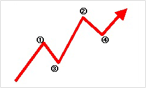

a. 연속하는 고점(①-②)들과 연속하는 저점(③-④)들이 높아진다.

b. 수급측면 - 매수세력이 강하다

### 하락추세

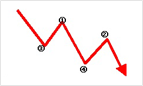

a. 연속하는 고점(①-②)들과 연속하는 저점(③-④)들이 낮아진다.

b.수급측면- 매도세력이 강하다.

### 비추세(=횡보국면)

a. 연속하는 고점(①-②-③)간의 관계와 저점(④-⑤-⑥)간의 관계가 명확하지 않으며, 거의 수평등락 과정이 반복되거나 수렴과정이 진행된다.

b. 수급측면 - 매수/매도가 균형을 이룬다.

## 추세선 작성하기

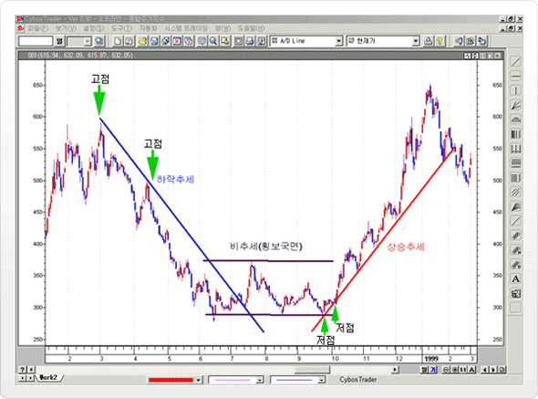

### 상승추세선 작성하기

상승하는 연속적인 두개의 저점(장중 저가를 포함) 잇고, 오른쪽으로 쭉 연장해서, 다음 나오는 세번째 저점에서 지지를 받으면 "상승추세선"으로 판단한다.

### 하락추세선 작성하기

하락하는 연속적인 두개의 고점(장중 고가를 포함)을 잇고, 오른쪽으로 쭉 연장해서, 다음 나오는 세번째 고점에서 저항을 받으면 "하락추세선"으로 판단한다.

## 장기 / 중기 / 단기 추세 읽는 법

### 추세형성기간에 따른 추세 분류

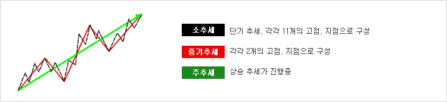

| 분류  | 추세형성 기간 |
|---|---|
| 주추세(Major Trend),장기추세  | 1년 이상 지속되는 추세, 우리나라에서는 대세상승, 대세하락이라고도 통용됨  |
| 중기추세(Intermediate Trend) | 1-3개월정도 지속되는 추세 |
| 소추세(Minor Trend)/단기추세(Nearterm Trend) | 2-3주 정도 지속되는 추세 |

## 추세의 전환 파악하기

### 추세전환의 원리

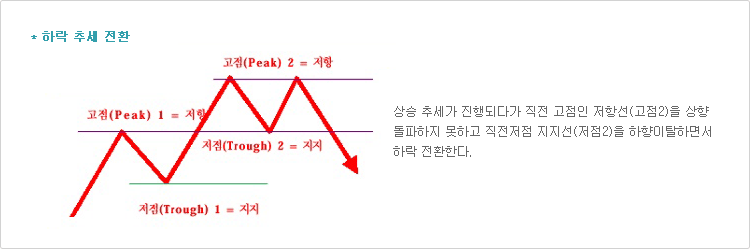

a. 상승추세에서 직전 고점 저항선을 상향돌파하지 못하게 되면, 하락추세나 횡보국면으로 전환될 가능성이 높다.

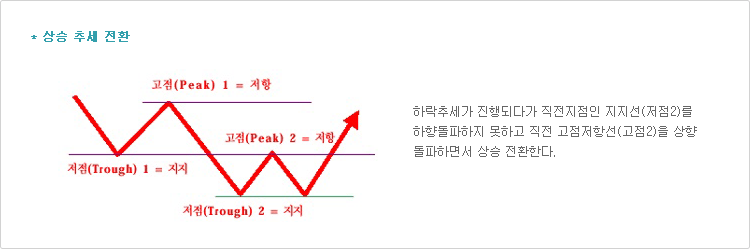

b. 하락추세에서 직전 저점 지지선을 하향돌파하지 못하게 되면, 상승추세나 횡보국면으로 전환될 가능성이 높다.

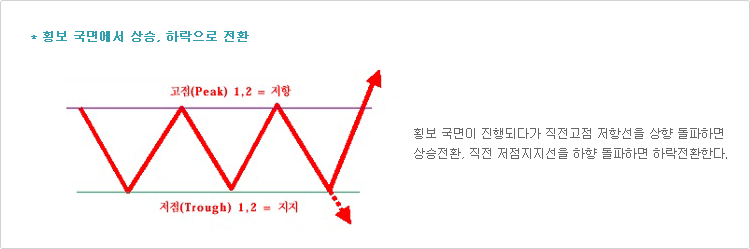

c. 횡보국면에서는 고점 저항선을 상향돌파하면 상승추세로 전환될 가능성이, 저점 지지선을 하향 돌파하게 되면 하락추세로 전환될 가능성이 높다.

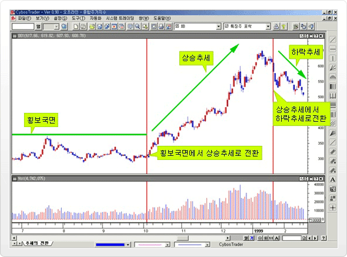

위의 그림은 종합주가지수 일간차트를 사용하였으며, 횡보국면을 일정기간 지속하다가 횡보국면을 상향 돌파하면서 상승추세로 
전환되었으며 연속되는 고점,저점이 높아지는 상승추세가 진행되었다. 그 뒤 직전 고점을 상향 돌파하지 못하는 국면이 발생하였고 
직전 저점인 지지선에서 지지를 받는 듯하였으나, 이내 하향 돌파하여 하락추세가 진행되는 것을 나타내고 있다.

### 추세전환 확인 방법

a. 종가에서 지지/저항선을 이탈하는 것이, 장중에 이탈하는 것보다 추세전환 가능성이 더 크다.
b. 주가가 일정비율(1%, 3%, 5%, 일반적으로 3% 사용) - 3% 이상 이탈하면 전환이 확인된 것으로 간주한다.(3% 원리)
c. 주가가 일정기간(1일,3일,5일 등) 지지, 저항선을 계속해서 벗어나면 추세 전환될 가능성이 크다.
d. 상승 추세전환의 경우, 거래량이 급증하면서 이탈할 경우 추세전환 가능성이 크고, 하락 추세전환의 경우, 거래량이 급감하면서
이탈할 경우 추세 전환 가능성이 크다.

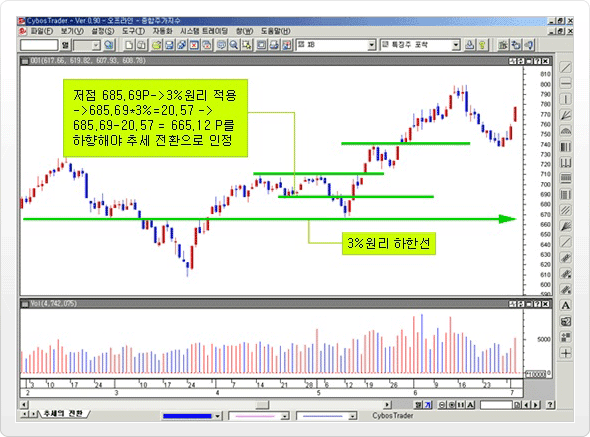

위의 그림은 종합주가지수 일간 차트를 사용하였으며, 지수는 3%원리에 벗어나지 않는 하락으로 추세 전환이 인정되지 않는다. 
또한, 지지선 이탈 기간도 3일로 추세 전환으로 확인하기에 힘들다.

### 주가의 일시적인 되돌림 현상

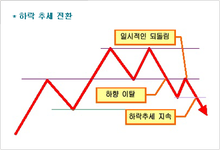

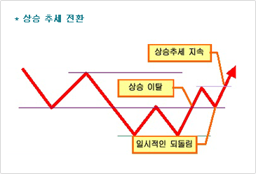

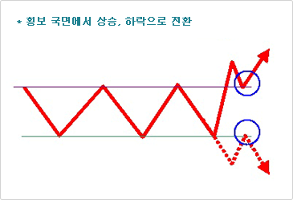

추세전환 과정에서, 추세 이탈 이후 다시 지지/저항선으로 되돌아오는 특성으로서, 늘 발생하는 것은 아니지만, 
일단 발생했다면 추세이탈을 확인할 수 있다.

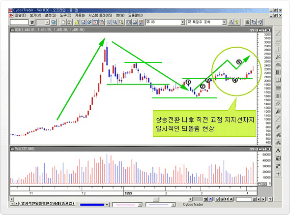

위의 그림에서 증권업 지수가 하락추세(①)에서 상승추세(②)로 전환되는 과정에서, 직전 고점을 상향 돌파(③)하는 추세전환이
발생하고 난 뒤에 다시 직전 고점까지 되밀리는 "일시적인 되돌림 현상"(④)이 발생했다. 그 뒤 직전 고점 지지선에서 지지를 받고 
상승추세를 이어가(⑤) 추세전환을 확인할 수 있다.

### 팬의 원리, 부채꼴의 원리(Fan Principle)

주가의 추세전환은 급하게 발생하는 경우도 있지만, 점진적인 추세변화가 동반되는 경우가 많다.

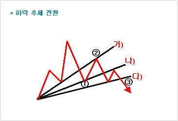
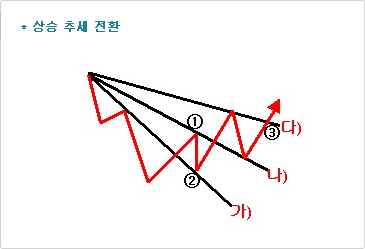

추세를 이탈하는 파동이 직전 저점에서 지지를 받고 되돌림 현상이 발생하나 추세선, 내에 재진입하지 못하는 되돌림현상이 두번(①②.) 반복되면서 추세전환 되는 경우이다.

가).나).다) : 상승/하락 추세선 ①② : 되돌림 현상, ③ : 3개의 상승/하락 Fan을 벗어나면서, 추세전환이 이루어지는 시점

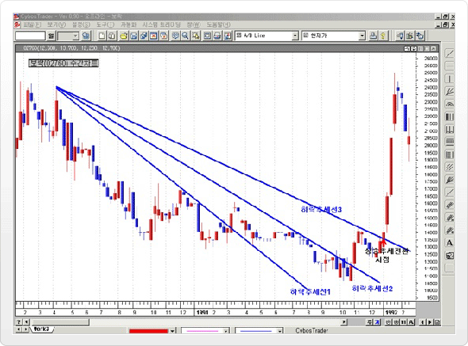

위의 그림은 팬원리를 활용한 보락(02760) 주간차트이다.

### 추세의 강도 파악하기

주가추세의 형성과 마찬가지로, 현재 가파른 추세선인 경우 주가가 추세선을 이탈해서 추세선의 의미를 약화시킬수 있으며, 완만한 기울기의 추세선인 경우는 좀더 기울기가 큰 추세선으로 작성될 가능성이 커진다.

일반적으로 45도 추세선이 기술적분석에서 가장 큰 의미를 두고 있으며, 45도 보다 큰 경우 가파른 추세선으로, 45도 보다 작은 경우 완만한 추세선으로 간주한다.

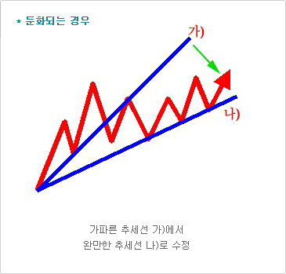

둔화되는 경우 - 가파른 추세선 가)에서 완만한 추세선 나)로 수정

가속되는 경우 - 완만한 추세선 가)에서 가파른 추세선 나)로 수정

# 지지저항선

~추세(trend)란 가장 단순한 의미로 시장의 진행방향(direction of market)을 말하며, 따라서, "추세 분석" 이란 주가의 "진행방향"을 분석하는 작업이다.~

## 지지/저항선 작성하기

### 추세 분류

지지(Support) - 주가 하락을 저지할 수 있는 실질적인 또는 잠재적인 "매수세"가 예상되는 시점으로서, "저점"에서 주가를 밑에서 
떠받치는 "지지(Support)" 역할을 한다.

저항(Resistance) - 주가 상승을 저지할 수 있는 실질적인 또는 잠재적인 "매도세"가 예상되는 시점으로서, "고점"에서 주가를 위에서 
내려누르는 "저항(Resistance)" 역할을 한다.

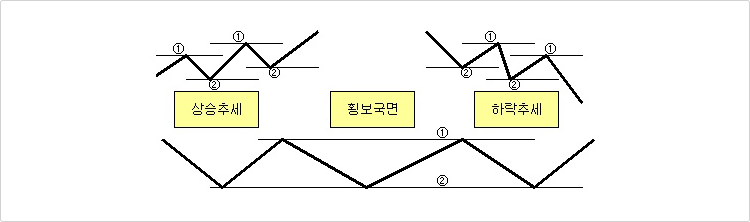

(①저항, ②지지)상승추세에서는 저점(①)인 지지선을 형성한 이후 직전 고점(②)인 저항선이 쉽게 상향 돌파,
하락추세에서는 고점(②)인 저항선을 형성한 이후 직점 저점(①)인 지지선이 쉽게 하향 돌파,
횡보 국면에서는 고점(②)인 저항선과 저점(①)인 지지선을 돌파하지 못함

## 지지/저항의 강도 파악하기

매매에 실패한 거래량이 많을수록 지지/저항의 강도는 강해진다. - 거래가 많이 이루어진 가격수준이 그렇지 않은 것 보다 지지/저항의 
강도가 강하다.

단기적인 저점/고점 보다는 장기적인 고점/저점이 신뢰성이 높다. - 단기적인 고점/저점은 주가의 작은 파동에 의해서도 쉽게
무너질 수 있기 때문이다.

여러 번 돌파 시도된 저점/고점은 지지력과 저항력이 약화된다. - 돌파시도가 자주 일어난다는 것은 그 가격수준에서 손바뀜 현상이
일어난다는 것을 의미하므로 잠재적인 매도/매수는 점차 소멸된다. 일반적으로 3번정도 돌파시도가 되면 돌파될 가능성이 높다.

완만한 변화를 보인 저점/고점보다 주가가 급격한 변화를 일으킨 저점/고점이 더욱 강력한 힘을 갖는다. - 상승세를 보이던 주가가 
일정수준에서 더 이상 상승하지 못하고 급락하는 것은 그만큼 그 가격수준에서 매도세가 강하다는 것을 의미한다.

지지나 저항 수준으로부터 거리가 멀어질수록 강한 지지/저항을 받는다. - 상승하던 주가가 저항 수준 에서 강력한 매도세를 만나 
하락 반전하였을 때, 하락폭이 클수록 저항 수준에서 매수한 투자자는 매수가 잘못됐다는 것을 인식하므로 저항선으로서의 역할이 강화된다.

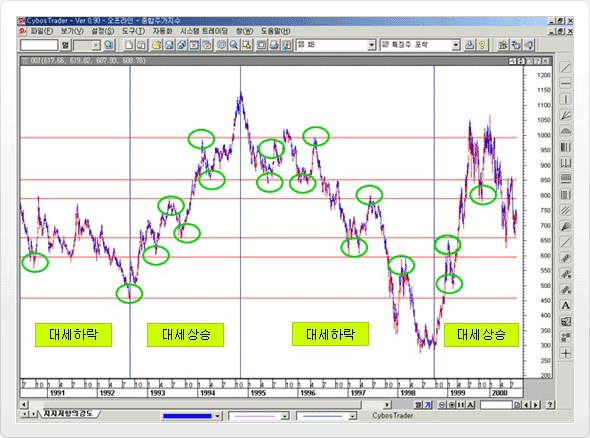

위의 그림은 종합주가 지수 일간차트를 사용하였으며, 1991년도부터 2000년도까지 장기 주추세 상으로 보면 대세하락 -> 
대세상승->대세하락->대세상승의 일련의 추세전환과정을 거치고 있다. 강도가 강한 장기 지지, 저항선을 수평선으로 지지,
저항 시점을 원호로 표시하였는데 그림에서보면 주추세의 방향과 관계없이 중요한 지지, 저항을 하는 것을 알수 있다.#

# 추세대

## 채널 작성하기

### 추세 분류

상승 또는 하락 추세선을 그린 뒤, 추세선 형성 고점 또는 저점까지, 추세선을 "평행 이동"시킨다.

CYBOS Trader나 CYBOS2002에서는 추세선을 긋고난 후, "Ctrl 키"를 누른 상태 에서 추세선을 마우스로 끌어서 원하는 위치에 
놓으면 평행선을 그을수 있다.

상승추세선의 상단은 "저항선", 하단은 "지지선"의 역할을 한다.

## 추세 전환 파악하기

추세대 VS 지지선/저항선/추세선 추세대는 상단과 하단의 밴드 범위에서 주가가 움직일 가능성이 커서 상단에서 저항을 받은 주가는 
하단까지, 하단에서 지지를 받은 주가는 상단까지 움직이는 경향을 나타낸다.

추세전환이란? 상승추세대의 경우 하단에서 지지를 받은 주가가 상단까지 상승하지 못하고 하락 전환 되면 하단을 이탈할 가능성이
커져서 "추세전환"을 예고하게 된다.

상승 추세 강화란? 상승추세대의 상단까지 상승한 주가가 상단을 상향 돌파하고 상승을 이어가게 되면"상승 추세 강화"로 본다.

## 추세 강도 파악하기

지지/저항을 많이 받을수록, 형성기간이 길수록 상승/하락 추세의 강도가 커진다.

## 추세대를 이용한 최소 목표치 설정법

주가가 추세선을 이탈하는 경우, 향후 주가가 어느 정도까지 진행될지, 미리 예상 가격을 설정해 볼 수 있다. 단, 최소 목표치라는 
의미대로 주가가 그 목표치까지 진행될 "가능성이 있다"는 의미만 있으므로, 진행되는 과정에 중요한 지지/저항이 있는지 함께 검증해보아야 한다. (최소 목표치 : A)

### 지지, 저항선 활용

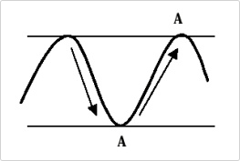

지지선에서 저항선까지, 저항선에서 지지선까지를
최소 목표치로 설정할 수 있음.

### 채널, 이탈의 경우

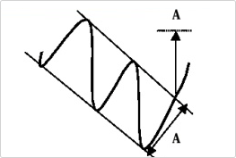

지지선에서 저항선까지, 저항선에서 지지선까지를
최소 목표치로 설정할 수 있음.

### 비추세 국면

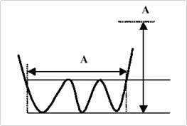

비추세 국면 형성기간 길이 만큼을 이탈 이후
바닥권부터 수직거리를 최소 목표치로 설정

### 헤드 앤 쇼울더

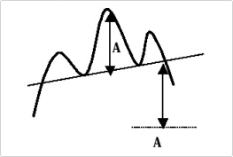

헤드(head)에서 넥라인(neck line)까지 거리를
이탈 이후 최소 목표치로 설정

### 삼각형 패턴

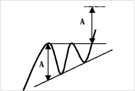

삼각 수렴형의 밑변 길이를 최소 목표치로 사용.

### 깃발형 패턴

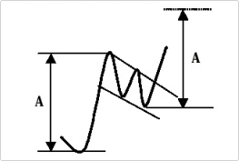

깃발형 형성전 상승한 폭을 이탈 이후 바닥권으로
부터 최소 목표치 설정

### 이중 바닥형

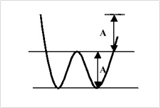

이중바닥형 이탈 전 폭을 이탈이후의 최소
목표치로 사용.

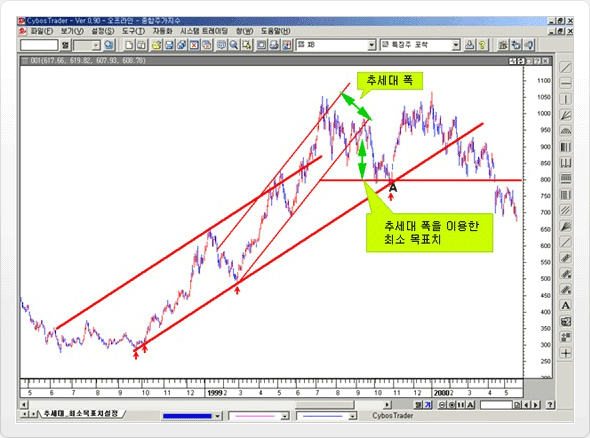

중기상승 추세대를 이탈한 시점에서 추세대 폭을 이용하여 최소목표치를 설정하면 지수는 최소목표치 이하로 하락하였지만, 
장기상승 추세대에서 지지를 받고 하락이 둔화됨을 보여준다.-A 시점

# 추세진행중 조정

## 의미

추세 진행 시 계속 상승/하락 하는 것이 아니라, 일정수준의 추세가 진행되고 난 뒤에 다시 추세를 진행 하기 위해서 잠시 쉬어가는
조정파동으로서, 상승추세에서는 하락 조정, 하락추세에서는 반등을 의미 한다.

## 조정폭과 그 활용

일반적으로 기존 추세의 50%(1/2) 조정이 가장 보편적이며 그 외에, 33%(1/3), 66%(2/3)조정도 자주 사용된다. 
이러한 예상 조정비율을 사용하여, 상승추세인 경우는 저점매수기회로, 하락추세의 경우는 고점매도의 기회로 활용한다.

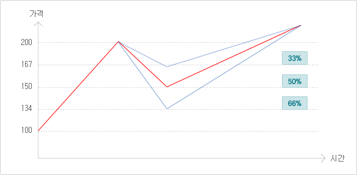