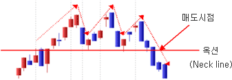
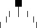

# Line Chart

방법 : 종가만을 연결한 선
서로 다른 종목을 비교 분석하거나 주가의 흐름을 명확하게 파악하기 위해 사용

# Bar Chart

방법 : 시장의 움직임을 하나의 막대로 표시해 시가, 고가, 저가, 종가를 표시
서로 다른 종목을 비교 분석하거나 주가의 흐름을 명확하게 파악하기 위해 사용 사용

# Candle stick chart

## Candle stick chart 의 기본

일본에서 개발되어 미국등 선진국에서도 사용되고 있으며, 한국에서 가장 많이 사용하는 차트

표시법 : 시가, 고가, 저가, 종가를 모두 표시하며 종가가 시가보다 높으면(주가가 상승한 날) 양봉(White Body)으로 표시하고,
종가가 시가보다 낮으면(주가가 하락한 날) 음봉(Black Body)이라 한다.

일반적으로 상승은 빨간색, 하락은 파란색을 사용하지만 사용자의 기호에 따라 다르다.
시가와 종가까지를 몸통(body)라 하고 고가와 종가/고가와 시가까지를 윗그림자(upper shadow)라 하고, 저가와 시가/저가와 종가까지를 아래그림자(lower shadow)라 한다. 몸통의 크기와 그림자의 길이가 캔들스틱 분석의 기초가 된다.

## 사께다 전법

### 삼산(三山) = 삼봉천정형

이 패턴은 큰 천정을 형성하는 대표적인 모형으로 주가가 크게 상승하고 난 후 매입 세력이 강력한 가운데 더 이상 상승하지 못하는 상태이다. 이 패턴의 확률은 매우 높지만 자주 나타나지 않는 특징을 가지고 있고 1년에 한 번 정도 형성되는 것이 보통이며, 대체로 형성되는데 1개월 이상 소요된다. 이러한 패턴 은 향후 대세하향이 예상되기 때문에 삼산 모형에서 지지선인 목선(네크라인)이 결정 적인 매도 시점이 된다.

### 삼천(三川) = 삼봉바닥형

이 패턴은 대세 바닥을 형성하는 모형으로 삼산과 정반대되는 개념이다. 주가가 장기간 크게 하락해 오면서 낮은 수준에서 주가가 바닥권을 형성한 후 비교적 큰 폭의 등락을 보이는 모형이다. 따라서 주가가 수개월간 하락한 후 나타나게 되며 삼천 모형에서의 저항선인 목선 돌파 시점이 매수적기가 된다.

### 삼공(三空) = 갭(Gap)

주가가 상당한 기간을 상승하는데 있어 점차 인기가 가열되어 공간을 3회 연속 만드는 경우를 말한다. 주가가 장기간에 걸쳐 상승을 보인 후 마지막 상승선 다음에 하락선이 전일의 시가보다 높은 시가에서 출발하여 전일의 종가 아래로 떨어지는 모양이 나타나거나, 십자형인 +형이 나타나면 전형적인 천정의 패턴이 매도시점이 된다.

### 삼병(三兵)

주가 흐름의 큰 전환을 암시하는 모형으로 적삼병과 흑삼병으로 구분된다. 적삼병은 오랜기간 침체 국면에서 평행으로 움직이던 주가가 단기간에 걸쳐 양선3개가 출현하는 경우를 말하며, 바닥권에서 움직임을 끝내고 이탈하는 신호로 해석한다. 이 패턴은 인기가 있었던 종목이 장기간에 침체국면에서 바닥권을 탈출할 때, 전형적 으로 출현하며 반드시 바닥권에서 출현하여야 한다.
흑삼병은 적삼병과 대비되는 패턴으로 주가가 큰 폭으로 상승해 고가권에서 음선이 3회연속 출현하는 경우를 말하며, 고가권에서 출현 시 앞으로 급락으로 이어질 확률이 높다. 이 패턴도 적삼병과 같이 해석 시 유의해야 할 점은 장기간에 걸친 주가 상승과 고가권에서 출현하여야 한다.

### 삼법(三法)

이 패턴은 큰 천정을 형성하는 대표적인 모형으로 주가가 크게 상승하고 난 후 매입 세력이 강력한 가운데 더 이상 상승하지 못하는 상태이다. 이 패턴의 확률은 매우 높지만 자주 나타나지 않는 특징을 가지고 있고 1년에 한 번 정도 형성되는 것이 보통이며, 대체로 형성되는데 1개월 이상 소요된다. 이러한 패턴은 향후 대세하향이 예상되기 때문에 삼산 모형에서 지지선인 목선(네크라인)이 결정적인 매도 시점이 된다.

### GAP

상승갭 : 금일의 저가가 전일의 고가보다 높은 것
하락갭 : 금일의 고가가 전일의 저가보다 낮은 것 

## GAP의 종류

일반 갭(Common Gap) : 비추세 구간(Trading Range)에서 형성되는 갭으로 큰 의미가 없다.

돌파 갭(Breakaway Gap) : 비추세 구간을 돌파하는 시점에서 자주 발생하는 갭으로서 중요한 의미를 갖는다. 흔히 거래량의 증가를 동반하며 수일 내에 주가가 다시 갭을 채우지 않아야 큰 의미를 갖는다.

진행 갭(Runaway Gap) : 주가가 상승 탄력이 아주 강해지면서 발생하는 갭이다.

소멸 갭(Exhaustion Gap) : 주가가 고점이나 저점을 형성하는 과정에서 발생하는 갭으 로 추세전환을 확인할 수 있다.

그러나 진행 갭과 소멸 갭은 그 당시에 확인하기 힘들며 주가가 정점에서 전환하면 갭을 채울때가 되서야 구분할 수 있다.

## 반전형 패턴

| 상승전환  | 하락전환  |
|---|---|
| 하나의 봉 | 하나의 봉 |
|해머(hammer)  작은 몸통(양봉이나 음봉)과 윗꼬리가 없으며 긴 아래 꼬리로 형성 --> 하락추세에서 형성| 행잉맨(hanging man)  작은 몸통(양봉이나 음봉)과 윗꼬리가 없으며 긴 아래 꼬리로 형성 --> 상승추세에서 형성|
| 반전해머(inverted hammer)  작은 몸통(양봉이나 음봉)과 아래꼬리가 없으며 긴 윗 꼬리로 형성 --> 하락추세에서 형성| 유성(shooting star)   작은 몸통(양봉이나 음봉)과 아래꼬리가 없으며 긴 윗 꼬리로 형성 --> 상승추세에서 형성|
|도찌(doji)와 잠자리형(dragonfly doji)   도찌(시가=종가)는 반전형 패턴으로 전후의 봉형태와 결합하여 사용. Dragonfly doji(시가 = 종가 = 고가)는 해머에서 몸통이 없는 형태로 하락 중 상승반전형임.| 도찌(doji)와 비석형(gravestone)  도찌(시가=종가)는 반전형 패턴으로 전후의 봉형태와 결합하여 사용. 비석형(시가 = 종가 = 고가)는 유성형에서 몸통이 없는 형태로 상중 하락반전형임.|
|두개의 봉|두개의 봉|
|상승 장악형(bullish engulfing pattern)  작은 음봉 이후 긴 양봉이 직전 음봉을 완전히 덮어쓰는 형태--> 하락추세에서 형성|하락 장악형(bearing engulfing pattern)  작은 양봉 이후 긴 몸통이 직전 음봉을 완전히 덮었는 형태 --> 상승추세에서 형성|
|관통형(piercing pattern)  음봉 이후 양봉이 직전 음봉 몸통의 반 이상을 덮어쓰는 형태--> 하락추세에서 형성|흑운형(dark cloud cover)  음봉 이후 양봉이 직전 음봉 몸통의 반 이상을 덮어쓰는 형태--> 상승추세에서 형성|
|강세형 하라미(bullish harami)와 강세형 하라미 크로스(bullish harami cross)  두 형태의 차이는 음봉 이후 봉이 도찌냐에 따라 결정됨. 강세형 전환 패턴|역세형 하라미(bearish harami)와 약세형 하라미 크로스(bearish harami cross)  두 형태의 차이는 양봉 이후 봉이 도찌냐에 따라 결정됨. 약세형 전환 패턴|
| 세개의 봉 | 세개의 봉 |
|샛별형(morning star)과 도찌형 샛별(morning doji star)  긴 음봉 이후 갭(gap)을 동반한 작은 몸통(음봉이나 양봉) 형성. 그 뒤 양봉이 출현하면서 전전 음봉 안까지 진입|저녁별형(evening star)와 도찌형 저녁별(evening doji star)  긴 양봉 이후 갭(gap)을 동반한 작은 몸통(음봉이나 양봉) 형성. 그 뒤 음봉이 출현하면서 전전 양봉 안까지 진입|
|적삼병(three white soliders)와 흑삼병(three black soliders)  적삼병 : 세개의 양봉이 연속적으로 발생하면서 종가가 점점 높아지는 형태 --> 상승 전환형 패턴 흑삼병 : 세개의 음봉이 연속적으로 발생하면서 종가가 점점 낮아지는 형태 --> 하락 전환형 패턴|Advanced Block  적삼병(three white soliders)과 유사한 형태이나 advance block은 상승추세에 발생하며, 적삼병은 하락 추세에서 발생함. 두번째, 세번째 양봉이 상승 탄력의 약화 (윗 그림자가 길어지고 양봉의 몸통이 적어짐)를 나타내어 하락 전환형 패턴임|

## 지속 패턴

### Rasing three method & Falling three method

Rasing three method : 긴 양봉 출현 이후 작은 세개의 음봉이 이어지고 재차 긴 양봉이 직전 양봉을 돌파하는 형태 --> 상승 지속 패턴
Falling three method : 긴 음봉 출현 이후 작은 세개의 양봉이 이어지고 재차 긴 음봉이 직전 음봉을 돌파하 형태 --> 하락 지속 패턴

### On Neck & In Neck Line

on neck line : 하락 진행형 패턴으로 두번째 양봉이 전일 음봉의 저가에 못 미치는 형태.
In neck line : 하락 진행형 패턴으로 두번째 양봉이 전일 음봉의 저가에 근접하는 형태.

### Upside Tasuki Gap & Downside Tasuki Gap

Upside Tasuki Gap : 양봉 출현 이후 상승갭이 발생하면서 상승한 뒤 재차 음봉이 출현하는데 음봉이 갭을 채우지 않고 상승세를 이어가는 패턴
Doenside Tasuki Gap : 음봉 출현 이후 하락갭이 발생하면서 하락한 뒤 재차 양봉이 출현하는데 양봉이 갭을 채우지 않고 하락세를 이어가는 패턴

### Seperating Lines

Separating Lines : 상승이 진행되다가 음봉이 출현한 뒤 음봉 시가에서 재차 양봉이 출현하면서 상승세를 이어가는 패턴
반대로 하락이 진행되다가 양봉이 출현한 뒤 양봉 시가에서 재차 음봉이 출현하면서 하락세를 이어가는 패턴

## Filtering 기법(=Candle stick power guide)

Filtering 기법이란?

캔들스틱 분석의 가장 핵심은 진정한 전환형이나 진행형을 구분할 수 있느냐 하는 것이다. 그 이유는 캔들스틱 패턴을 분석하다 보면 수많은 속임수형 패턴이 발생하기 때문이며, 따라서 "주가가 어느 정도 상승한 이후에만 발생하는 전환형 패턴만 인정"과 같은 조건을 추가하는 Filtering 기법이 함께 사용 된다.

예를 들어 널리 알려진 기술적 지표인 스토캐스틱(Stochastick)지표의 과매수(80 이상)와 과매도(20 이하)구간에 서만 전환형 패턴을 인정하는 방법도 좋은 필터링 방법이다.

## 예

위 그림은 신동아화재 일간차트에 캔들스틱 분석과 함께 스토케스틱 지표를 이용해서 필터링을 한 사례이다.
우선 주가에 번호가 붙어있는데 이는 캔들스틱 분석을 통한 전환형 패턴 형태가 발생한 시점을 가리키고 있다.
스토케스틱 필터링 조건은 스토케스틱(5,3,3)이 80 이상에서는 하락 전환형 인정, 20 이하에서는 상승전환형 인정을 적용하였다.

① Dark Cloud Cover : 두개의 봉으로 하락 전환형 패턴이 발생하였음.
- 스토케스틱 지표가 80 이상이 아니므로 전환형 패턴이 인정 안됨

② Bullish Engulfing Pattern : 두개의 봉으로 상승 전환형 패턴이 발생하였음.
- 스토케스틱 지표가 20 이하가 아니므로 전환형 패턴으로 인정 안됨

③ Bearish Engulfing Pattern : 두개의 봉으로 하락 전환형 패턴이 발생하였음.
- 스토케스틱 지표가 80 이상으로 전환형 패턴으로 인정

④ Bullish Engulfing Pattern : 두개의 봉으로 상승 전환형 패턴이 발생하였음.
- 스토케스틱 지표가 20 이하로 전환형 패턴으로 인정

⑤ Doji : 하나의 봉으로 전환형(여기서는 하락 전환형) 패턴 발생
- 스토케스틱 지표가 80 이상으로 전환형 패턴으로 인정

⑥ Bearish Engulfing Pattern : 두개의 봉으로 하락 전환형 패턴이 발생하였음.
- 스토케스틱 지표가 80 이상이 아니므로 전환형 패턴으로 인정 안됨

⑦ Hanging Man : 하나의 봉으로 상승전환형 패턴 발생
- 스토케스틱 지표가 20 이하가 아니므로 전환형 패턴으로 인정 안됨

⑧ Bullish Engulfing Pattern : 두개의 봉으로 상승 전환형 패턴이 발생하였음.
- 스토케스틱 지표가 20 이하로 전환형 패턴으로 인정

⑨ Inverted Hammer : 하나의 봉으로 상승 전환형 패턴 발생
- 스토케스틱 지표가 20 이하가 아니므로 전환형 패턴으로 인정 안됨

# P&F Chart

## 요약

P&F 차트는 시간과 거래량 개념을 무시하고 가격만을 주 값으로 한 차트이다.

장점 - 지지와 저항수준 쉽게 파악 장기추세 예측이 편리 추세 반전 시점을 찾아내어 매매시점 결정이 용이

## 표시 방법

한칸의 가격폭을 결정하되 해당 주가의 가격수준을 판단하여 고주가이면 폭을 크게 하고 저주가이면 작게한다.

주가가 상승할때는 X표로, 하락할때는 ○표로 구분하여 주가가 계속 상승할때는 X표 만을, 계속 하락할때는 ○만을 Y축에 표시한다.

주가가 상승에서 하락으로 반전될 때는 X표에서 ○표로 바꾸되 한칸 아래에 표시하고 하락에서 상승으로 반전될 때는 ○표에서 X표로 바꾸되 한칸 위에 표시한다.

C처럼 행을 바꾸어 X표에서 ○표(또는 ○표에서 X표)로 바꾸어 표시되기 위해서는 2포인트 가격변화를 채용하였을 때는 2칸, 3포인트 가격변화를 채용하였을 때는 3칸의 가격변화가 필요하다. (보통 3포인트 변환임)

## 분석 방법

### 패턴 분석

보통의 주가차트에서 볼 수 있는 보합권의 경우와 마찬가지로 보합권의 상한을 저항선으로, 하한을 지지선으로 하며 이는 P&F차트 분석에서 중요한 의미를 갖는다. 즉, P&F챠트는 XXX가 이전의 XXX보다 상승한 시점에서 매수하고, OOO가 이전의 OOO보다 하회하는 시점에서 매도한다.

### 추세 분석
패턴분석은 종종 속임수가 있다. 이러한 속임수를 회피하기 위한 패턴분석의 보조수단으로서 추세선의 설정이 필요하다. P&F챠트의 추세선은 가격의 변화만을 나타내기 때문에 주가챠트의 추세선보다 더욱 중요한 의미를 갖는다.

### 목표치 계산
매입한 주식이 어느 정도 상승할 것이며 어느 정도에서 매도할 것인지, 또한 주식을 매도했다면 어느 수준까지 주가가 하락할 것인지를 전망하여 이를 측정하는 것이 목표치 계산이다. 계산방법으로는 추세선 이용법, 수평 계산법, 수직 계산법등이 있다.

# 삼선전환도

## 요약

주가상승이 이전 하락선 3개를 상향 돌파하는 경우에만 상승선을 표시하고 주가하락이 이전 상승선 3개를 하향 돌파하는 경우
하락선을 표시하여 이를 각각 상승 및 하락 신호로 본다.

## 해석

주가의 상승전환 및 하락전환을 빠르고 간편하게 포착하기 위한 기법으로, 투자자에게 매입 및 매도 신호를 분명히 제시해 주기
때문에 자동적으로 매매신호를 포착할 수 있다.

## 한계

증권시장 주변상황의 불안등으로 단시일내에 주가등락이 반복되는 경우 이용하기 부적합 주가가 지속적으로 또는 상,하한가와
같이 급격하게 변동하는 경우 부적합

## 극복 방법

10% Plan 병용법 : 주가가 상승할 때 최고가에서 10% 이상 하락하면 하락전환이 나타나지 않아도 매도하고, 반대로 하락 시
최저점에서 10% 이상 상승할 때 상승전환이 나타나지 않아도 매입하는 방법

# Candle volume chart

## 요약

캔들차트와 Equivolume 차트의 독특한 혼합 형태 - 캔들차트의 특성을 살려 색깔과 시가, 고가, 저가, 종가가 표현되고 Equivolume 차트의 특성을 살려 박스 크기를 거래량으로 표시

## 해석

Candlevolume 차트는 캔들챠트 분석에 준용하여 분석하는데 특히 거래와 관련된 움직임을 조합시켜 박스하나가 종합적으로 분석되어진다. Equivolume 차트에서 분석하듯이 저항선 수준에서 양봉의 Power Box가 나타나며 저항수준이 돌파되면 추세는 상승으로 지속되고, 반대로 지지선 수준에서 음봉의 Power Box가 나타나며 지지수준이 돌파되면 추세는 하락 반전될 확률이 높다고 분석을 하고 고점과 저점, 지지와 저항선 수준에서는 Candlesticks의 분석법에 준용하여 복합적으로 분석을 한다.

Power Box : 가로축이 좁고 세로축이 길다란 형태의 봉모양으로 에너지의 강함을 암시한다.

## 극복 방법

Candlevolume 차트의 작성은 기존의 캔들 차트(시가, 저가, 고가, 종가 포함)를 그리듯이 그리는데, 단 기존의 캔들차트에서 분리되어 그려지던 거래량을 Equivolume 차트에서와 같이 박스의 넓이로 표현하여 그린다.
