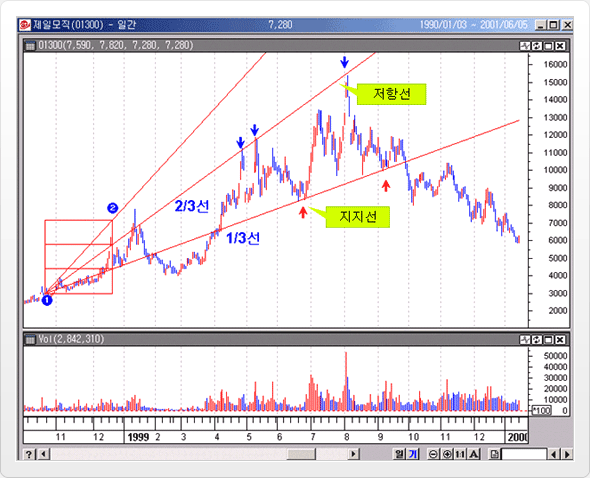
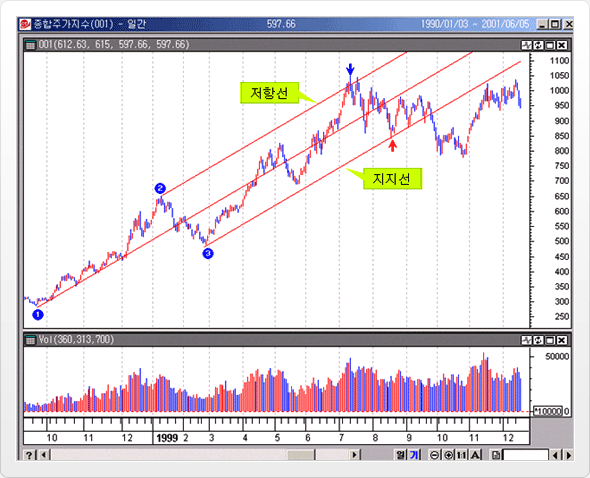
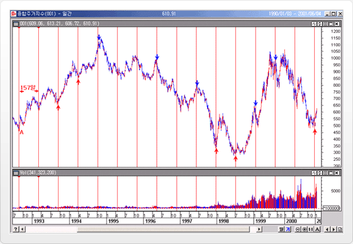
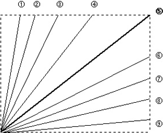
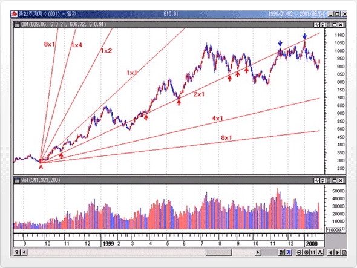
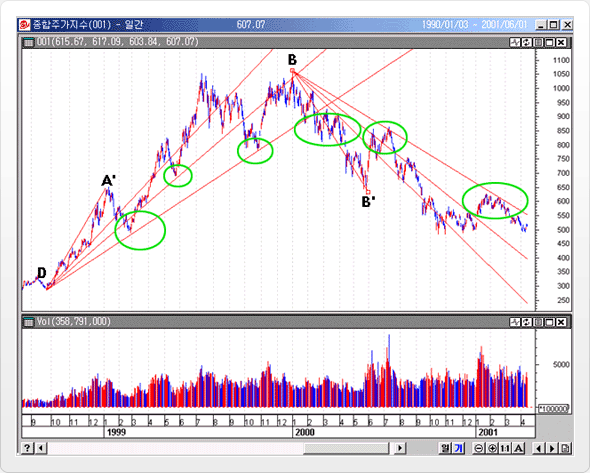
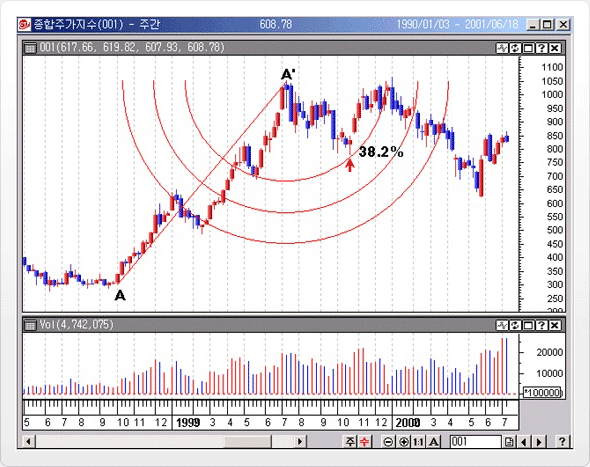
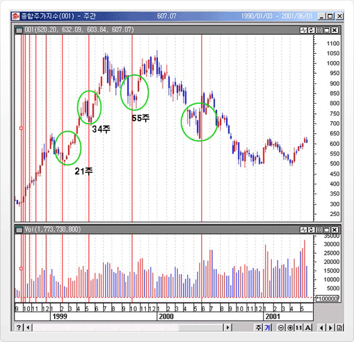
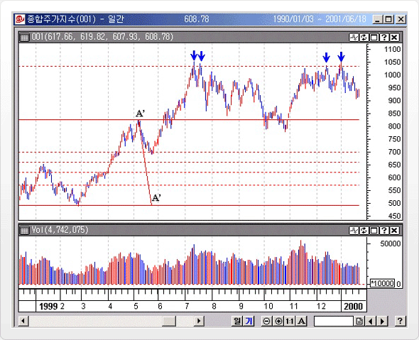
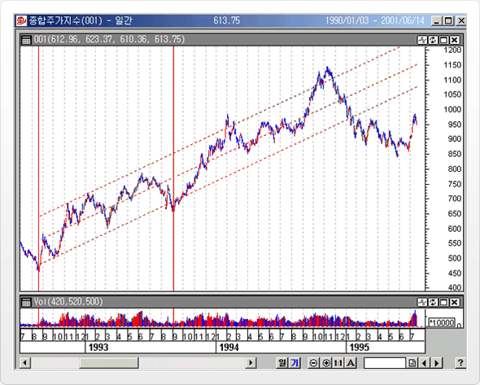

# Speed Line

## 요약

가격 움직임에 따라 정확히 3개로 균등 분할하여 나눈 선으로, 피보나치 팬라인의 구조와 비슷하다. 두가지 다 시간과 가격의 함수로 되어 있으며 추세가 진행될수록 진폭이 커지는 주가 특성을 이용하였으며, 다른점은 지지, 저항선을 얼마의 비율로 설정하느냐에
차이가 있다.

처음 추세선의 시작을 저점(①점) 에 두고 고점인 ②점을 다음 선택점으로 하면 3개의 선이 나란히 나타나는데, 여기서는 2/3선이 상승추세에서 저항선이 역할을 하고 있으며, 1/3선이 지지선의 역할을 하고 있는 것을 볼 수 있다.

# Andrew’s pitchfork

## 설명

앨렌 앤드류스(Dr. Alan Adrews)가 개발한 쇠스랑(Pitchfork)이란 의미의 채널 기법이다. 이 채널 기법은 3개의 극점을 이용하여 지지선과 저항선이 만들어 진다.

상승추세의 경우(저점 2개, 고점 1개) : 최근에 형성된 가장 저점 선택 → 이후 형성된 최고점 → 이후 형성된 (맨처음 선택한 저점보다 높은 두번째) 저점

하락추세의 경우(고점 2개, 저점 1개) : 최근에 형성된 가장 고점 선택 → 이후 형성된 저점 → 이후 형성된 (두번째에서 정한 저점 이후 형성된) 고점

위의 그림에서 보면 상승추세에서 앤드류스 피치포크는 먼저 최저점(①)을 선택하고 이후 고점(②)을 선택한 뒤, 세번째로 2차 저점인 ③를 선택하면 추세선이 생성되는데, 주가는 이 추세선을 중심으로 지지와 저항을 받으며 상승을 보이는 것을 알 수 있다.

# Cycle Zone

## 설명

주가가 일정한 주기를 가지고 변화한다는 가정을 기초로, 추세 형성 기간을 등간격 주기로 표시 한다. 저점-저점 / 고점-고점 / 저점-고점 등 의미 있는 주기는 그 다음 변화시점 형성에 영향을 주어 동일 기간이 경과된 뒤에 새로운 추세가 형성될 가능성이 크다는 것을 의미한다. Line 또는 Arc로 표현할 수 있다.

위의 그림은 종합주가지수가 92년 대세상승 초기 국면에서 형성된 두 저점(157일)을 이용해서 주기선을 작성한 사례이다. 그림에서 보면 이때 설정한 주기선이 그 다음 상승 국면에서 형성된 두 저점 형성 시기와 거의 일치하는 것을 알 수 있으며, 또한 고점 형성시기도 상당히 근접한 형성시기를 보여주고 있다. 최근까지의 추세를 파악해보더라도 초기에 설정한 주기선이 상당히 정확한 저점 및 고점(변화시점) 형성시기를 나타내고 있는 것을 볼 수 있다.

# Gann Fans

## 설명

W.D. Gann은 챠트의 가격 움직임을 연구하여 가격과 시간이 연계된 기하학적 각도와 비율로 시장의 가격변화를 예측할 수 있는 분석 방법을 고안하였다. 구체적인 방법으로 중요한 고점이나 저점에서 시간과 가격의 1대 1 대응(영업일수 기준)으로 고점이나 저점에서 대각선을 그리는데 여기서 가장 중요한 선은 45도 대각선이다. 즉, 저점이나 고점에서 45도 방향으로 진행하는 선(Gann Line)이 중심선 역할을 하며 중심선에 일정 비율(8등분)의 대각선 (부채꼴 모양)을 그려나가는 방법이 갠팬(Gann Fans)이다. 갠 팬은 총 9 개의 선으로 구성되며 구성은 다음과 같다.

①	1×8	82.5도

②	1×4	75도	

③	1×3	71.25도	

④	1×2	63.75도	

⑤	1×1	45도

⑥	2×1	26.25도

⑦	3×1	18.75도

⑧	4×1	15도

⑨	8×1	7.5도

Gann 은 위와 같은 각도를 관찰한 결과 시장의 추세가 진행되는 동안 각각의 각도가 지지와 저항 역할을 한다고 보았다.
즉 하나의 각도가 돌파되면 가격은 다음 각도로 이동하거나 집중된다고 분석한다.

종합주가 지수 일간챠트에다 상승추세 전환 시점 저점에서 갠팬을 작성하였다. 그림에서 보듯이 지수가 상승추세를 진행하는 동안 2x1선이 아주 유효한 지지선 역할을 하였으며 하락추세 전환 시점에서는 저항선 역할을 하는 것을 알 수 있다.

# Fibonacci

## 설명

주가가 일정한 주기를 가지고 변화한다는 가정을 기초로, 추세 형성 기간을 등간격 주기로 표시 한다. 저점-저점 / 고점- 고점 / 저점-고점 등 의미 있는 주기는 그 다음 변화시점 형성에 영향을 주어 동일 기간이 경과된 뒤에 새로운 추세가 형성될 가능성이 크다는 것을 의미한다. Line 또는 Arc로 표현할 수 있다.

종합주가 지수에 A점~A'점으로 연결되는 상승 Fibonacci fan과 B점~B'점으로 연결되는 하락 Fibonacci fan을 적용하였다. 위에서 보듯이 상승추세에서는 지지선 역할, 하락추세에서는 저항선 역할을 하고 있다.

## Fibonacci Arc

고점과 저점 또는 저점과 고점을 연결한 선을 중심선으로 피보나치 비율인 38.2%, 50%, 61.8%의 되돌림 타원을 그린다. 되돌림 타원이 중요한 지지, 저항 역할을 한다는 의미를 가진다.

위는 종합주가지수 주간차트에서 저점 A~고점A'로 Fibonacci Arc를 그은 것이다. 상승후 하락추세에서 38.2%선에서 지지를 받고 다시 상승한 것을 볼 수 있다.

## Fibonacci Timezone

피보나치 시간대는 수직선의 연속을 보여준다. 이 직선은 피보나치 간격 공간인 1, 2, 3, 5, 8, 13, 21, 34... 등으로 그려지는데, (일간이면 1일, 2일, 3일, … 144일…, 주간이면 1주, 2주, … 144주… 간) 해석 방법은 이 시간대에서 주가는 저점이나 고점을 형성할 가능성이 크다는 것을 의미한다.)

위의 그림은 종합주가지수 주간 차트를 사용하였으며 여기에 피보나치 시간대를 표시한 것이다. 그림에서 보듯이 상승 추세 시작점부터 21주,34주,55주 시점에서 주가는 정확히 저점을 형성하고 상승 추세로 전환되는 것을 알 수 있다. 이와 같이 피보나치 시간대는 "주가의 변화 시점"을 예측할 수 있게 해 준다.

## Fibonacci Retracement

저점과 고점을 중심선으로 23.6%, 38.2%, 50%, 61.8%, 100% 되돌림 수평선으로 표시한 것이다. 더 나아가 100% 이상 수준인 161.8%, 261.8% 선도 표시할 수 있다.

위는 종합주가 지수를 이용하여 피보나치 비율을 적용한 예상 목표치 활용 방법이다.중간파동의 고점과 저점의 크기를 사용해서 그 크기의 61.8%(피보나치 수열)을 더한 크기를 1차 예상 목표치로 설정하였다. 그림에서 보듯이 상승을 지속하던 지수는 예상 목표치에서 심한 저항을 받는 것을 알 수 있다. a 4개의 화살표로 표시

## Fibonacci Vertical Retracement

Fibonacci Retracement와 마찬가지로 일정폭을 Fibonacci 수열로 구분하게 된다. 차이점은 Fibonacci Retracement 가 가격폭을 세분한다면 Vertical Retracement는 기간을 세분한다는 점이다.

즉 일정 기간을 1로 설정하였을 경우 일정기간내를 피보나치 수열로(38.2%,61.8% 등)구분하여 표시하거나 161.8%,261.8% 등 일정간 시간 밖의 시간대도 표시해주는 기간 분석 방법이다.

# Channel

## 설명

### 선형 회귀선을 활용한 채널 기법은 상한, 하한선 결정 방법에 따라 크게 세가지로 구분할 수 있다.

A. 래프 선형 회귀 채널( Raff Regression Channel) → 일정 기간 동안의 선형회귀선을 중심선으로 상, 하한선과 함께 3개의 선 으로 구성된다. 상하한선은 선형회귀선을 그린 기간 동안의 고점, 저점 중 최대값과 선형회귀선의 거리를 기준으로 상,하한선을 그린다.

B. 표준편차 채널( Standard Deviation Channel) → 일정 기간 동안의 선형회귀선을 중심선으로 상, 하한선과 함께 3개의 선으로 구성된다. 상하한선은 선형회귀선을 그린 기간동안의 표준편차 (기본적으로 2 표준편차) 값과 선형회귀선의 거리를 기준으로 상,하한선을 그린다.

C. 표준 오차 채널( Standard Error Channel ) → 일정 기간 동안의 선형회귀선을 중심선으로 상, 하한선과 함께 3개의 선으로 구성된다. 상하한선은 선형회귀선을 그린 기간 동안의 표준오차 값과 선형회귀선의 거리를 기준으로 상,하한선을 그린다.

위 그림은 종합주가지수의 93년 대세 상승 초기에서 95년 추세 전환 시점까지를 나타내고 있는 그림이다. 우선 선형회귀선을 상승초기 국면( 선형 회귀 계산 구간)으로 계산하고 그 다음 시점부터 오른쪽으로 무한정 연장하여 선형회귀선 활용한 채널기법 3가지를 동시에 표시하였다.
선형회귀선을 활용한 채널기법 3가지의 중심선은 같은 선형 회귀선이 적용되며 상한폭은 표준편차 채널 > 래프 선형회귀 채널 > 표준오차 채널 순 임을 알 수 있다.
세가지다 상한선은 저항선이 되며 하한선은 지지선이 된다.
우선 선형회귀 계산 구간을 벗어난 지수는 상승추세를 지속하게 되는데 선형회귀 계산 구간 이후인 연장 국면을 살펴보면 1차 상승 목표치를 중심선까지의 상승으로 설정할 수 있다.
그런데 지수는 중심선 근처에서 한 차례 조정을 받고 상승세를 지속하는 양상으로 중심선을 상향 돌파하게 된다.(이때 상한선까지를 2차 상승 목표치로 설정할 수 있다)

위와 같은 과정을 거치면서 지수는 원으로 표시된 E,E번의 고점을 형성하고( 특히 래프 선형회귀 채널의 상한선이 가장 근접한 저항선 역할) 중심선까지 되돌리는 과정이 반복되었다.a 매도 시점 E번 고점 형성 이후 중심까지 되밀린 지수는 재차 중심선에서 저항을 받고 하락하는 양상으로 추세 전환을 암시한다.( 이때 추세 지표를 같이 사용하면 확인이 가능할 것이다.) 되밀린 지수는 채널 하단을 이탈하여 추세 전환이 확인되며 위 그림에서 원으로 표시된 I 번과 같이 이탈후 하락을 확인시켜주는 반등( 반등을 보였으나 재차 추세 채널 안으로 들어오지 못하고 하락전환) 이 발생하였다. A 추세 전환 확인 시점.

위와 같이 채널기법을 활용하면서 추세가 끝나기 전까지 중심선을 중심으로 등락하는 특성을 이용하여 하한선에서 지지를 받을 경우 1차 상승 목표치를 중심선으로 설정할 수 있으며 중심선 상향 돌