# 주가모형

## 요약

캔들챠트와 Equivolume 챠트의 독특한 혼합 형태 - 캔들 챠트의 특성을 살려 색깔과 시가, 고가, 저가, 종가가 표현되고 Equivolume 챠트의 특성을 살려 박스 크기를 거래량으로 표시

## 해석

Candlevolume 챠트는 캔들챠트 분석에 준용하여 분석하는데 특히 거래와 관련된 움직임을 조합시켜 박스하나가 종합적으로 분석되어진다. Equivolume Chart에서 분석하듯이 저항선 수준에서 양봉의 Power Box가 나타나며 저항수준이 돌파되면 추세는 상승으로 지속되고, 반대로 지지선 수준에서 음봉의 Power Box가 나타나며 지지수준이 돌파되면 추세는 하락 반전될 확률이 높다고 분석을 하고 고점과 저점, 지지와 저항선 수준에서는 Candlesticks의 분석법에 준용하여 복합적으로 분석을 한다.

Power Box : 가로축이 좁고 세로축이 길다란 형태의 봉모양으로 에너지의 강함을 암시한다.

## 극복 방법

Candlevolume 챠트의 작성은 기존의 캔들 챠트(시가, 저가, 고가, 종가 포함)를 그리듯이 그리는데, 단 기존의 캔들챠트에서 분리되어 그려지던 거래량을 Equivolume 챠트에서와 같이 박스의 넓이로 표현하여 그린다.

# 머리어깨모형

## 정의

반전모형의 대표적인 모형으로서, 한 개의 머리와 좌우에 두개의 어깨로 이루어진다.

## 머리어깨 천정형

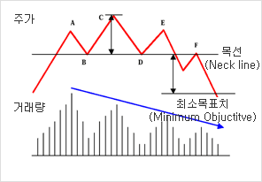

* 세개의 고점(A,C,E)과 두개의 저점(B,D)으로 구성되며, 두개의 저점(B,D)을 이은 수평선을 목선이라 한다. 주가가 세개의 고점을 형성한 뒤 목선을 하향이탈(P1) 하면 머리어깨 천정형이 완성되고, 상승에서 하락으로 추세 전환된다.
* 주가 : 세개의 고점(A,C,E)중에 머리(C )가 가장 높은 고점이 되며, 양쪽 어깨 고점(A,E)는 거의 비슷한 높이를 나타낸다.
* 거래량 : 왼쪽 어깨에서 오른쪽 어깨로 갈수록 감소하는 특징을 보인다.
* 되돌림 현상 : 목선을 하향 이탈(P1)한 후에 재차 되돌림 반등(P2)이 발생하며 목선(F)에서 저항을 받고 하락 전환된다면 머리어깨 천정형이 완성되고 하락추세로 전환됨을 확인시켜준다.
* 최소 목표치 : 머리에서 목선까지 거리 h를 이탈(P1)이후 하락 최소 목표치로 본다.

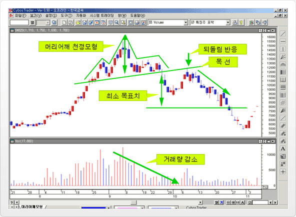

위의 그림은 한국 금속 일간 차트를 사용하였으며, 머리어깨 천정형을 형성하고, 하락 전환하는 국면을 나타낸 사례로서, 왼쪽어깨에서부터 오른쪽 어깨까지 진행한 뒤 목선을 하향 이탈한 주가가 다시 목선까지 상승하는 되돌림 반등을 보이고, 머리어깨 천정형 형성이후 하락 전환하는 과정을 볼 수 있다.

## 머리어깨 바닥형

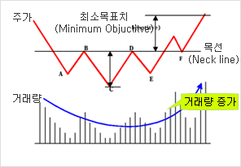

* 세개의 저점(A,C,E)과 두개의 고점(B,D)으로 구성되며, 두개의 고점(B,D)을 이은 수평선을 목선이라 한다. 주가가 세개의 저점을 형성한 뒤 목선을 상향이탈(P1) 하면 머리어깨 바닥형이 완성되고, 하락에서 상승으로 추세 전환된다.
* 주가 : 세개의 저점(A,C,E)중에 머리(C )가 가장 낮은 저점이 되며, 양쪽 어깨 저점(A,E)은 거의 비슷한 높이를 나타낸다.
* 거래량 : 왼쪽 어깨에서 오른쪽 어깨로 갈수록 접시형 증가세를 보인다. 거래량은 머리부분에서 가장 적고, 머리 형성이후 점차 증가하다가, 목선을 상향돌파하면서 급격히 늘어나게 된다.
* 되돌림 현상 : 목선을 상향 이탈(P1)한 후에 재차 되돌림 반등(P2)이 발생하며 목선(F)에서 지지를 받고 상승 전환된다면 머리어깨 바닥형이 완성되고 상승추세로 전환됨을 확인시켜준다.
* 최소 목표치 : 머리에서 목선까지 거리 h를 이탈(P1)이후 상승 최소 목표치로 본다.

위의 그림은 동아제약 일간 차트를 사용하였으며, 머리어깨 바닥형을 형성한 후 상승 전환 되는 사례를 나타낸 것이다. 왼쪽 어깨에서 오른쪽 어깨로 이어지는 머리어깨 바닥 모형이 상당기간 진행되다가 목선을 상향돌파하면서 상승 전환되는 과정을 볼 수 있다. 거래량 패턴에 있어서도 접시형 증가 형태를 띠고 있으며, 주가가 목선을 돌파한 이후 최소 목표치를 상회하는 상승세가 이어지고 있다.

## 다중 머리어깨 모형

* 머리어깨 모형의 구성 요소가 복잡한 형태로 나타나는 것을
" 다중 머리어깨 모형"이라고 한다.
* 단순한 머리어깨모형에 비해 대칭성이 강하게 나타난다.

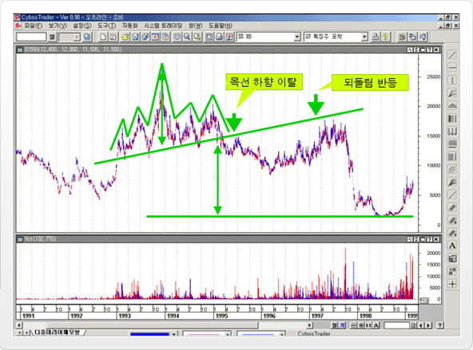

위의 그림은 조비 일간 차트를 사용하였으며, 다중 머리 어깨 천정형으로서, 왼쪽 어깨 두개, 머리하나, 오른쪽 어깨 두개로 구성되어 있다. 주가는 목선을 하향 이탈하고 나서, 다시 목선까지 되돌림 반등하였다가 저항을 받고 급격히 하락 전환하여, 최소 하락 목표치까지 하락 전환되었다.

# 원형모형

대표적인 추세반전형 모형인 머리어깨 모형이 장기간에 형성되다 보면 구성 요소들이 점차 복잡해져서 다중머리어깨모형으로 발전하고,
나아가 더 복잡해지면 목선의 기울기가 활선의 형태를 가진 원형모형으로까지 발전하게 된다. 이와 같이, 추세반전형 모형중 원형모형은 장기간에 걸쳐서 완만한 속도로 형성되므로 주가모형의 대칭성이 강하게 나타난다.

## 원형 천정형

원형 천전형의 초기 단계에서는, 매수세가 왕성하여 거래도 활발하고 주가도 상승세를 보인다. 주가가 상승세를 보일수록 매수세는 위축되고 이에 따라 거래량도 감소하는 모습을 보인다. 매수세가 감소하고 매도세와 대등하게 되면 주가는 일정가격에서 횡보양상을 보이게 되며, 지리한 주가 움직임에 실망한 투자가들은 매도에 가담하여 수습의 균형이 깨지게 되어 주가도 하락세로 반전한다.

## 원형 바닥형(=접시형)

거래량 : 접시형을 완성하면서 상향 돌파 시, 거래량이 눈에 띄게 증가한다.

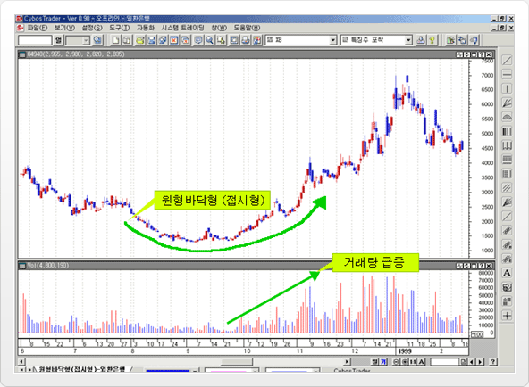

위의 그림은 외환은행 일간차트를 사용하였으며 주가가 장기간 동안 원형바닥권을 형성하였고, 거래량이 급진적으로 증가하면서 상승추세로 전환되고 있다. 일반적으로 원형바닥형의 형성기간이 길수록 상승전환 후의 탄력성이 강하다.

# 삼중천정/삼중바닥형모형

이중 천정형(M자형)에서 고점이 하나 더 형성되어 고점이 세개인 경우, 이중 바닥형(W자형)에서 저점이 하나 더 형성되어 저점이 세개인 경우로서, 머리어깨 천정형/머리어깨 바닥형에서 양쪽 어깨와 머리가 비슷한 높이로 형성된 모형으로 파악할 수도 있다.

## 삼중 천정형 모형

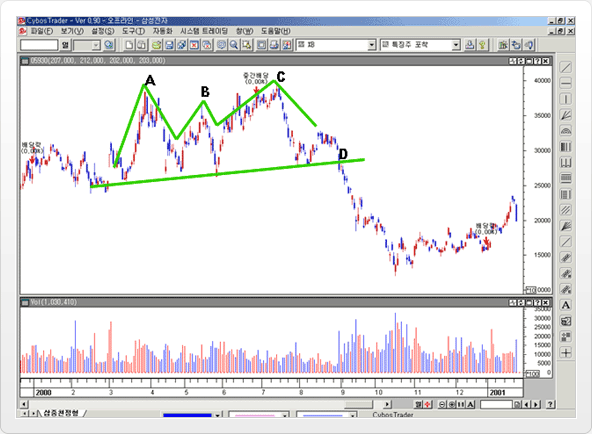

위의 그림은, 삼성전자 일간차트를 사용하였으며, 첫번째 최고점(A)을 형성한 뒤, 고점을 두개 더 형성하고(B,C) 직전 저점 지지선을 하향 이탈(D)하게 되면 삼중천정형이 완성된다.

## 삼중 바닥형 모형

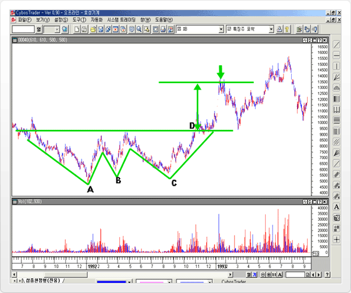

위의 그림은 효성기계 일간 차트를 사용하였으며, 세번의 저점(A,B,C)을 형성한 주가가 직전 고점을 상향 돌파하는 시점(D)에서 삼중 바닥형이 완성되고, 상승추세전환임을 확인할 수 있다. 최소 상승 목표치를 설정해 보면 상승전환 이후 1차 고점 형성 가격대가 최소 상승 목표치와 거의 일치함을 보인다.

# 이중천정/바닥모형

이중 천정형(M자형)은 첫번째 고점을 두번째 고점이 돌파하지 못하며,이중 바닥형(W자형)은 첫번째 저점을 두번째 저점이 돌파하지 못한다.

## 이중 천정형 모형( =쌍봉형 = M자형)

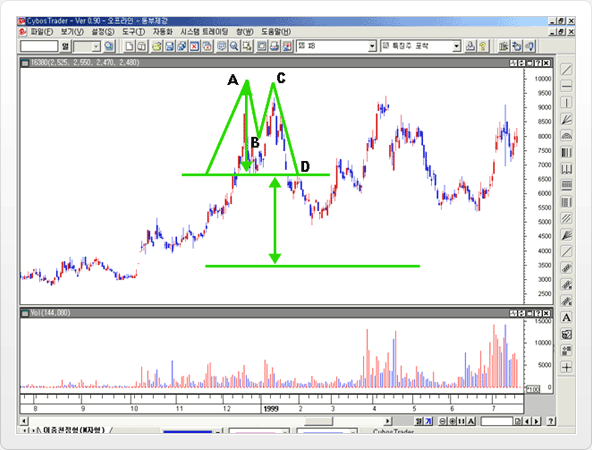

위의 그림은 동부제강 일간차트를 사용하였으며, 급등 이후 고점(A)을 형성한 뒤 , 다시 저점(B)을 형성하고, 상승 하였으나, 직전고점(A)을 상향 돌파하지 못한 채, 다시 하락전환하여(C) 직전 저점 지지선을 하향이탈하여(D) 이중천정형(M자형)을 완성한다. 최소 하락 목표치는 최고점(A)에서 이중천정형을 완성한 저점(D)까지의 수직거리를 사용한다.

## 이중 바닥형 모형(=W자형)

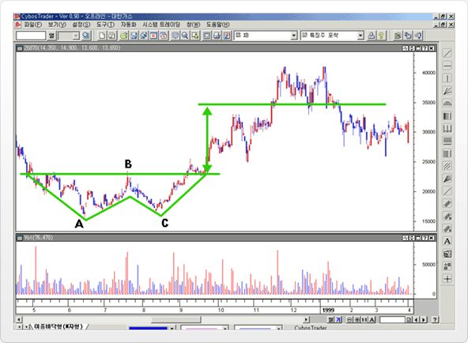

위의 그림은 대한가스 일간차트를 사용하였으며, 주가가 저점(A)을 형성하고 상승반등을 보이다가 다시 저점을 향해 하락전환(B)을 하였으나 기존 저점(A)를 갱신하지 못하고 거래가 증가하면서 상승세(C) 를 나타낸다. 상승세를 보인 주가가 직전 고점(B)을 상향돌파하는 시점에서 이중바닥형이 형성됨을 알 수 있다.

# V자형

V자 모형은 하락 추세가 단기간내에 V 형으로 급반전하는 V자 바닥형과, 상승 추세가 고깔모자형으로 급반전하는 V자 천정형으로 구분된다. 다른 반전모형들의 완만한 주가반전과는 다르게, V자형은 급격한 추세 이탈에 의하여 거의 사전 예고없이 추세가 급반전되는 모형으로 시장분석가들이 판단할 수 있는 시간적 여유가 없어 발생할 당시에는 매우 판단하기 힘들다.

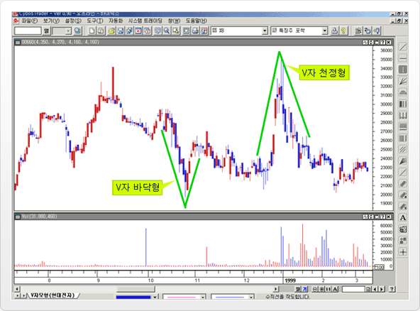

위의 그림은 하이닉스 일간 차트를 사용하였으며, V 자 바닥형과, V자 천정형이 한번씩 발생하였다. V 자 모형은 차트에서 보듯이 완성되기 전에는 예상하기 힘든 반전모형이다.

# 삼각형모형

## 대칭 삼각형

* 지속모형에 속한다. -> 지속모형의 특성
* 주가 변동폭이 점차 축소되어 한점에 수렴해가면서 형성되는 모형이다.
* 최소 목표치 : 대칭 삼각형에서 삼각형의 밑변의 길이를 사용한다.
* 두개이상의 고점이 점진적으로 낮아지고, 두개이상의 저점이 점진적으로 높아지는 경우, 삼각형모형으로 진행되는 것을 확인할 수 있다.

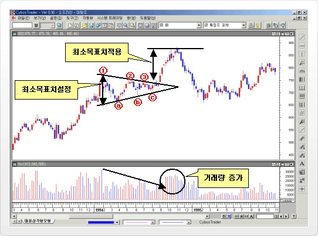

위의 그림은 대형주 주간 차트를 사용하였으며, 추세강화형(지속형)의 대표적인 모형인 "대칭삼각형"모형을 보여주고 있다. 처음에, 지수가 상승세를 보이다가, 고점(①)과 저점(ⓐ)을 형성한다. 그러나 여기까지는 아직, 대칭삼각형 국면으로 진행될지는 예측할 수 없고, 그 다음에 고점(②)와 저점(ⓑ)가 형성됨을 보고 난 후에야 "대칭삼각형"으로 진행될 것임을 추측할 수 있다. 저점(ⓑ) 형성 이후부터, 주가는 계속 수렴하면서 "대칭삼각형"내에서 고점(③)과 저점(ⓒ)를 형성한다. 이 시기에 거래량를 보면 감소하고 있는데, 여기서, "지속형모형의 수렴국면에서 거래량 감소" 라는 전형적인 특성을 볼 수 있다. 고점 3개(①,②,③), 저점3개(ⓐ, ⓑ ,ⓒ) 를 형성한 후, 수렴국면을 상향돌파하게 된다. 이때에도 거래량이 증가하는 양상을 보여서 상향돌파를 확인시켜준다.(추세강화형의 특징) 삼각형의 밑변을 최소 목표치로 설정했는데, 이 최소 목표치 만큼의 길이를 돌파하고 나서 지수가 최소 상승치 목표에서 심한 저항을 받고 하락 전환되는 것을 알수 있다.

## 상향 직각 삼각형

* 지속모형에 속한다. -> 지속모형의 특성
* 최소목표치 : 삼각형의 밑변길이를 사용한다.

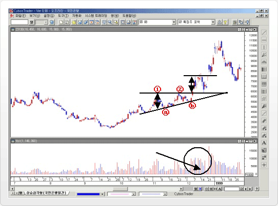

위의 그림은 국민은행 일간 차트를 사용하였으며, 상승국면으로 전환 이후 두개의 고점(①,②)과 두개의 저점(ⓐ,ⓑ)을 이용한 "상승 삼각형"이 형성된 사례이다. 상승삼각형이 형성되는 기간동안에 거래량 감소, 상향돌파 시 거래량 급증이라는 지속모형의 특징을 보여준다. 상향돌파 이후 1차 고점까지 거리를 보면 삼각형의 밑변으로 예상해본 최소목표치와 거의 흡사함을 알 수 있다.

## 하향 직각 삼각형

* 수평기울기를 갖고 있는 저점 경계선과 하향기울기를 갖고 잇는 고점경계선으로 구성
* 주가하락을 예고
* 수렴과정이 진행되는 동안에 거래량이 감소 -> 지속모형의 특성

위의 그림은 삼성증권 일간 차트를 사용하였으며, 하락추세가 진행되면서 "하락삼각형"을 형성하고 있는 사례이다. 두개의 고점(①,②)과 두개의 저점(ⓐ,ⓑ)으로 하락삼각형을 형성하고 나서, 바로 하향이탈하여 주가가 급락한다. 형성된 삼각형의 밑변을 최소목표치로 놓고 볼 때, 하향이탈한 주가의 반등전환 시점을 예측해 볼 수 있다.

# 쐐기모형

## 대칭 삼각형

### 삼각형 모형과 비슷하지만 두변의 방향이 같은 방향으로 형성되는 모형

삼각형 모형 : 삼각형모형은 고점을 연결한 선과 저점을 연결한 선 중 한 선이 수평이거나 다른 선과 반대방향 으로 형성되어 두 선이 일정기간 이후에는 합쳐지게 되는 형태

### 삼각형 모형 이란?

* 쐐기 모형 : 쐐기 모형은 두선의 방향이 같은 방향으로 형성되고 기울기만 틀린 모형으로서 두 선이 합쳐지는 기간이 길게 형성
* 쐐기 모형은 상향쐐기형과 하향 쐐기형으로 구분

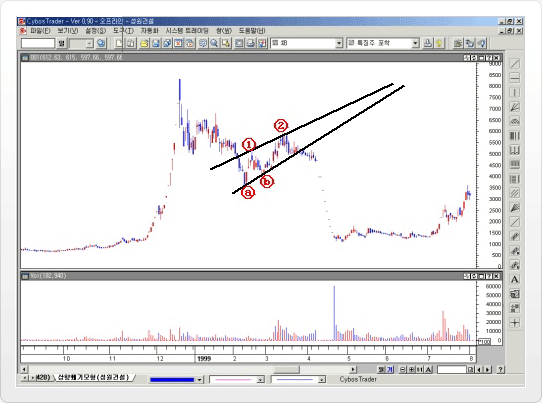

위의 그림은 성원건설 일간 차트를 사용하였으며, 두개의 고점(①,②)과 두개의 저점(ⓐ,ⓑ)으로 "상향쐐기형"을 형성하고 있는 사례이다. 주가가 하락 전환한 뒤 하락 추세가 진행되는 과정에서 하락진행방향과 반대방향인 우상향으로 주가가 고점 (①,②), 저점(ⓐ,ⓑ)을 형성한다. 여기서 형성된 고점간, 저점간 연결한 선의 방향이 같아서 "상향쐐기형" 임을 판단할 수 있다. 주가가 상향쐐기형을 하향이탈하면서 하락추세를 계속 진행하게 된다.

# 확대모형

## 대칭 삼각형

* 삼각형 모형의 좌우가 뒤집어진 주가 모형으로, 주가 파동이 확대되는 삼각형 모양의 주가 변화를 거치면서 형성된다.
* 거래량 : 삼각형 모형과 반대로 시간이 지날수록 증가하는 추세를 보인다
* 각종 루머가 난무하는 가운데 투자심리가 극도로 흥분되어 시장열기가 과열, 급냉을 반복하는 시장의 상황에서 형성되며 따라서 대세상승말기의 약세 전환형으로 간주한다

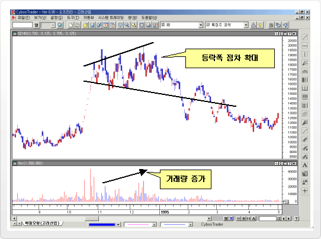

위의 그림은 성원건설 위의 그림은 고려산업 일간 차트를 사용하였으며, 급등 이후 고점 형성단계에서 주가가 급등락폭이 증가하는 확대국면이 진행되었습니다. 거래량도 등락폭 증가와 함께 증가하는 전형적인 "확대모형" 사례이다.

# 다이아몬드형

* 확대모형과 대칭삼각형이 결합된 형태로서 다른 모형들에 비해서 희소한 패턴
* 앞쪽 절반은 확대 모형이고 뒤쪽 절반은 대칭 삼각형 모형

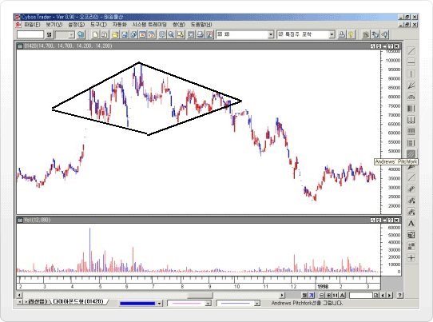

위의 그림은 태원물산 일간 차트를 사용하였으며, 다이아몬드형 주가모형을 보여준다.

# 직사각형

* 직사각형 모형은 주가가 고점/저점의 파동을 형성하면서, 고점을 연결한 경계선과 저점을 연결한 경계선이 모두 수평의 기울기를 가지고 있을 때 형성된다.
* 비슷한 세력을 가진 두개의 특정집단 즉, 평소 주가수준보다 낮은 일정 가격수준에서 주식을 매수하려는 세력과 평소 주가수준보다 높은
* 일정 가격수준에서 매도하려는 세력이 투쟁을 하는 과정에서 형성된다.
* 직사각형 모형은 경험적으로 3/4정도가 강화모형으로 발전하며, 1/4정도가 반전모형으로 발전한다.
* 강화모형/반전모형이란?
* 모형 형성기간이 길수록, 모형돌파 후 주가가 큰 폭으로 변화하는 경향이 있다.

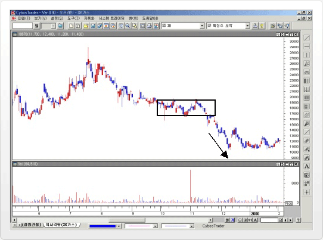

위의 그림은 SK가스 일간 차트를 사용하였으며, 하락추세 진행도중, 다소 짧은 기간 동안 직사각형 모형을 형성하고 난 후, 모형 돌파 후에 주가가 큰폭으로 떨어지면서 기존의 하락추세가 더욱 강화됨을 보여주고 있다.

# 직사각형

## 깃대, 페넌트 모형

깃대모형과 페넌트 모형은 상승 혹은 하락 추세를 강화시키는 전형적인 주가모형이다. 삼각형이나 쐐기형과는 다르게 다소 단기간에 형성되며 주가추세의 바닥권이나 천정권에서는 반전모형으로도 간혹 사용되지만 주로 지속형 모형으로 사용된다. 진행되는 동안 거래량이 감소하며 모형 돌파 시 거래가 급증한다.

## 깃대 모형

* 깃대 모형은 주가의 상승 또는 하락추세가 진행되는 과정에서 형성되면 깃대와 유사한 모양을 갖는다.
* 모형의 폭과 크기가 작고 좁다. 외관상 직사각형 모형과 비슷해 보이지만 직사각형 모형에 비해서, 모형의 형성기간과 주가변동폭이 짧고 기울기도 수평이 아니다.
* 직사각형 모형이란?: 상승추세에서 형성되는 상승 깃대형은 우하향 방향으로, 하락추세에서 형성되는 하락 깃대형은 우상향 방향으로 형성된다. (추세와 반대로 형성)

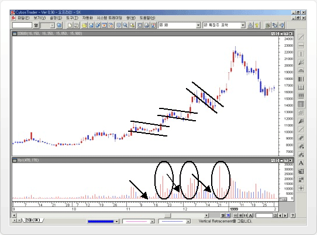

위의 그림은 SK 일간 차트를 사용하였으며 세번의 깃대모형이 나타났다. 상승추세 진행과정 중간중간에 깃대형이 형성되었고 상향돌파하면서 상승추세가 진행됨을 보여준다. 거래량은 깃대형성 기간에는 감소하다가, 거래량이 급증함과 함께 상승한다.

## 페넌트 모양

* 외관상 삼각형 모형이나 쐐기모형과 유사하지만, 주가변동폭이 작고 밀집된 형태를 가진다.
* 기술적으로는 깃대모형과 같은 의미를 가진다.
  * 상승추세에서 형성되는 페넌트 모형은 우하향하게 되며, 하락추세에서 형성되는 페넌트 모형은 우상향한다.(추세와 반대방향으로 형성)
  * 모형 형성 기간 내에는 거래량의 감소하며 모형 돌파 시 거래량이 현저하게 증가한다.

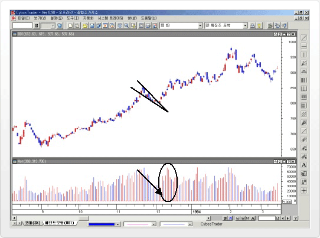

위의 그림은 SK 일간 차트를 사용하였으며 세번의 깃대모형이 나타났다. 위의 그림은 종합주가지수 일간 차트를 사용하였으며, 상승진행 중에 페넌트형이 발생하였다. 페넌트 모형 형성 기간 중에는 거래량이 감소하고 있으며, 모형을 상향돌파하면서부터 기존의 상승추세를 지속하고, 거래

# 종합분석

## 종합 분석(Power User Guide)

상승 혹은 하락 추세가 진행되는 동안에는 지속모형이 반복적으로 나타나며, 추세가 전화되는 시점에서는 반전모형이 발생한다. 즉, 현재 지속형 모형이 발생하였다면 주가는 계속 같은 추세로 진행됨을 예상할 수 있으며, 반전형 모형이 발생하였다면 주가는 추세가 전환될 것이라는 것을 예상해서 매매를 한다.

## 주가 모형 분석 사례

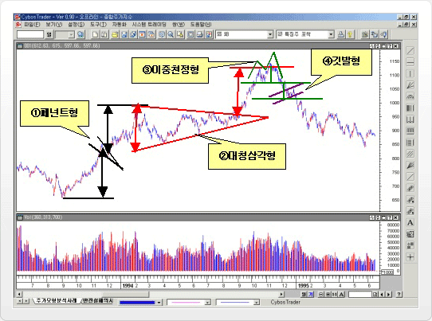

위의 그림은 종합주가지수 일간 차트를 사용하였으며, 대세상승 중기 국면에서 대세하락으로 전환되는 국면까지를 나타내고 있다.

① 상승추세를 형성하던 지수가 "페넌트형"이 형성되면서 잠시조정을 받은 뒤 다시 상승추세를 이어간다.

② 페넌트형을 벗어난 이후에 오랜기간 동안 고점과 저점들이 수렴하는 "대칭삼각형"을 형성한다. 이 기간동안 거래량이
감소하다가 대칭삼각형을 상향돌파하면서 지수는 다시 상승추세를 이어간다. 최소상승목표치를 삼각형 밑변 길이 만큼 잡고
돌파 이후의 예상 목표치로 활용한다.

③ 예상목표치 전후에서 “이중천정형”을 형성한 지수는 직전 저점지지선을 하향이탈하면서 대세상승국면을 마무리하고 하락추세로
전환되었다. 고점과 저점과의 거리로 최소하락 목표치를 설정해 볼 수 있는데, 주가가 최소 목표 치에 도달하기 전에 다시 “깃발형”이 형성된다.

④ “깃발형”은 하락추세 진행의 중간과정에서 형성되었으며 추가하락세가 이어질 것이라는 것을 예상할 수 있게 깃발형을 하향이탈한 지수는 하락추세를 지속하게 되고 여기서도 깃발형 형성 고점과 깃발형 형성 저점까지를 최소 하락 목표치로 활용할 수 있는데
이탈 이후 예상 하락목표치를 계산해보면 계산된 시점이 지수가 하락추세에서 벗어나 횡보추세로 전환되는 시점을 가리키고 있다.