# A /D Line (Accumulation/ Distribution Line)

## 지표해설

* 주가에 거래량을 조합하여 상승강도 및 하락강도를 잘 표현해주는 지표
* 매일매일 거래량을 누적해서 표현하되, 주가(종가)의 움직임에 따라, 다른 누적비율을 적용한다.
* CO 지표 계산식의 기본이 되는 지표

## 지표해석

* A/D Line 상승: 매수 세력이 강화 (축적, Accumulation) ==> "주가상승" 예상
* A/D Line 하락: 매도 세력 강화 (분산 Distribution) ==> "주가하락" 예상

## 공식

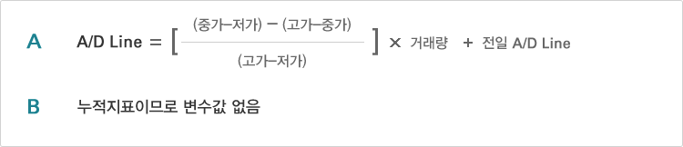

## CYBOS Trader에서의 구현

AD([optional]Pos)

# CO (Chaikin Oscillator , 채킨 오실레이터)

## 지표해설

* A/D Line의 장단기 이동평균선의 차
* 기준선인 "0"을 중심으로 등락을 반복하는 진동지표, 오실레이터(Oscillator)
* 당일 종가가 중간값(=(고가+저가)/2) 이상에서 끝나면 매집, 이하에서 끝나면 분산
  * a. 당일 주가가 고가에 가깝게 끝날수록 매집정도가 강하고,(매수세력이 강하고)
  * b. 저가에 가깝게 끝날수록 분산정도가 크다는 의미(매도 세력이 강하다)

## 지표해석

|   |   |
|---|---|
|기준선(Equilibrium Line) 활용|기준선 = 0 매수 = 지표가 기준선 상향 돌파 매도 = 지표가 기준선 하향 돌파|
|신호선(Signal) 활용|신호선 =CO 지표의 이동평균선 매수 = 지표가 기준선 상향 돌파 매도 = 지표가 기준선 하향 돌파|
|과매수(Overbought)/ 과매도(Oversold) 활용|일정 구간을 정할 수 없음. 과거의 추세에서 종목별로 임의 설정을 해서 사용할 수 있음.|
|역배열 활용(Divergence)|상승형 역배열 = 지표는 저점을 높이는데 주가는 저점을 낮추는 형태로 주가 상승 전환을 예상할 수 있음. -> 빠른 매수 하락형 역배열 = 지표는 고점을 낮추는데 주가는 고점을 높이는 형태로 주가 하락 전환을 예상할 수 있음. -> 빠른 매도|

## 공식

* CO = A/D Line 단기 이동평균선 - A/D Line 장기 이동평균선
* 변수값 : 단기 3일, 장기 10일 권장

## CYBOS Trader에서의 구현

CO(ShortTerm, LongTerm, [Optional]Pos)

## 예

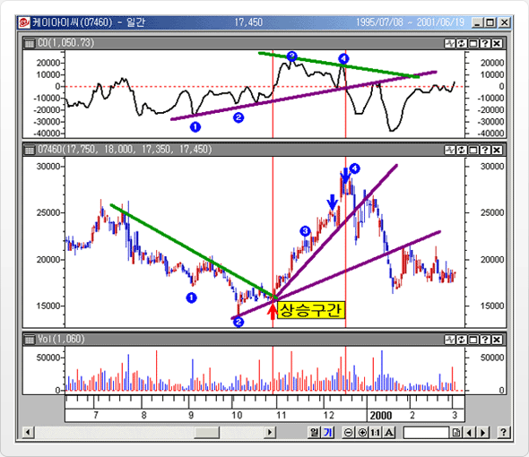

케이아이씨 일간 차트에 CO지표를 단기3일, 장기10일을 적용한 사례이다.
①②구간에서 CO지표는 저점을 높이면서 상승하고, 주가는 저점을 낮추면서 하락하는 "상승형 역배열"을 보여줌으로서,
그 다음에 상승구간이 옴을 미리 예상할 수 있도록 한다.
또한, 이 상승구간에 접어들면서부터 CO지표는 고점을 낮추고(③④), 주가는 고점을 높이는 "하락형 역배열"을 보여줌으로서,
그다음에 하락구간이 옴을 미리 예상할 수 있도록 한다.
기준선을 활용해보면, 위의 상승구간이 시작되는 시점에서부터, CO지표가 기준선을 상향 돌파하는 경우 매수 (▲) 하향돌파하는 
경우 매도 (▼)시점으로 잡을 수 있다.

# MFI ( Money Flow Index)

## 지표해설

* 특정주식의 매수/매도 자금의 유입/유출 정도를 나타내주는 지표
* 매진동지표(Oscillator)로서 0~100사이에서 움직임
* 70~ 80 이상 : 과매수권 / 30~20 이하 : 과매도권
* MFI vs RSI
  * a. RSI(Relative Strength Index) - 탄력성/변동성 지표로서 "가격의 흐름만"을 반영
  * b. MFI - 가격외에 "거래량" 까지 고려한 지표

## 지표해석

|   |   |
|---|---|
|기준선(Equilibrium Line) 활용|기준선을 특별하게 사용하지 않지만 50선을 기준선 의미로 사용할 수 있음. 매수 = 지표가 기준선 상향 돌파 매도 = 지표가 기준선 하향 돌파|
|신호선(Signal) 활용|신호선 = MFI지표의 이동평균선 매수 = 지표가 기준선 상향 돌파 매도 = 지표가 기준선 하향 돌파|
|과매수(Overbought)/ 과매도(Oversold) 활용|일반적으로 70 이상 = 과매수권으로 사용 30 이하 = 과매도권으로 사용 매수전략 = 70 상향 돌파 시 매수, 30 상향 돌파 시 매수 매도전략 = 70 상향 돌파 시 매도, 30 상향 돌파 시 매도|
|역배열 활용(Divergence)|상승형 역배열 = 지표는 저점을 높이는데 주가는 저점을 낮추는 형태로 주가 상승 전환을 예상할 수 있음. -> 빠른 매수 하락형 역배열 = 지표는 고점을 낮추는데 주가는 고점을 높이는 형태로 주가 하락 전환을 예상할 수 있음. -> 빠른 매도 특히 과매수/과매도권에서 형성되는 역배열의 의미가 큼|

## 공식

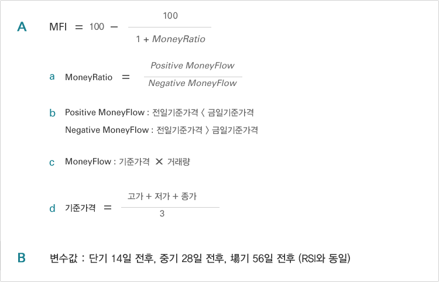

## CYBOS Trader에서의 구현

MFI(Length, [Optional]Pos)

## 예

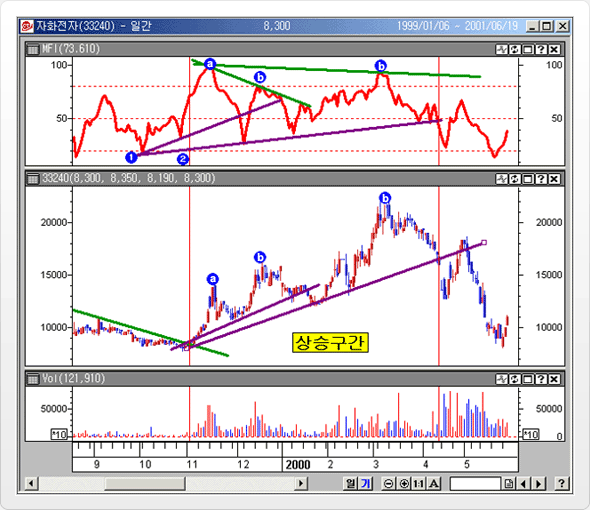

위의 차트는 자화전자 일간차트에 MFI 14일을 적용한 경우이다.

주가가 왼쪽 끝에서부터 작용하고 있는 하락 추세선을 상향 돌파하는 시점에서 MFI가 이미 상승형 역배열(①②)을 포함한 
기존추세강화 형태가 형성되어 상승을 예고하고 있다.

②번 바로 뒤 시점이 상승구간 진입시점으로 주가는 하락추세를선을 상향 이탈하며, 이때, MFI지표는 이미 상승형 역배열 형태의
기존추세강화를 완성하고, 50선 이상 상승세가 지속되는 상황으로 상승직전에 거래량이 증가하는 "매집과정"이 발생하였다.
이후 주가가 상승세를 지속하는 가운데 지표는 하락형 역배열(ⓐⓑ)을 형성하게 되어 상승추세약화를 예상한다. MFI지표는
가)시점에서 상승추세선 하향이탈이 발생한다. 따라서, MFI지표의 직전 고점인 ⓐ가 그전 고점보다 높은 상태로 가)저점과 
①번 저점을 이어서 상승추세선을 수정한다.

하락형 역배열 형성 후 상승하던 주가가 상승추세선을 이탈하게 되고, 이시점에서 MFI지표는 50 이상 매수강화구간에 위치하면서 
수정된 상승추세선 위에 형성되어 있다. 따라서 주가가 상승추세선 이탈 저점은 매수기회로 활용된다. 상승을 지속하던 주가는 
지표와 다시 한번 하락형 역배열(ⓐ,두번째ⓑ)을 형성하게 되며 곧이어 MFI가 상승추세선을 하향이탈하여 주가가 상승추세선을 이탈하는 시점에서는 상승구간이 마무리됨을 알 수 있다.

# OBV (On Balance Volume)

## 지표해설

OBV란 "거래량은 주가에 선행한다" 라는 전제하에, 주가가 전일에 비해 상승한 날의 거래량 합계에서 하락한 날의 거래량 합계를
차감하여 이를 매일 누적해서 집계/도표화 한 것

거액 투자자의 단계적 매집/분산 등과 같은, 시장의 변동 사항 파악에 유용한 지표

## 지표해석

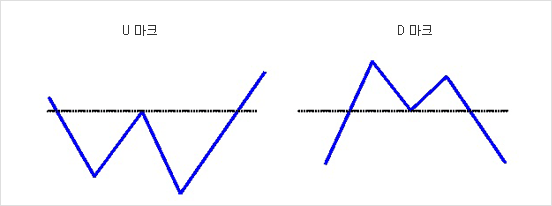

* OBV선의 상승은 매입세력의 집중(매집)을 나타내고 OBV선의 하락은 매입세력의 분산을 나타낸다.
* OBV선이 장기적인 상승추세선을 상향 돌파하는 경우 강세장을, 장기적 하락추세선을 하회하면 약세장을 예고한다.
* OBV선 상승함에도 불구하고 주가가 하락하면 조만간 주가 상승이 예상되고, OBV선이 하락함에도 불구하고 주가가 상승하면 조만간 주가 하락이 예상된다.

위와 같은 지표 특성을 이용하여 매수, 매도 조건을 구성해 보면 다음과 같다.
| 매수	  | 매도  |
|---|---|
|OBV선이 장기 상승 추세에 있으면서 도중에 D 마크가 나타날때|OBV선이 장기 하락 추세에 있으면서 도중에 U 마크가 나타낼때|
|진행중인 상승추세선 상에 최초로 D 마크가 나타날때|진행중인 상승추세선 상에 최초로 U 마크가 나타날때|
|D 마크가 나타난 후 OBV선이 중요지지선상에 있을때|U 마크가 나타난 후 OBV선이 중요지지선 상에 있을때|
|OBV선이 하락추세선을 상향돌파하면서 한 두개의 U 마크가 보일|OBV선이 하락추세선을 상향돌파하면서 한 두개의 D 마크가 보일때|때

## 공식

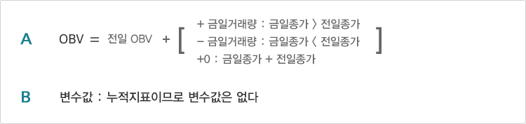

## CYBOS Trader에서의 구현

OBV([Optional]Pos)

## 예

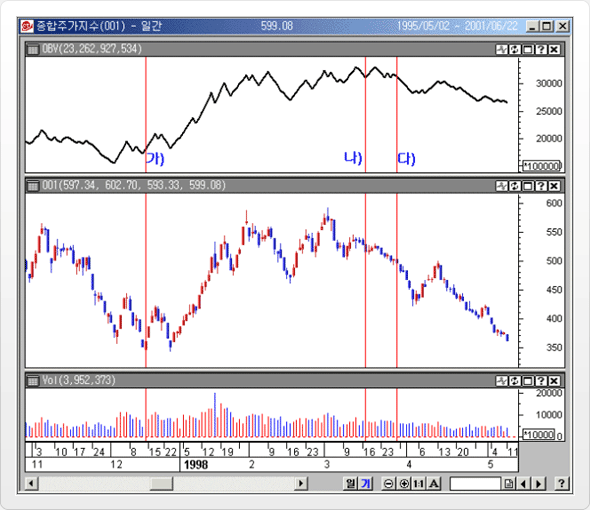

위종합주가지수(001)에 OBV선 1995년 5월부터 누적한 지표를 적용한 사례이다.

가) 시점은 상승전환 시점으로서 지수보다 지표가 먼저 하락추세선을 상향돌파하면서 U 마크를 반복적으로 형성하는 
상승추세를 보인다. 따라서 매수시점으로 사용된다.

나) 시점은 상승추세선 상에서 상승을 지속하던 OBV선이 처음으로 상승추세선을 하향 이탈하는 시점으로, 지수도 
이미 상승추세선을 이탈하기 시작하여 추세전환을 예상할 수 있다.

다) 시점은 지수는 하락을 지속하는 반면 OBV선은 저점지지선에서 지지를 받으며 횡보하다가 처음으로 D 마크가 출현하면서 
하락전환(지지선 하향이탈)시점으로 추세전환을 확인하는 시점이 된다.

# Volume Oscillator

## 지표해설

거래량의 단기이동평균에서 장기이동평균의 거리를 나타내는 지표이다.

즉 MAO(Moving Average Oscillator) 와 마찬가지로 주가 대신에 거래량 이동평균선을 사용한 거래량 지표이다.

## 지표해석

지표 활용 방법은 Volume ROC 지표와 같다.

다시 말해서 주가와 거래량이 동행하는지 주가는 하락하는데 거래량이 증가하는 매집 국면이 발생하는지, 주가가 상승하거나 
하락 전환하는데 거래량이 증가하는 분산 국면이 발생하는지를 판단할 수 있다.

차이점은 Volume Oscillator 지표는 신호선을 지표로 사용하지 않고 원래 지표 고유의 값을 그대로 사용하고 신호선을 
보조선으로 활용한다는 것이다.

|   |매수	   |매도|
|---|---|---|
|기준선(Equilibrium Line)= 0|지표가 기준선 상향 돌파|지표가 기준선 하향 돌파|
|신호선(Signal) =Volume Oscillator 지표의 이동평균선|신호선 상향 돌파|신호선 하향 돌파|
|역배열 활용(Divergence)|상승형 역배열 = 지표는 저점을 높이는데 주가는 저점을 낮추는 형태로 주가 상승 전환을 예상 할 수 있슴-> 빠른 매수 |하락형 역배열 = 지표는 고점을 낮추는데  주가는 고점을 높이는 형태로 주가 하락 전환을 예상할 수 있슴-> 빠른 매도|

## 공식

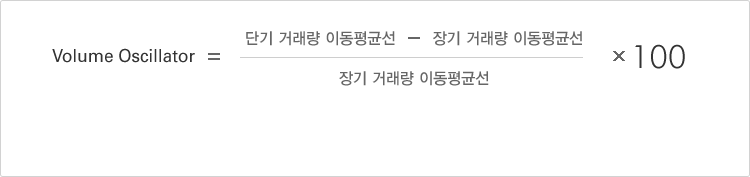

단기 = 5일 ~ 10일 / 장기 = 20일 ~ 30일

단기를 장기보다 다소 짧게 설정하여 사용하는 것이 지표의 설명력을 증가시킬 수 있다.

## CYBOS Trader에서의 구현

Vosc(ShortTerm, LongTerm, Method, [Optional]Pos)

## 예

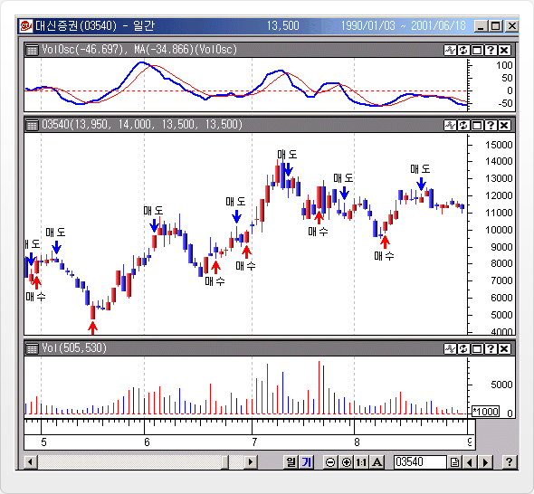

위는 대신증권 일간차트에 VO(5,20)과 V0의 5일 이동평균선의 교차점을 활용한 매도/매수 시점을 표시하였다.

# Volume Oscillator

## 지표해설

Volume ROC는 추세지표에서 설명한 Price ROC와 계산 방법은 같은데 주가 대신에 거래량의 증감률을 계산한 지표이다. 
즉, 일정 기간 전 거래량에 비해 현재 거래량이 몇 % 증가했는지를 나타내 준다. 

Volume ROC자체만을 사용할 경우 상당히 급격한 진동지표 형태(Price ROC(%)보다 더 급격한 변동을 보임)를 나타내어 
해석하기가 어려워진다. 

따라서 Volume ROC를 이동평균한 이동평균선을 자주 사용하게 된다.

## 지표해석

|   |매수	   | 매도|
|---|---|---|
|기준선(Equilibrium Line) = 0|지표가 기준선 상향 돌파|지표가 기준선 하향 돌파|
|신호선(Signal) = Volume Oscillator 지표의 이동평균선|신호선을 Volume ROC 지표로 사용하는 것이 지표해석에 도움이 됨| 동일 |
|역배열 활용(Divergence)|상승형 역배열 = 지표는 저점을 높이는데 주가는 저점을 낮추는 형태로 주가 상승 전환을 예상 할 수 있슴-> 빠른 매수|하락형 역배열 = 지표는 고점을 낮추는데 주가는 고점을 높이는 형태로 주가 하락 전환을 예상할 수 있슴-> 빠른 매도|

## 공식

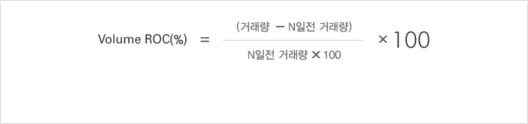

단기 = 5일 ~ 10일 / 장기 = 20일 ~ 30일
단기를 장기보다 다소 짧게 설정하여 사용하는 것이 지표의 설명력을 증가시킬 수 있다.

## CYBOS Trader에서의 구현

VROC(Length, Method, [Optional]Pos)

## 예

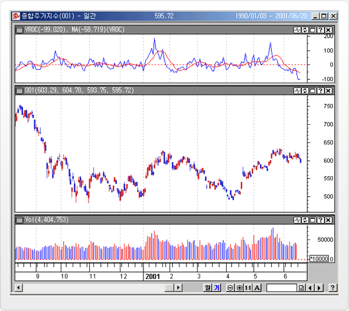

이 챠트는 삼성전자 일간차트에 VR 지표 20일을 적용한 사례이다. 
그림에 침체권 이탈 시점을 점선으로 표시하였고, VR이 상승이후 급격히 하락하는 시점에 매도 화살표를 표시하였다. 
침체권 이탈 시점은 주가의 되돌림 바닥권 시점을 잘 찾아주고 있다. 반대로 주가 고점을 찾기 위한 과열권 진입
(350% 이상) 이후 이탈은 유용성이 떨어지지만 지표가 고점을 형성한 형태인 급격한 변화 시점은 각각의 주가 고점을 잘
찾아주고 있다.그림에서 보듯이 VR 지표는 고점 찾기

# VR(Volume Ratio)

## 지표해설

거래량을 비율로 분석하는 방법으로 일정기간 동안의 주가 상승일의 거래량과 주가 하락일의 거래량과의 비율을 백분비로 나타낸 지표.
OBV선과의 연관성 : OBV선은 시작일에 따라 수치에 큰 차이가 발생하여 절대수치 그 자체로서는 시세를 판단하거나 과거와 
비교하는 것이 불가능하다. 이러한 결점을 보완하기 위해서 누적차수가 아닌 비율로 분석한 것이 VR이다.

## 지표해석

* VR이 200% 라면 대체로 상승 시 거래량이 주가 하락 시 거래량의 2배라는 것을 의미한다.
* VR 이 150% : 보통 수준
* VR 이 350% 초과 : 단기 과열권
* VR 이 70% 이하 : 바닥권 단기 매수 시점
  * 특히 바닥권의 수치는 꽤 신뢰도가 높은 매입시점이다.
  * VR의 대표적인 분석방법은 Divergence 분석이다.

## 공식

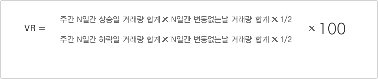

변수값 : N일(보통 20 ~ 30 사이)

## CYBOS Trader에서의 구현

VR(Length, [Optional]Pos)

## 예

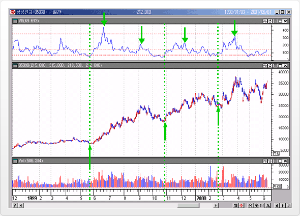

이 챠트는 삼성전자 일간차트에 VR 지표 20일을 적용한 사례이다. 그림에 침체권 이탈 시점을 점선으로 표시하였고, VR이 
상승이후 급격히 하락하는 시점에 매도 화살표를 표시하였다. 침체권 이탈 시점은 주가의 되돌림 바닥권 시점을 잘 찾아주고
있다. 반대로 주가 고점을 찾기 위한 과열권 진입(350% 이상) 이후 이탈은 유용성이 떨어지지만 지표가 고점을 형성한 
형태인 급격한 변화 시점은 각각의 주가 고점을 잘 찾아주고 있다.
그림에서 보듯이 VR 지표는 고점 찾기보다 바닥권 매수시점 포착에 좀더 그 활용도가 크다.