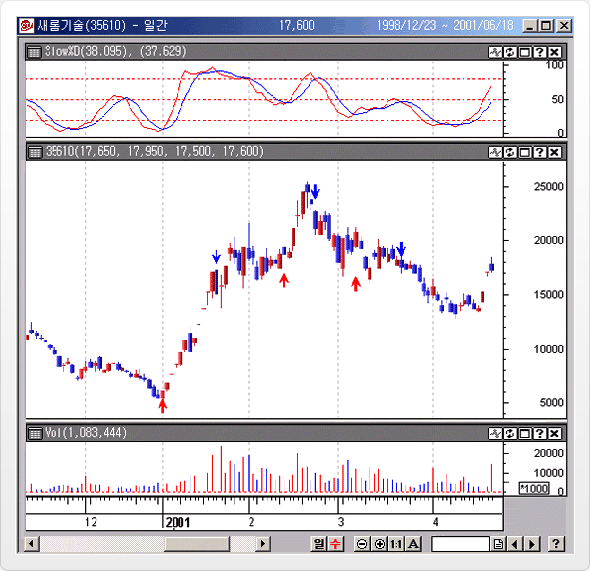

# DMI(Directional Movement Index)

## 지표해설

* 전일대비, 금일 고가/저가/종가의 최고값을 이용하여 현재 추세의 강도 및 매수/매도 시점을 판단해주는 탄력성 지표
* 진정한 주가 변동폭(전일대비)을 측정하여 상승힘은 "DMI(+DI)", 하락힘은 "DMI(-DI)"로 표시
* 방향성(상승/하락)에 관계없이 탄력성과 변동성만을 나타내주는 DMI(ADX)와 병행하여 사용
  (ADX=Average Directional Movement Index)

## 지표해석

* 14일 사용 DMI(+DI)가 20%, DMI(-DI)가 25% 일때
  * a. 최근 14일 동안 TR(참변동폭)의 가격에서 20%는 상승, 25%는 하락,
  * b. 상승 20%와 하락 25%를 합한 45% 는 추세적 움직임, 나머지 55%는 비추세적 움직임
* DMI(+DI)가 DMI(-DI)를 상회하면 할수록 상승탄력이 커지고, DMI(-DI)가 DMI(+DI)를 상회하면 할수록 하락탄력이 커짐
* DMI(+DI)가 DMI(-DI)를 상향돌파 시 ->"매수신호“
* DMI(-DI)가 DMI(+DI)를 상향돌파 시 -> "매도신호"
* DMI(ADX) 가 상승 시 , DMI(+DI)로 인한 상승탄력, DMI(-DI)로 인한 하락탄력이 더욱 강화된다.

|   |   |
|---|---|
|기준선(Equilibrium Line) 활용|기준선이란 의미있는 선은 없음|
|신호선(Signal) 활용|+DI와 -DI와 교차를 매매 신호로 활용.<br>ADX의 경우에는 변곡점(전환 시점)을 찾기 위해서 ADXR를 사용하여 ADX가 ADXR을 상향 돌파하면 ADX 상승 신호로, 하향 돌파하면 하락 신호로 사용함.|
|과매수(Overbought)/<br>과매도(Oversold) 활용|일반적으로 사용하는 과매도 구간을 설정하지 않음.<br>단지 20 이하 구간을 방향성과 탄력성이 없는 구간으로 설정해서 사용함<br>20 이상 = 방향성과 탄력성이 있는 구간<br>20 이하 = 방향성과 탄력성이 없는 구간|
|역배열 활용(Divergence)|상+DI, -DI, ADX 각각 역배열 개념이 적용됨<br>상승형 역배열 = 지표는 저점을 높이는데 주가는 저점을 낮추는 형태로<br>주가 상승 전환을 예상할 수 있슴. -> 빠른 매수<br>하락형 역배열 = 지표는 고점을 낮추는데 주가는 고점을 높이는 형태로<br>주가 하락 전환을 예상할 수 있슴. -> 빠른 매도|
|역배열 확장 할용<br>(Divergence Extention)|역배열 확장 개념을 적용할 수 없음|
|추가적인 활용 방법<br>(실전매매 유용하게 사용)|+D가 -DI를 상향 돌파하는 날의 고가를 극값(Extreme Point)으로 기준을 삼고 주가가 이 극값을 상향 돌파하기 전까지 매수를유보함. 마찬가지로 -D 가 +DI 상향 돌파하는 날의 저가를 극값(Extreme Point)으로 기준을 삼고 주가가 이 극값을 하향 돌파하기전까지 매수를 유보함<br>+D가 -DI의 차가 최대치를 형성한 이후 축소되면서 ADX가 주가와 반대 방향으로 움직이면 추세 전환 가능성이 크다.<br>+D가 -D가 20 이상 최대치로 상승한 뒤 하락전환 되면서 상승하고 있는 ADX를 하향 돌파하게 되면 현재 보유하고 있는 포지션을 청산함.|

## 공식


## CYBOS Trader에서의 구현

DIPlus(Length, [Optional]Pos)
DIMinus(Length, [Optional]Pos)
ADX(Length, [Optional]Pos)

## 예시


한국통신 공사 일간 차트에 DMI 20일을 적용한 사례이다.

① 은 매수 시점이지만 매수 시 고려사항인 극점을 활용할 경우 그 다음날 극점을 상향돌파하지 못하였기 때문에 매수유보

② 는 매수시점 - 극점을 상향돌파하는 상승세가 출현해 매수 전략 구사 시점이 되며 ADX도 횡보추세로 매수 시점으로 인정된다.

③ 은 매수 청산 시점 - 상승하던 +DI가 ADX를 하향돌파

④ 는 재매수 시점 - ADX아래로 하락하던 +DI가 재차 상승 전환

⑤ 는 매수 청산 시점 - 상승하던 +DI가 ADX를 다시 하향 돌파

⑥ 매수 시점이지만, ⑦,⑧시점인 +DI와 주가가 하락형 역배열을 형성하고 주가의 상승추세선을 하향 돌파하여 하락추세로 
전환된 뒤에 발생하였기 때문에 매수 유보

# LRS (Linear Regression Slope, 선형회귀곡선)

## 지표해설

매일매일의 회귀선의 "기울기"를 나타내는 지표. 기준선인 "0"을 상향 돌파하면 주가상승을 예측할 수 있고, "0"선을 하향돌파하면 주가하락을 예측할 수 있다.

## 지표해석

|   |   |
|---|---|
|기준선(Equilibrium Line) 활용|기준선 = 0<br>매수 = 지표가 기준선 상향 돌파<br>매도 = 지표가 기준선 하향 돌파|
|신호선(Signal) 활용|신호선 = LSR 지표의 이동평균선<br>매수 = 지표가 기준선 상향 돌파<br>매도 = 지표가 기준선 하향 돌파|
|과매수(Overbought)/<br>과매도(Oversold) 활용|일정구간을 정할 수 없음<br>과거 추세에서 종목별로 임의 설정을 해서 사용할 수도 있음|

## 공식

각 시점별 기울기(B)를 연결하여 LRS(선형회귀곡선)를 작성

```
Y=  A + B * X
B : 기울기 , A : 절편 , Y : 가격 , X : 시간
변수값 X : 단기는 14일 전후, 중기는 28일 전후, 장기는 55일 전후값 사용
```

## CYBOS Trader에서의 구현

LRS(Price, Length, [Optional]Pos)

## 예시


위 차트는 대동 일간차트에 LRS 14일을 적용한 사례이다.

구간 ①-②에서, 주가는 고점을 낮추는데, 지표는 저점을 높이는 상승형 역배열이 발생하고, 이후에 주가의 하락추세선 
상향돌파로 이후, 상승추세 전환을 확인할 수 있다.

구간 ③-④에서, 주가는 저점을 높이는데 지표는 고점을 낮추는 하락형 역배열이 발생한 뒤 주가가 상승추세선을 
하향이탈하면서 이후, 하락추세로 전환되는 진행과정을 나타내고 있다.

# P. SAR (Parabolic Stop And Reversal)

## 지표해설

주가가 추세형성 초기에는 그 추세의 진행속도가 빠르지 않으나, "시간"이 지나면서 가속이 붙어 빠른 속도로 상승/하락하는 특성을 활용하여 개발된 지표

주가와 시간과의 함수로 구성

## 지표해석

* 주가가 P.SAR보다 커지는 시점이 매수시점이고, 작아지는 시점이 매도시점이다.
* 상승/하락 추세가 형성된 구간에서만 의미를 가지므로, 다른 지표와 복합해서 활용한다.
* 주가가 상승추세일때는 매수위주 매매, 하락추세일때는 매도위주의 매매를 한다.

## 공식

* SAR(t + 1) = SAR(t) + AF * (EP - SAR(t))
* `EP (Extreme Price)` : 상승추세에서는 신고가, 하락추세에서는 신저가
* `AF(Acceleration Factor :가속변수)` : 
  * 시간경과에 따른 가속 변수
  * 0.02부터 시작해서 고가/저가를 갱신할 때마다 0.02씩 증가
  * 최대값(0.2)을 넘어갈 수 없음.(0.02*10일 = 0.2, 즉 고가/저가를 10번 갱신하면 가속변수는 0.2로 고정됨)
* i변수값
  * AF(가속변수) : 0.02를 주로 사용
  * 최대값(최대AF) : 0.2를 주로 사용

## CYBOS Trader에서의 구현

PSAR(Step, Max, [Optional]Pos)

## 예시


위 차트는 대신증권 일간차트에 P.SAR를 가속변수 0.02, 최대값0.2를 적용한 사례이다.

# RSI ( Relative Strength Index) = 상대 강도

## 지표해설

일정 기간 동안 지수의 움직임을 파악하는 것

현재의 가격 추세가 상승 추세라면 얼마나 강력한 상승 추세인지, 혹은 하락 추세라면 얼마나 강력한 하락추세인지를 나타내는 탄력성 지표.(일정기간 동안 지수의 움직임을 파악하는 것)

가격의 추세 강도와 함께 "추세 방향"도 표현

## 지표해석

|   |   |
|---|---|
|기준선(Equilibrium Line) 활용|기준선을 특별하게 사용하지는 않지만 50선을 기준선 의미로 사용할 수 있음.<br>매수 = 지표가 기준선 상향 돌파<br>매도 = 지표가 기준선 하향 돌파|
|신호선(Signal) 활용|신호선 = RSI 지표의 이동평균선<br>매수 = 지표가 기준선 상향<br>매도 = 지표가 기준선 하향 돌파|
|과매수(Overbought)/<br>과매도(Oversold) 활용|일반적으로<br>70 이상 = 과매수권으로 사용<br>30 이하 = 과매도권으로 사용<br>매수전략 = 70 상향 돌파 시 매수. 30 상향 돌파 시 매수<br>매도전략 = 70 하향 돌파 시 매도. 30 하향 돌파 시 매도|
|역배열 활용(Divergence)|상승형 역배열 = 지표는 저점을 높이는데 주가는 저점을 낮추는 형태로<br>주가 상승 전환을 예상할 수 있음. -> 빠른 매수<br>하락형 역배열 = 지표는 고점을 낮추는데 주가는 고점을 높이는 형태로<br>주가 하락 전환을 예상할 수 있음. -> 빠른 매도|
|역배열 확장 할용<br>(Divergence Extention)|역배열 확장 개념을 적용할 수 없음.|

## 공식


## CYBOS Trader에서의 구현

RSI(Price, Length, [Optional]Pos)

# 예시


세풍 일간 차트에 RSI 14일을 적용한 사례이다.

①시점에서 RSI 가 Botton Failure Swings를 형성(지표의 저점이 높아지는 현상)하고, 기존추세인 상승추세가 강화되는 시점이다.

②시점에서 RSI가 Top Failure Swings를 형성하고 기존추세인 하락추세가 강화된다.

# R-Squared

## 지표해설

* 추세의 강도를 나타내며, 다른 추세지표 특히, LRS(선형회귀곡선)나 Standard Error(표준오차)의 보조지표로서 많이 활용된다.
  * [LRS란?]()  [Standard Error 란?]()
* LRS의 선적합도를 검증하고자 할 때 주로 사용하며, 0~+1사이의 값을 가진다.
  * R-Squared = 1 : 가격과 LRS가 "완전상관", LRS에 모든 가격에 일치
  * R-Squared = 0 : 가격과 LRS가 "상관관계가 없는 무작위적이다", LRS와 어떤 가격도 일치하지 않음

## 지표해석

LRS(선형회귀곡선)나 Standard Error(표준오차)의 보조지표로서 다음과 같이 활용된다.

### LRS(선형회귀곡선)의 보조지표로 활용 시

R-Squared(결정계수)는 LRS(선형회귀곡선)의 상승 혹은 하락하는 방향성과 관계없이 강도만을 나타내준다.

LRS(선형회귀곡선)의 상승 ? 주가 상승은 R-Squared(결정계수)가 기준선을 상향돌파하는 시점부터 강화되며 정점을 형성한 뒤에는 LRS(선형회귀곡선) 및 주가가 하락 전환 가능성이 커진다. (반대의 경우도 동일)

### Standard Error(표준오차)의 보조지표로 활용 시

주가 추세의 변화는 높은 값을 형성하던 R-Squared(결정계수)가 하락하기 시작하고 낮은 값을 형성하던 Standard

Error(표준오차)가 상승하기 시작하거나, 반대로 낮은 값을 형성하던 R-Squared(결정계수)가 상승하기 시작하고 높은 값을 형성하던 Standard Error(표준오차)가 하락하기 시작하면 주가 추세의 변화가 예상된다.

## 공식

각 기간별로 유의수준 95% 이상을 나타내주는 R-Squared(결정계수) 값들은 아래와 같다.

| 기간  | 결정계수|
|-------|---------|
| 5     | 0.77 |
| 10    | 0.40 |
| 14    | 0.27 |
| 20    | 0.20 |
| 25    | 0.16 |
| 30    | 0.13 |
| 50    | 0.08 |
| 60    | 0.06 |
| 120   | 0.03 |

14일 기간을 사용할 경우 현재 주가의 R-Squared (결정계수)가 0.10으로 나타나면 위 표에서 표시된 값인 0.27을 하회하는 값으로 95% 유의수준에서 벗어난 것으로 지금까지 진행되어온 추세의 선형 관계가 없어졌다는 의미를 가진다.

이후, R-Squared (결정계수)가 0.27을 상향돌파하기 시작하면 주가가 진행되는 추세가 강화되는 것을 나타낸다.

## CYBOS Trader에서의 구현

RSQR ( DataField , Length, [Optional]Pos )

## 예시


위의 차트는 삼성전자 일간 차트에 LRS(14일), R-Squared(14일), Standard Error(14일)을 적용한 사례이다.

가)는 R-Squared(14일)을 사용하였을 때 유의수준 95%인 0.27선을 상향 돌파하는 시점 

나) 시점 이전을 보면 R-Squared 가 0.27이하로 LRS의 방향성이 없다는 것을 나타낸다.

다)이후에 LRS가 이미 0선위로 상승이 진행되고 있는 상태로 R-Squared 가 0.27선을 상향 돌파함으로서 이제 주가의
상승 강도가 강해질 것을 나타내준다. 이때 Standard Error를 보면 R-Squared 상승세가 반대로 하락세로 전환되는 
것을 알수 있다.

라)시점에서 다시 R-Squared가 0.27선을 상향돌파하는 시점으로 역시 LRS의 상승강도가 강해지는 것을 나타낸다.

마)시점도 R-Squared가 0.27선을 상향돌파하는 시점으로서 LRS의 하락세가 강화되는 것을 나타낸다. 주가의 하락세가
강화되는 시점으로 Standard Error값이 감소하면서 R-Squared의 상승을 확인시켜주고 있다.

# Standard Deviation (표준편차)

## 지표해설

변동성을 통계적으로 나타내는 지표로, 일정기간 동안의 평균값에 대한 분포 정도 측정

단독적인 사용보다는 선형회귀곡선, 볼린저밴드 등 여타 기술적 지표의 보조적인 성격으로 사용

## 지표해석

* 표준편차 값이 크다 -> 일정기간 동안의 주가 분포가 넓다 -> 주가 변동성이 크다 ->주가가 급변할 가능성이 크다.
* 표준편차 값이 작다 -> 주가가 안정적인 움직임을 보이고 있다 -> 횡보 국면이다.

## 공식


변수값 : 주가 = 각 시점별 주가
함께 사용되는 기술적 지표와 동일한 변수 값 주로 사용

## CYBOS Trader에서의 구현

StdDev(DataField, Length, Mult, [Optional]Pos)

## 예시


그림을 보면 주가가 횡보 국면 -> 상승추세 국면 -> 급등락 반복 국면 -> 횡보국면이 진행 되는데 이 기간 동안 표준편차 지표는
매우 낮은 수준 -> 높은 수준 -> 아주 높은 수준 -> 낮은 수준으로 진행한다. 표준편차 값이 큰 폭으로 증가하는 시점은 주가의 
"변동성"이 큰 폭으로 증가한다는 의미를 가지고 있어 주가는 급등락을 반복하게 된다.l

# Standard Error

## 지표해설

주가가 선형 회귀선에 얼마만큼 집중되어 있는가를 나타냄.

즉, 주가가 상승이든 하락이든 추세가 형성되었을 때 표준오차 값은 적어지게 되고 반대로 추세가 변화되거나 등락을 반복하게 되면 
표준오차 값은 증가하게 된다.

## 지표해석

* 표준오차 값이 크다 -> 주가가 선형회귀선 주위로 넓게 분산되어 있다 -> 주가의 변동성이 크다
* 표준오차가 값이 적다 -> 주가가 선형 회귀선 주위에 집중되어 있다 ->주가 변동성이 적다
* 보통 결정 계수와 함께 사용하여 선형관계 분석에 유용하게 사용

## CYBOS Trader에서의 구현

StdErr(Price, Length, [Optional]Pos)

## 예시

결정계수에서 설명

# Stochastic(fast)

## 지표해설

매일의 종가가 최근 일정기간의 고가-저가 범위 내에 어느 곳에 위치하는가를 관찰함으로써 시장의 강약을 파악하려고 하는 지표. 
(0 ~ 100 사이)

(즉, Stochastic은 주가가 상승추세에서는 최근 주가 움직임(고가-저가)의 고점 근처에서 끝나고, 하락추세에서는 저점 근처에서 
끝나는 경향이 있다는 사실에 기초함)

주가 변화에 매우 민감하게 반응하여 수많은 톱날 모양을 만들어 낸다.

## 지표해석

|   |매수|매도    |
|---|---|----|
|기준선(Equilibrium Line)= 50%선|지표가 기준선 상향 돌파|지표가 기준선 하향 돌파|
|신호선 = 기준선|지표가 기준선 상향 돌파|지표가 기준선 하향 돌파|
|과매수(Overbought)/과매도(Oversold)<br>활용80% 이상 = 과매수권으로 사용<br>20% 이하 = 과매도권으로 사용|80% 상향 돌파 시<br>20% 상향 돌파 시|80% 하향 돌파 시<br>20% 하향 돌파 시|
|역배열 활용(Divergence)<br>특히 과매수/과매도권에서 형성되는 역배열의 의미가 큼.|상승형 역배열 = 지표는 저점을 높이는데 주가는 저점을 낮추는 형태로 주가 상승 전환을 예상 할 수 있음. -> 빠른 매수|하락형 역배열 = 지표는 고점을 낮추는데 주가는 고점을 높이는 형태로 B 주가 하락 전환을 예상할 수 있음. -> 빠른 매도|
|역배열 확장 활용<br>(Divergence Extention)|역배열 확장 개념을 적용할 수 없음.|

## 공식


Fast %D = Fast %K 값의 M 기간 이동평균
변수값 : 기간(N), Fast %D값 계산을 위한 기간 값(M) (보통 5, 3 이용)

# Stochastic(slow)

## 지표해설

일반적으로 스토케스틱 지표라고 표현되는 것은 Slow Stochastic을 말하며 Slow %K 를 %K로, Slow %D 를 %D로 사용한다. 주가가 상승 추세이면 현재가격이 일정기간 동안의 고가권에 위치하게 되며, 하락추세이면 저가권에 위치하게 되는 주가의 순환특성을 횔용한다.

Stochastic(Slow)가 Stochastic(Fast)와 다른 점은 주가 변화에 덜 민감하게 반응하므로, 시장의 비정상적이고 중요하지 않은 변화를 걸러낼 수 있다는 점이다.

## 지표해석

실전매매에서 유용하게 사용할 수 있는 활용법은 다음과 같다.

매수(매도) 신호가 발생하였을 경우(과매수/매도 구간 상향/하향 이탈시점이나 중간 구간에서 %K, %D가 교차가 발생하였을 경우) 
→ 주가가 이미 상승(하락)해 있지 않아야 신호의 의미가 더 큼.

과매도권 이탈 이후 재차 50 선을 돌파하지 못하고 하향 전환될 경우 → 하락 탄력이 가속화되는 경향이 있 음.( 반대의 경우도 동일)

과매수, 과매도권을 이탈할 경우 이탈 시점 가격이 전일 가격보다 낮아(높아)져야 매매신호의 의미가 증가 함.

Stochastic 지표는 추세적 시장(trend market) 즉, 상승추세가 확연할 때나 하락추세가 확연할 때에는 자주 과매수권, 
과매도권에서 등락을 보여 매매신호가 큰 의미를 갖지 못함. 오히려 비추세적(Trading Range) 시 장인 횡보 국면에서의 
매매신호가 더 큰 의미를 갖고 있음.

## 공식

* Slow %K = Fast %D = Fast %K 값의 M 기간 이동평균
* Slow %D = Fast %D의 L 기간 이동평균
* 변수 값 : 스토케스틱 계산 기간(N), %K를 계산하기 위한 이동평균 기간(M), %D를 계산하기 위한 이동평균
* 기간 값(L)

일반적으로 자주 사용되는 기간 값


# 예시



# Bollinger Bands

## 지표해설

John Bollinger는 통계적 채널분석 기법을 이용하여 Alpha-Beta Bands를 제시하였다. 이 방법이 바로 그의 이름을 따서 널리 알려진 변동성 지표 "Bollinger Bands" 이다. Bollinger는 이동평균선에 표준편차(Standard Deviation)을 이용하여 두 개의 Band를 추가로 이용하였는데, 이동평균선을 중심으로 주가가 표준편차 ±2배 내에 가격의 95%가 위치한다는 통계적 가정을 근거로 하고 있다.

Bollinger Bands의 상, 하한선은 표준편차에 의해 산출된 이동평균 값이며 주가나 지수의 움직임이 큰 시기에는 Bands의 폭이 넓어지고 움직임이 작은 시기에는 Bands의 폭이 좁아지는 특성을 가지고 있다.

이처럼 Band는 최근 시장의 변동성에 따라 민감하고 유연하게 폭이 축소되거나 확장되는 하는 것을 알 수 있는데, 이를 자기조정(Self-Adjusting)기능이라 하며, 바로 이런 점이 이동평균선을 중심으로 고정된 비율의 상, 하한선을 유지하는 Envelopes와의 다른 성격이다.

## 공식

* 중심선(Middle Band) = N일의 이동평균선
* 상한밴드(Upper Band) = Middle Band + d * ∂
* 하한밴드(Lower Band) = Middle Band - d * ∂

`d = 승수 (통합 2를 사용하나 변동 가능함) / ∂ = 표준편차`


이동평균은 20일 단순이동평균을 이용하며, 승수는 보통 2를 권장하고 있으며, 단기 12일 장기 50일을 이용하기도 한다.

## 활용법

Bollinger Bands는 주가나 지수와 더불어 같은 도표에 나타내어 사용하는데, 주가가 수렴과 확장을 반복하며 움직일 때 주가 움직임의 크기에 따라 Bands의 넓이가 결정되는 것이 Bollinger Bands의 특성이다.

### 밴드 상하한폭과 가격을 활용

주가가 움직임(변동성)이 감소되면서 밴드폭이 현저히 줄어든 후에 발생되는 주가의 움직임은 급변동을 예고하는 것으로 볼 수 있다.

가격의 추세가 강하고 장중 변동폭이 클 때는 밴드의 폭이 확대되고 추세의 보합 또는 횡보국면에서는 밴드폭이 축소된다.

### 가격의 위치와 밴드를 활용

주가가 밴드폭 밖으로 이탈할 경우는 추후 현재의 추세가 지속을 암시한다.

가격이 밴드 밖으로 이탈한 뒤 다시 밴드 안으로 회귀할 경우 상한 밴드 내로 진입 시 매도신호로 하한밴드의 방향으로 진행할 확률이
높고, 하한 밴드 안으로 회귀 시 매수신호로 간주한며 상한밴드의 방향으로 진행할 확률이 높다.

상단을 벗어나는 경우 주가가 양봉을 형성하면 상승확장이 확인되며, 하락에서 하단을 벗어나는 경우 음봉이 형성되면 하락확장이 확인된다.

### 지지선과 저항선의 활용
가격이 밴드 중심선 위에 있을 경우 상승추세로 보고 상한 밴드가 저항선이 되고, 중간선은 지지선 역활을 한다.

가격이 밴드 중심선 아래에 있을 경우 하락추세로 보고 하한 밴드가 지지선이 되고, 중간선이 저항선 역활을 한다.

## 예시


[그림1]은 종합주가지수 주간차트에 12일 Bollinger Bands들 적용시킨 그림이다. 

[그림1]에서 ①구간에서 주가의 움직임이 감소되며 밴드폭이 현저히 줄어드는 축소국면(수렴)이 지난 후 ②번에서는 주가가 
급변동하며 밴드폭이 크게 확대되었다.

그림 ③에서 다시 밴드폭이 줄어들며 수렴국면을 거친 뒤 ④에서 다시 변동폭이 크게 증가하며 확장이 진행되고 있는 것을 알 수 
있다. 이처럼 Bollinger Bands는 주가와 함께 수렴과 확장을 반복하는 특성이 있다.


[그림2]에서 ①은 밴드폭이 축소되며 향후 변동성이 확대될 가능성을 나타내고 있는데, 하한밴드를 이탈하는 음봉이 나타나며
하락추세가 확장될 것을 내포하고 있으며 실제로 주가가 밴드하단과 중단사이에서 밴드폭이 확장되며 하락추세가 지속되었다.

②는 상승초기국면으로써 주가가 밴드상한을 양봉으로 돌파하며 이후 상승추세가 확대 될 것이라는 것을 내포하고 있으며, 
실제로 변동성과 밴드폭이 크게 확대되며 중기적 상승추세가 지속되었다. 

③과 ④는 상승추세에서 밴드의 하단과 중단이 중요한 지지선 역할을 하고있는 것을 잘 나타내고 있는 예이다.

# ATR (Average True Range)

## 개요

Welles Wilder는 그의 저서 "New Concepts in Technical Trading System"에서 가격의 변동성을 측정, 이용하는 지표로서 ATR(Average True Range)를 소개하였다. 보다 진보된 가격의 변동성의 측정으로 인해 변동성을 이용한 기술적지표와
트레이딩 시스템의 한 구성요소로서 다양하게 이용 되어지고 있다.


ATR에서 Range는 가격의 변동성을 측정하기 위한 방법으로 하루동안의 매매 구간 
즉, 일중 고가와 저가와의 차이이다.

하지만, 아래 [그림2]와 같이 가격 제한폭까지 상승한 경우 고가와 저가의 차이가 
zero이기 때문에 이경우 진정한 의미에서의 Range는 전일 종가와의 제한폭까지 
상승한 가격과의 거리라고 할 수 있다.


ATR의 True Range는 전일 종가의 위나 아래에서 형성되는 차트상의 gap을 Range에 
반영함으로서 일보 진전된 의미의 Range를 사용하였다.


ATR은 당일의 장중 등락폭과 전일 종가를 기준으로 당일의 고가와 저가의 위치를 서로 비교해서, 당일의 가격이 어떤 방향으로 얼마나 변동했는지를 수치로 표현하여 지표화 한 것이다. 

Wilder는 높은 ATR 값은 패닉같은 투매나 주식시장의 공황과 같은 현상 뒤에 시장의 바닥권에서 나타나며, 낮은 ATR의 값은 천정권이나 이동평균선의 밀집구간 (consolidation Period)같은 시장의 횡보국면 속에 흔히 발견된다. 또한 ATR은 단기적인 변동성을 측정하는 지표로도 사용되며 시장의 추세가 움직임이 없는 횡보국면 속에서도 큰 폭의 등락을 거듭하는 경우가 있다.

## ATR(Average True Range) 계산식

* ATR을 도출하기 위해서는 먼저 True Range가 산출 되어야 한다.
* True Range는 아래의 값 중 최대값으로 정해진다.
  * D1. 당일고가와 저가와의 차
  * D2. 전일의 종가와 당일의 고가와의 차
  * D3. 전일의 종가와 당일의 저가와의 차
  * TR = D1, D2, D3 중 최고가


ATR의 TR의 n일 단순 이동평균 방식으로 산출된다. n일은 DMI나 ADX와 같이 통상적으로
13~20일을 사용하나 전통적으로 14일을 사용한다.

## ATR 활용법


[그림1]에서 보면 (2)구간에서 주가는 큰폭으로 하락하여 급락하는데 ATR은 점점 증가하여 높은 수치를 나타내고 있는데 
이는 (1)구간의 변동성이 축소된 국면에 이어서 나타나는 현상으로 (1)구간에서 설정된 주가의 상승 추세선이 붕괴되면서
(2)구간에서 변동성이 크게 증가되고 있음을 알 수 있다.

ATR의 가격이 상대적으로 낮은 변동성 축소구간인 (3)국면에서는 주가는 횡보를 하고 있는데,이때 ATR은 지속적으로 하락하고
변동성이 계속 축소되고 있어 향후 일정한 시점에서 변동성이 크게 증가될 수 있음을 암시하고 있다.

그림 (3)국면에서 지수가 280p에서의 지지선을 받으며 하락추세선을 이탈하는 순간 ATR의 가격은 급등하였으며 이후 줄곧
상승함으로서 변동성이 증가되고 있음을 잘 나타내고 있다.

하지만, ATR은 Oscillator형의 지표와는 달리 변동구간이 넓고, 추세보다는 변동성에 초점이 있기 때문에 직접 매매에 
활용하기에는 어려움이 있다. 

따라서, ATR은 VBS( Volatility Break-out System)같은 변동성을 활용한 트레이딩 시스템이나 DMI나 ADX같은 변동성을 
활용한 기술적지표의 구성요소로서 사용되며, [그림2], [그림3]과 같이 트레일링스탑(Trailing Stop)같은 스톱로스
(stop loss)의 기능으로도 자주 사용된다.


Stop Loss : 손절매가를 진입가 대비 ATR 이동평균 * 배수로 산출
ATR Trailing Stop : 목표이익가를 달성 후 이익보전가를 산정
매수면 최고가 - ATR이동평균 * 배수 
매도면 최저가 + ATR이동평균 * 배수로 산정